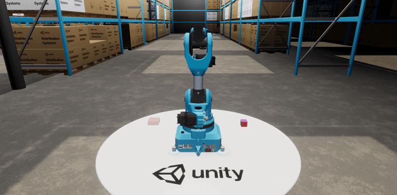

# Unity Robotics Hub

<!--  -->

This is a central repository for tools, tutorials, resources, and documentation for robotic simulation in Unity.

> The contents of this repository are in active development. Its features and API are subject to significant change as development progresses.

---

We're currently working on lots of things! Please take a short moment fill out our [survey](https://unitysoftware.co1.qualtrics.com/jfe/form/SV_0ojVkDVW0nNrHkW) to help us identify what products and packages to build next.

---

## Introduction

Simulation plays an important role in robotics development, and we’re here to ensure that roboticists can use Unity for these simulations. We're starting off with a set of tools to make it easier to use Unity with existing ROS-based workflows. Try out some of our samples below to get started quickly.

## Getting Started
### [Quick Installation Instructions](tutorials/quick_setup.md)

Brief steps on installing the Unity Robotics packages.

### [Pick-and-Place Tutorial](tutorials/pick_and_place/README.md)

A complete end-to-end demonstration, including how to set up the Unity environment, how to import a robot from URDF, and how to set up two-way communication with ROS for control.

### [Object Pose Estimation Tutorial](https://github.com/Unity-Technologies/Robotics-Object-Pose-Estimation)

A complete end-to-end demonstration in which we collect training data in Unity and use that data to train a deep neural network to predict the pose of a cube. This model is then deployed in a simulated robotic pick-and-place task.

### [Articulations Robot Demo](https://github.com/Unity-Technologies/articulations-robot-demo)

A robot simulation demonstrating Unity's new physics solver (no ROS dependency).

### [**New!**] [Navigation 2 SLAM Example](https://github.com/Unity-Technologies/Robotics-Nav2-SLAM-Example)

An example simulation environment, integrated with ROS 2 and **[New!] Visualizations**, which enables the exercise of ROS 2's Navigation 2 and slam_toolbox packages using a simulated Turtlebot 3.

## Documentation

| Tutorial | Description |
|---|---|
| [ROS–Unity Integration](tutorials/ros_unity_integration/README.md) | A set of component-level tutorials showing how to set up communication between ROS and Unity |
| [URDF Importer](tutorials/urdf_importer/urdf_tutorial.md) | Steps on using the Unity package for loading [URDF](http://wiki.ros.org/urdf) files |
| [**New!**] [Visualizations](https://github.com/Unity-Technologies/ROS-TCP-Connector/blob/main/com.unity.robotics.visualizations/Documentation~/README.md) | Usage instructions for adding visualizations for incoming and outgoing ROS messages |

## Component Repos

| Repo | Functionality |
|---|---|
| [ROS TCP Endpoint](https://github.com/Unity-Technologies/ROS-TCP-Endpoint) | ROS node for sending/receiving messages from Unity |
| [ROS TCP Connector](https://github.com/Unity-Technologies/ROS-TCP-Connector) | Unity package for sending, receiving, and visualizing messages from ROS |
| [URDF Importer](https://github.com/Unity-Technologies/URDF-Importer) | Unity package for loading [URDF](http://wiki.ros.org/urdf) files |

## Additional Resources

### Blog Posts and Talks

- [**New!**] (October 4, 2021) Introducing: Unity Robotics Visualizations Package [blog post](https://blog.unity.com/manufacturing/Introducing-Unity-Robotics-Visualizations-Package)
- (August 13, 2021) Advance your robot autonomy with ROS 2 and Unity [blog post](https://blog.unity.com/manufacturing/advance-your-robot-autonomy-with-ros-2-and-unity)
- (March 2, 2021) Teaching robots to see with Unity [blog post](https://blogs.unity3d.com/2021/03/02/teaching-robots-to-see-with-unity/)
- (November 19, 2020) Robotics simulation in Unity is as easy as 1, 2, 3! [blog post](https://blogs.unity3d.com/2020/11/19/robotics-simulation-in-unity-is-as-easy-as-1-2-3/)
- (November 12, 2020)
Unite Now 2020: Simulating Robots with ROS and Unity [video](https://resources.unity.com/unitenow/onlinesessions/simulating-robots-with-ros-and-unity)
- (August 26, 2020)
Announcing Unity Robotic Simulation [blog post](https://unity.com/solutions/automotive-transportation-manufacturing/robotics)
- (May 20, 2020)
Use articulation bodies to easily prototype industrial designs with realistic motion and behavior [blog post](https://blogs.unity3d.com/2020/05/20/use-articulation-bodies-to-easily-prototype-industrial-designs-with-realistic-motion-and-behavior/)

### More from Unity

- [Unity Industrial Simulation](https://unity.com/products/unity-simulation)
- [Unity Computer Vision](https://unity.com/computer-vision)
- [Unity ML-Agents Toolkit](https://github.com/Unity-Technologies/ml-agents)

## New Physics Features in Unity
### New Features
- **Contact Modification API** This API will allow users to define custom contact reactions, such as ignoring subsets of contact points, in order to help simulate holes, slippery surfaces, soft contacts, and more. It is available in Unity versions **2021.2a12+**. [Read more about the new Contact Modification API](https://forum.unity.com/threads/experimental-contacts-modification-api.924809/).
- **Collision detection modes exposed for ArticulationBody: discrete, sweep-based CCD, and speculative CCD**. New continuous collision detection (CCD) modes will ensure that fast-moving objects collide with objects, instead of tunneling or passing through those objects, which can happen in the default “discrete” mode. This API is available in Unity versions **2020.3.5f1+**. [Read more about continuous collision detection](https://docs.unity3d.com/2020.3/Documentation/ScriptReference/ArticulationBody-collisionDetectionMode.html).

### Coming Soon
Here’s a peek into what our Physics Team is hard at work on…

- **Wheel Collider shapes**. This feature will allow the user to specify the shape of the collider to be used for collision detection. Currently the collider shape is fixed to a cylinder, and collision detection is performed by casting a ray from the center of the cylinder. Custom shapes will improve the accuracy of simulating wheels over rough terrains, holes, etc. [Read more about Wheel Collider](https://docs.unity3d.com/Manual/class-WheelCollider.html).
- **Force/Torque Sensor API**. This API will allow users to get the force and torque acting on an articulation body (useful for simulating a force/torque sensor!), as well as to get the motor torque applied by an articulation drive.
- **Query primitives**. These simple, GameObject-less shapes allow for collision detection without requiring simulation (i.e., without calling Physics.Simulate). This feature will allow users to initialize objects in feasible locations, and can also be used for motion planning.

## ROS 2
ROS2 support is now available! You can get started by following [this tutorial](https://github.com/Unity-Technologies/Unity-Robotics-Hub/blob/main/tutorials/ros_unity_integration/publisher.md).

## Community and Feedback

The Unity Robotics projects are open-source and we encourage and welcome contributions.
If you wish to contribute, be sure to review our [contribution guidelines](CONTRIBUTING.md)
and [code of conduct](CODE_OF_CONDUCT.md).

## Support

For questions or discussions about Unity Robotics package installations or how to best set up and integrate your robotics projects, please create a new thread on the [Unity Robotics forum](https://forum.unity.com/forums/robotics.623/) and make sure to include as much detail as possible.

For feature requests, bugs, or other issues, please file a [GitHub issue](https://github.com/Unity-Technologies/Unity-Robotics-Hub/issues) using the provided templates and the Robotics team will investigate as soon as possible.

For any other questions or feedback, connect directly with the
Robotics team at [unity-robotics@unity3d.com](mailto:unity-robotics@unity3d.com).

## Newsletter
To get notified about new updates and features, [sign up for our newsletter](https://create.unity3d.com/robotics-simulation-newsletter-sign-up)!

## FAQs
[FAQs](faq.md)

## License
[Apache License 2.0](LICENSE)
