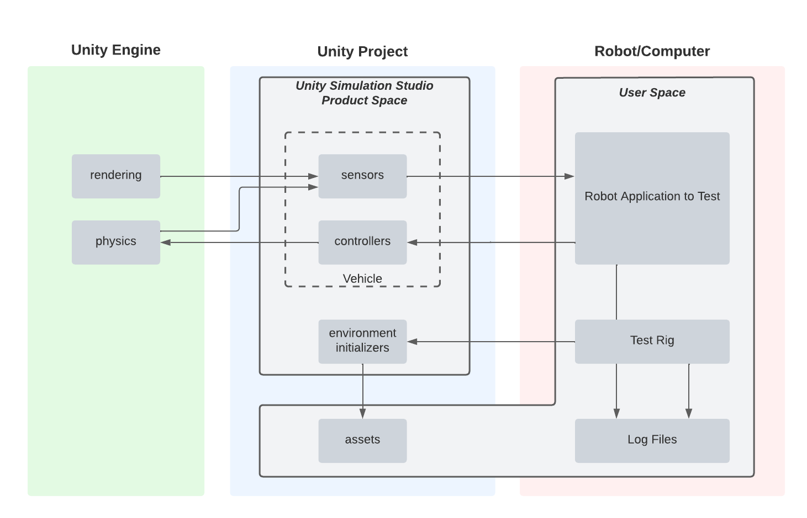
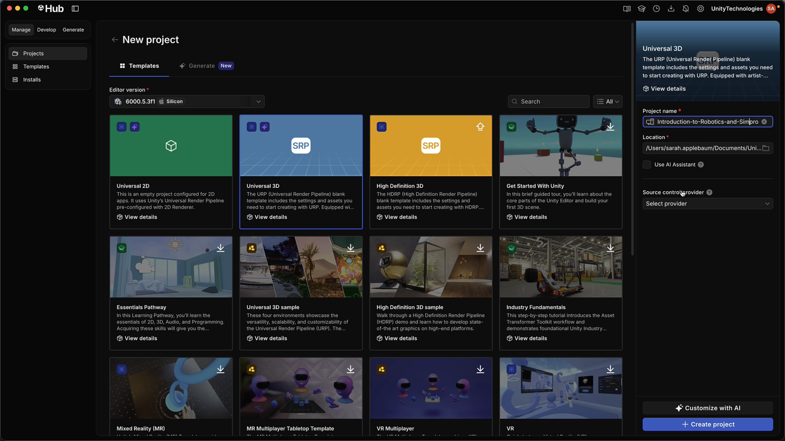
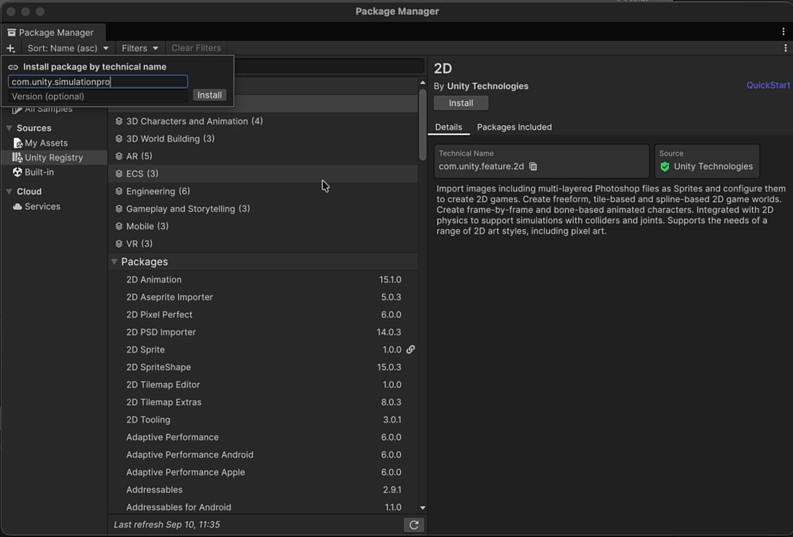
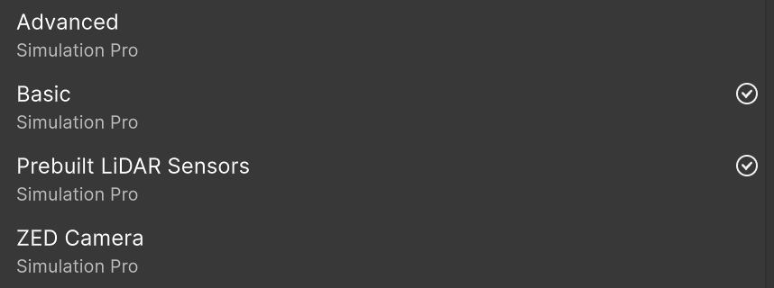
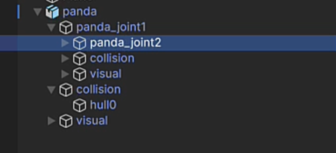
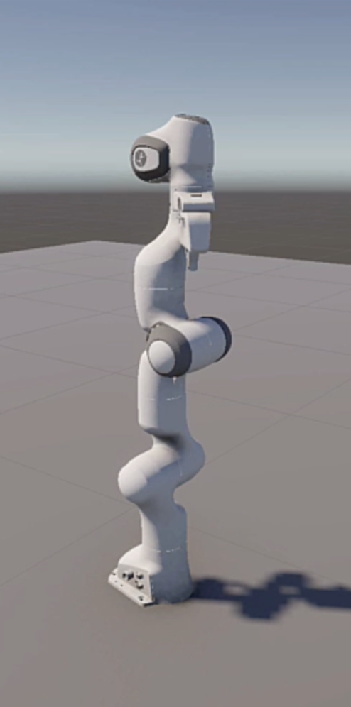
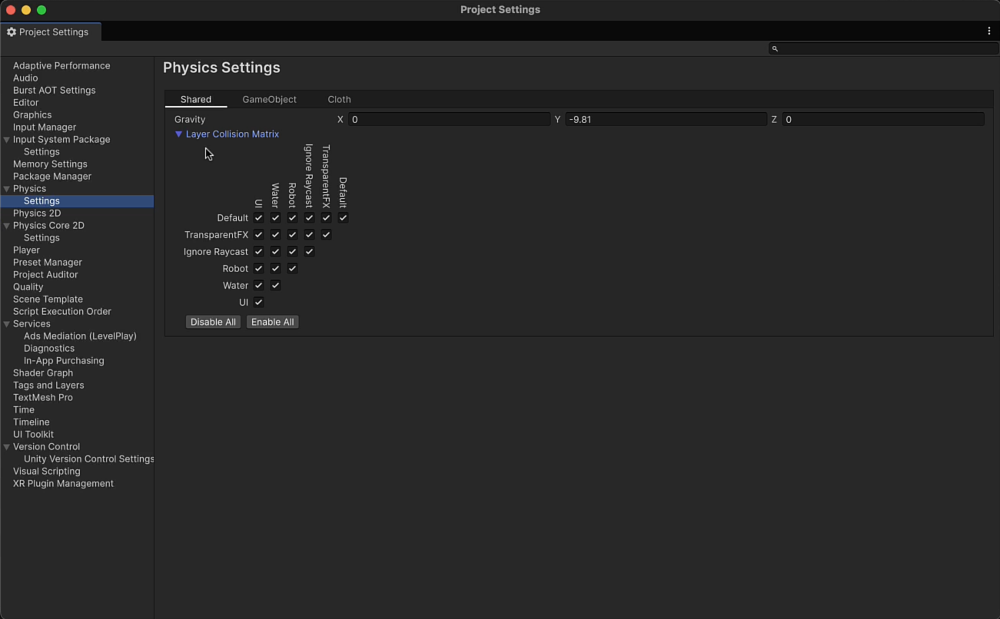
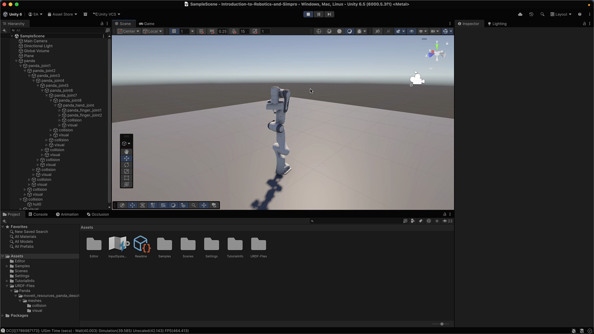

# Module 1 — Introduction

*Introduction to Unity Robotics and Simulation Pro · Module 1 of 5*

What Unity brings to robotics, what the Simulation Pro package contains, and how to get a robot into
the Editor from a URDF file.

By the end of this module you will have a new Unity 6 project with Simulation Pro installed, its
samples imported, and a Panda robot arm imported from URDF, configured, and standing still in Play
mode.

---

## 1. Unity as a simulation engine

Unity Robotics is not a single product. It is a set of packages that turn Unity from a game engine
into a **simulation engine** for robots. This course covers one of them: **Simulation Pro**, referred
to as **SimPro** from here on.

The reason to simulate a robot in Unity is that the Editor is already good at the things a robot test
rig needs:

| What Unity gives you | Why it matters for robotics |
|---|---|
| Prefab-based environments | Build a warehouse, a factory floor, or an obstacle course, then drop the same robot into each one |
| Physics simulation | The robot's joints, wheels, and contacts behave without you writing a dynamics model |
| Rendering | Simulated cameras see a real image, not an approximation |
| Digital twin workflows | Bring an existing physical site into Unity and capture data against it |
| ML-Agents | Use the Scene as a training environment, with simulated sensors in the training loop |

The typical use is to test a robot's behaviour in the Editor before deploying it to hardware — import
a factory robot, simulate its sensor feeds, and watch it perform its task.

### What SimPro adds

SimPro is a package that adds functionality to the Unity Editor. Its core features:

| Feature | What it does |
|---|---|
| **URDF import** | Turns a URDF robot description into Unity GameObjects, meshes, and ArticulationBodies |
| **Messaging** | C# classes for ROS 2 message types, plus publisher and subscriber base classes |
| **ROS connector** | A live TCP connection to a ROS 2 environment — or a **Dummy Connection** that fakes one |
| **Sensors** | Prefab sensors (camera, LiDAR, IMU, joint) that publish simulated data |
| **Clock** | Control over how simulation time advances relative to real time |
| **Coordinates** | Conversion between Unity's coordinate system and ROS's |
| **Visualization** | In-Editor UI and Scene gizmos for inspecting the messages going in and out |
| **Linux headless** | Running the simulation without a display. *Not covered in this course.* |

Modules 1–3 work entirely against a **Dummy Connection**, which stands in for a ROS 2 environment so
you can build and test without one. Module 4 replaces it with a live ROS 2 connection running on an
Ubuntu virtual machine.

> **Note:** This course does not cover setting up ROS 2 itself. A later course in the robotics
> learning pathway covers that.

### How the pieces fit together

```
Unity Engine                 Unity Scene                    ROS 2 environment
────────────                 ───────────                    ─────────────────
Rendering                    Robot prefab                   Robot software
Physics                       ├─ Virtual sensors    ◄────►  Nodes
                              └─ C# controllers             Logging
                             Connector
```

The engine handles rendering and physics. The Scene holds the robot prefab with its virtual sensors
and C# controller scripts. The ROS 2 environment runs the actual robot software and logs data. All
three share data through the connector.



---

## 2. Create the project and install SimPro

### 2.1 New project

Create a new Unity project. The course project is named `Introduction to Robotics and SimPro`, set to
**Local project**, with no source control provider.

Simulation Pro is supported on **Unity 6.3 and newer**. Use 6.3 or later to follow along.



### 2.2 Install the package

Navigate to the **Package Manager** and add the Simulation Pro package using its **technical name**.



### 2.3 Import the samples

The samples are Scenes you will use throughout Module 3, so import them now.

1. Go to **Window > Package Management > Package Manager**.
2. Select the **All Samples** tab.
3. Scroll to the Simulation Pro entries.

The available samples:

| Sample | Used in this course |
|---|---|
| **Simulation Pro Basic** | Yes — Module 3 uses these Scenes |
| **Simulation Pro Advanced** | No |
| **Prebuilt LiDAR Sensors** | Yes — models of real brand-name LiDAR units |
| **ZED Cameras** | No |

Import **Simulation Pro Basic** and **Prebuilt LiDAR Sensors**.



### Checkpoint

- The project opens without Console errors.
- The Project panel contains a `Samples` folder with the Basic and Prebuilt LiDAR sample content.

---

## 3. Import a robot from URDF

**URDF** — Unified Robot Description Format — is the standard file format for describing a robot: its
links, its joints, the limits on those joints, and the meshes that represent them. If you model
robots in software like OnShape or SolidWorks, you export URDF and bring the model into Unity with
its constraints intact.

**The importer runs automatically.** Drag a URDF file into the Assets folder and it imports. There is
nothing else to press. You can adjust settings after the fact if needed.

| The importer reads | The importer creates |
|---|---|
| Mesh information | Meshes, through decomposition |
| Links | Colliders |
| Joints | An ArticulationBody tree |
| Materials | URP materials |
| Sensors | Sensor prefabs |

An **ArticulationBody** is Unity's physics component for jointed machinery. Each joint gets one, with
its constraint and rotation type taken from the URDF.

> **XACRO files.** If your URDF is in XACRO format, convert it to pure URDF using ROS before
> importing. The importer does not process XACRO.

### 3.1 Import the Panda

1. Right-click in **Assets** and create a folder named `URDF Files`.
2. Double-click into it.
3. From the course assets, drag the **`Panda`** folder into `URDF Files`.

The import happens on drop. Expand the imported object and you will find the arm built out of Unity
meshes, colliders, and ArticulationBodies, with every joint's constraints and rotation type already
configured from the URDF.



### 3.2 Fix the materials

The Panda comes in **bright pink**. This is a render pipeline mismatch, and it has a specific cause.

The URDF importer converts materials based on the mesh files referenced by the URDF, and it primarily
handles **`.STL`**. Open the Panda's `visual` folder and you will see the meshes are **`.DAE`**
files instead.

The fix is an Editor script included with the course assets:

1. In the course project assets, find the **`Editor`** folder containing **`URDFURPMaterialFixer`**.
2. Drag the whole `Editor` folder into your project's Assets.

Unity compiles and runs the script on import, and the materials convert to standard URP materials
automatically.



> Open the script and read it. If your own robot's materials import incorrectly, this is the pattern
> to copy.

### Checkpoint

- The Panda appears in the Scene view in white and grey, not pink.
- Its Hierarchy shows a chain of joints ending at the hand and finger joints.

---

## 4. Configure the robot for physics

Press Play now and the arm will immediately glitch. The URDF's damping values do not
translate into stable Unity physics, so you set them yourself.

### 4.1 Damping and friction

Expand the Panda's joint hierarchy all the way down to the hand joint and the finger joints.

1. On the **base**, set it to **immovable**.
2. On **every joint** from joint 1 down, set:

| Property | Value |
|---|---|
| Linear damping | `10000` |
| Angular damping | `1000` |
| Joint friction | `1000` |

> This is repetitive. It is done by hand in the video for clarity, but a short editor script that
> walks the ArticulationBody chain and writes these three values is worth writing for a real project.

### 4.2 Stop the robot colliding with itself

A robot whose own colliders collide with each other behaves strangely — links fight each other at the
joints. Turn that off with a layer:

1. Select the root **`Panda`** object.
2. Create a new layer named **`robot`**.
3. Assign the Panda to the `robot` layer, choosing **Yes, change children** when prompted.
4. Go to **Edit > Project Settings > Physics**.
5. In the collision matrix, **uncheck `robot` / `robot`**.



### Checkpoint

Press **Play**.

- The arm holds its pose instead of thrashing.
- The base does not move.
- The Console has no red errors.



---

## 5. Where this goes next

The Panda is now a set of ordinary Unity components. From here you can attach sensors to it, send and
receive ROS 2 messages about it, or write custom scripts to drive its joints directly.

**Next: [Module 2 — Messages](M2-Messages.md)**, which covers nodes, topics, and the
publisher/subscriber pattern, and gets Unity sending and receiving its first messages.
