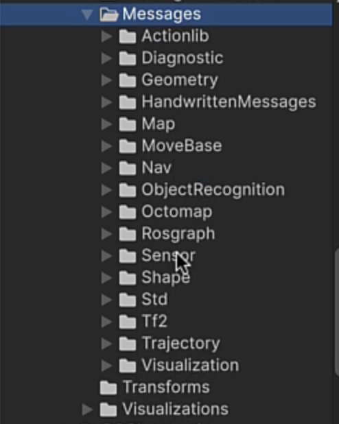
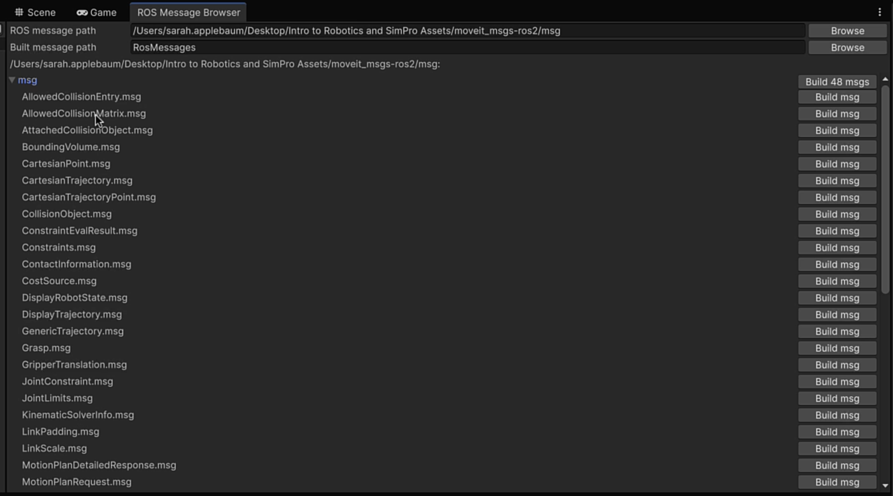
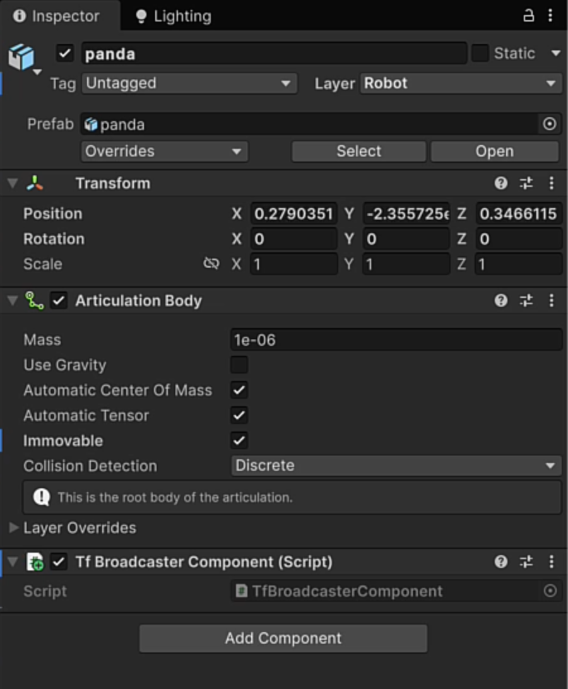
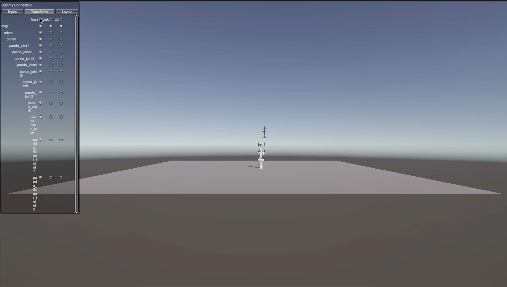

# Module 2 — Messages

*Introduction to Unity Robotics and Simulation Pro · Module 2 of 5*

How ROS 2 nodes talk to each other, what message types SimPro ships with, and how to publish and
receive messages from Unity.

By the end of this module you will have a publisher and a subscriber exchanging messages through a
Dummy Connection, and the Panda broadcasting the transforms of every one of its joints.

---

## 1. Nodes, topics, and the publisher/subscriber pattern

A **node** is the core unit of a ROS 2 system. A node is a set of instructions — *read the camera*,
*raise the right arm*. A robot running on ROS 2 is made of many small nodes, each doing one job.

The question is how an instruction gets from the computer (the brain) to the machine (the body).
Nodes communicate by publishing and receiving messages on **topics**. A topic is a named channel that
carries one specific *type* of message. Sensor data goes out on the topic appropriate to that sensor
type.

This happens through the **publisher/subscriber pattern**:

- A **publisher** sends messages without knowing who, if anyone, is listening.
- A **subscriber** receives messages without knowing who sent them.

Neither side holds a reference to the other. That decoupling is the point: you can swap out a
component — a different LiDAR unit, a different driver — and as long as the replacement agrees on the
**topic name** and **message type**, nothing else in the system needs a code change.

---

## 2. Message types in SimPro

SimPro provides C# classes for the standard ROS 2 message types. Find them in the Project panel under
**Packages > Simulation Pro > Runtime > Foundation > Messages**.

| Category | Contains |
|---|---|
| **Geometry** | Poses, transforms, twists, points, vectors |
| **Sensor** | IMU, point cloud, image, fluid pressure, humidity, temperature, and more |
| **Standard** | Primitives: strings, integers, floats, booleans |
| **Transform** | TF data; used by the TF Broadcaster later in this module |
| **Navigation** | Odometry, paths, occupancy grids |
| **Diagnostic** | Status and health reporting |
| **Visualization** | Markers and display data |
| **Other** | Everything else |

Every message class implements the **`IMessage`** interface. If you need a message type SimPro does
not ship, you have two options: write the C# class yourself against `IMessage`, or generate it from a
`.msg` file.



### 2.1 Generating message classes from .msg files

**MoveIt** is a widely used robotics motion-planning library, and it introduces custom message types
that are not part of base ROS 2. SimPro can generate C# classes for them from the message files.

1. Create a folder in **Assets** named `MoveIt Messages`.
2. Open **Simulation > Generate ROS Messages**.
3. In **ROS message path**, point at the MoveIt message folder. In the course assets this is
   `moveit-messages-ros2`, inside its `msg` folder.
   - The quickest way is to copy the full path of any one message file (for example
     `AllowedCollisionEntry`) and paste it in — the browser detects every message file in that
     folder.
4. Set the output location to your `MoveIt Messages` folder.
5. Click **Build 48 messages**.

Compilation takes a while. When it finishes, `MoveIt Messages` contains a C# class for each MoveIt
message type.



### 2.2 ROS 1 vs ROS 2 schema

Open **Simulation > Simulation Settings**. There is a schema setting for **ROS 1** or **ROS 2**.

Message formats differ between the two, and ROS 1 messages are not necessarily compatible with a
ROS 2 environment. If you are working against ROS 1, switch the schema. **This course uses ROS 2, so
leave it set to ROS 2.**

### Checkpoint

- `Assets/MoveIt Messages/` contains generated C# message classes.
- The Console shows no compile errors after the build.
- Simulation Settings shows the schema set to ROS 2.

---

## 3. Publishing a message

SimPro provides base classes so you do not have to write message plumbing yourself.
**`PublisherBehaviour<T>`** is an abstract MonoBehaviour that publishes messages of type `T`. It
exposes virtual members you override to define what gets published and where.

### 3.1 Write the publisher

1. Create a folder named `Message Scripts`.
2. Right-click **Create > Scripting > MonoBehaviour Script**, name it **`HelloPublisher`**.
3. Replace its contents:

```csharp
using Unity.SimulationPro.Foundation;
using Unity.SimulationPro.Foundation.StdMessages;

public class HelloPublisher : PublisherBehaviour<StringMsg>
{
    public override string DefaultTopic => "/hello";

    void Update()
    {
        if (CanPublish)
            Publish(new StringMsg("Hello from Unity!"));
    }
}
```

What each part does:

| Line | Why |
|---|---|
| `PublisherBehaviour<StringMsg>` | Inherit from the publisher base class, typed to a string message |
| `DefaultTopic => "/hello"` | Everything this component publishes goes out on `/hello`. Any subscriber that wants it must listen on the same topic |
| `if (CanPublish)` | Only publish once the connection is ready |
| `Publish(new StringMsg(...))` | Call the base class's publish method with a new message |

> Hold **Cmd/Ctrl** and click `PublisherBehaviour` to read the base class. Doing the same for the
> other SimPro base classes is the fastest way to learn what you can override.

---

## 4. Receiving a message

**`SubscriberBehaviour<T>`** is the mirror of the publisher: it subscribes to a topic and hands you
each message as it arrives.

### 4.1 Write the subscriber

Create another MonoBehaviour script named **`HelloSubscriber`**:

```csharp
using System;
using UnityEngine;
using Unity.SimulationPro.Foundation;
using Unity.SimulationPro.Foundation.StdMessages;

public class HelloSubscriber : SubscriberBehaviour<StringMsg>
{
    public override string DefaultTopic => "/hello";

    protected override Action<StringMsg> Callback =>
        msg => Debug.Log($"Received: {msg.data}");
}
```

Two differences from the publisher:

- **The topic must match.** `/hello` on both sides, or the subscriber never hears anything.
- **There is no `Update()`.** Nothing needs to run every frame. The `Callback` fires only when a
  message arrives. `Callback` is abstract, so the class will not compile until you implement it.

### 4.2 Set up the Scene

1. Create an empty GameObject named **`Message Manager`**.
2. Add **HelloPublisher** and **HelloSubscriber** to it.
3. Create another empty GameObject named **`Connection`**.
4. Add a **Dummy Connection Component** to it.

The **Dummy Connection** simulates a live ROS 2 environment. With a real setup, a ROS 2 machine
running Ubuntu would be receiving and publishing these messages; the Dummy Connection stands in for
it so you can develop without one. Module 4 swaps it for a real connector.


### Checkpoint

Save and press **Play**, then open the **Console**.

- The Console fills with `Received: Hello from Unity!`.
- The publisher is sending on `/hello` and the subscriber is receiving on `/hello`.


> Strings are the simplest case. Messages carry integers, floats, quaternions, arrays, and composite
> types — anything a robot or Unity needs to act on.

---

## 5. Broadcasting transforms with TF

You will often need transform data for a robot's joints and sensors: where each one is and how it is
oriented, continuously. Rather than writing a publisher per joint, SimPro ships a prewritten
component. **`TfBroadcaster`** publishes transform messages for a GameObject **and all of its
children**.

This is the pattern the sensors in Module 3 use as well: prewritten components that publish their
own messages, which you inspect through the connector's visualization.

### 5.1 Add the broadcaster and the visualization suite

1. Select the **`Panda`** in the Hierarchy.
2. Add a **TF Broadcaster** component.
3. Search your Assets for `visual` and drag the **Default Visualization Suite** prefab into the
   Scene.

The visualization suite creates a UI overlay in the Game view for reading the messages moving through
the connection. Its child objects are each primed to receive and display a category of SimPro
message, and its root carries a **TF System** component that renders the TF broadcast specifically.



### 5.2 Read the output

Press **Play**. The visualization UI appears in the Game view.

1. Select **Topics** to list every topic moving to and from the Editor through the Dummy Connection.
2. Find **`/tf`**.
3. Select **2D** to see the message contents.

Each transform in the message has a **parent frame** and a **child frame** — `Panda` to
`panda_joint1`, for example — plus that joint's position and rotation. Every joint on the arm is
represented.

### 5.3 Visualize the joints in the Scene

Open the **Transforms** tab in the visualization UI, then switch to the **Scene** view. You can
enable:

| Toggle | Shows |
|---|---|
| **Axes** | The local axes of every joint |
| **Links** | The connections between joints |
| **Labels** | Each joint's name |



### Checkpoint

- `/tf` appears in the topic list while in Play mode.
- Its 2D view lists parent and child frames with position and rotation for each joint.
- Axes, links, and labels draw on the Panda in the Scene view.

---

**Next: [Module 3 — Sensors](M3-Sensors.md)**, which covers every sensor that ships with SimPro and
how to read what each one publishes.
