# Module 3 — Sensors

*Introduction to Unity Robotics and Simulation Pro · Module 3 of 5*

Every sensor that ships with Simulation Pro: what each one simulates, how it does it, and what it
publishes.

By the end of this module you will be able to add any SimPro sensor to a Scene, configure it, and
read its output through the visualization suite.

---

## 1. The sensor panel

SimPro ships its sensors as **prefabs, preconfigured**. Each one simulates the data a real sensor
would produce, so the robot software downstream can interpret it and act on it exactly as it would in
the field.

Open **Window > Simulation > Sensors**. Dock the panel next to the Inspector.

The panel has three sections:

| Section | Sensors |
|---|---|
| **LiDAR** | Ray-traced, raster, physics |
| **Camera** | Camera, fisheye cube, fisheye left/right, stereo depth, time of flight |
| **Other** | IMU, joint |

Click a sensor's button to add it to the Scene. Position it, press Play, and its topic appears in the
visualization suite.

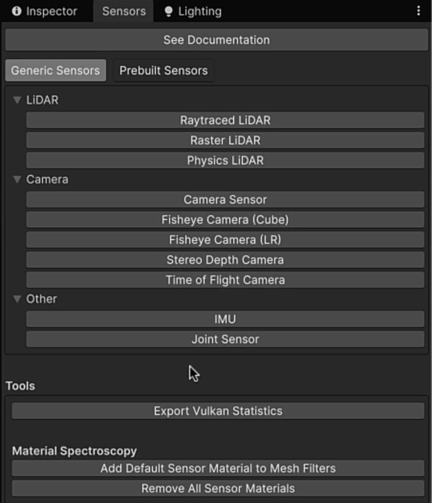

> **Prebuilt sensors.** The Prebuilt LiDAR Sensors sample imported in Module 1 contains
> representations of actual brand-name units. Instantiate those as prefabs and parent them to your
> robot's GameObjects when you are mirroring specific hardware.

### Working with the sample Scenes

Every sensor in this module has a sample Scene under **`Samples/Basic/`** built to demonstrate it.
Those Scenes are what the rest of this module walks through:

| Sensor | Scene |
|---|---|
| Camera | `Samples/Basic/Camera` |
| Fisheye | `Samples/Basic/FisheyeCamera` |
| Stereo depth | `Samples/Basic/StereoDepth` |
| Time of flight | `Samples/Basic/ToF` |
| LiDAR | `Samples/Basic/PhysicsLidar`, `RasterLidar`, `RayTracedLidar` |
| IMU | `Samples/Basic/Imu` |

The reading procedure is the same every time: press **Play**, open **Topics** in the visualization
UI, increase the scale if the panel is small, and select **2D** (or **3D**, for point clouds) to
inspect the message.

---

## 2. Camera sensor

**What it simulates.** A standard RGB-D camera. It captures RGB colour and depth for everything in
its view, and the output can be compressed to PNG or JPEG.

**How it works.** Depth comes from the camera's **depth buffer**, using the clip-space coordinates of
objects in view.

### 2.1 Read the output

Open `Samples/Basic/Camera` and press **Play**. The sample Scene has moving objects and an on-screen
simulation time readout.

Open **Topics** and select **2D**. The camera publishes four streams:

| Stream | What you see |
|---|---|
| Camera info | The camera's properties and intrinsics |
| RGB image | The colour view of the Scene |
| Depth image | A depth texture — near objects dark, distant objects light |
| Depth info | Properties for the depth stream |

Any of these can be sent to your robot as PNG or JPEG.

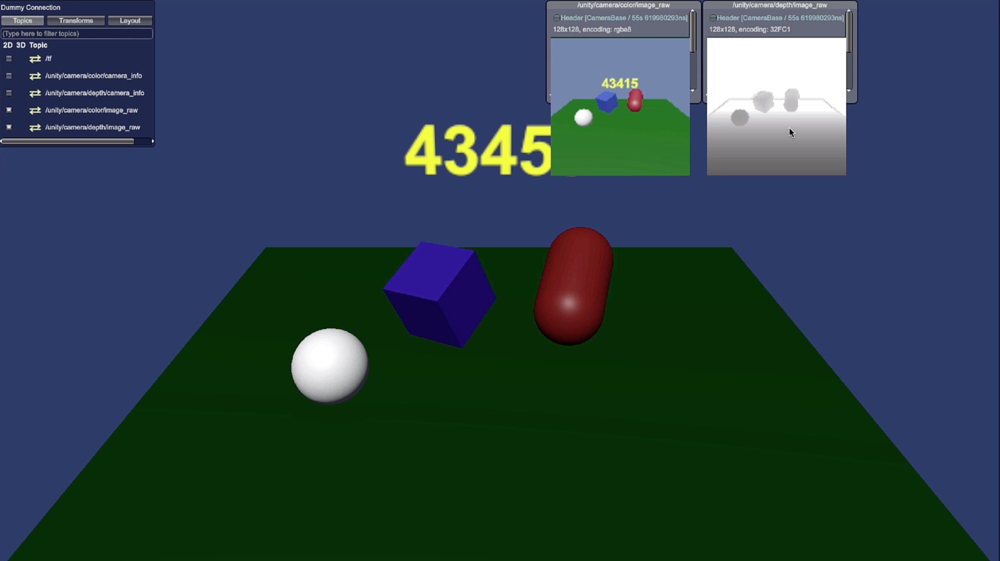

### 2.2 Configure it

Select the sensor GameObject and look at the **Camera Sensor** component in the Inspector.

| Setting | What it controls |
|---|---|
| **Update rate** | How often, in Hz, the sensor publishes |
| **Start time offset** | Delays the first publish, so the camera begins after the simulation starts |
| **Target camera** | The Unity Camera the sensor reads from |
| **Field of view** | The camera's FOV |
| **Width / height** | Output image resolution |
| **Near / far clip plane** | The depth range |
| **Distortion, compression, filtering** | Image processing applied to the output |
| **Noise** | Adds noise to the image, and separately to the depth, to test how your robot handles real-world conditions |
| **Topic names** | One per publisher |

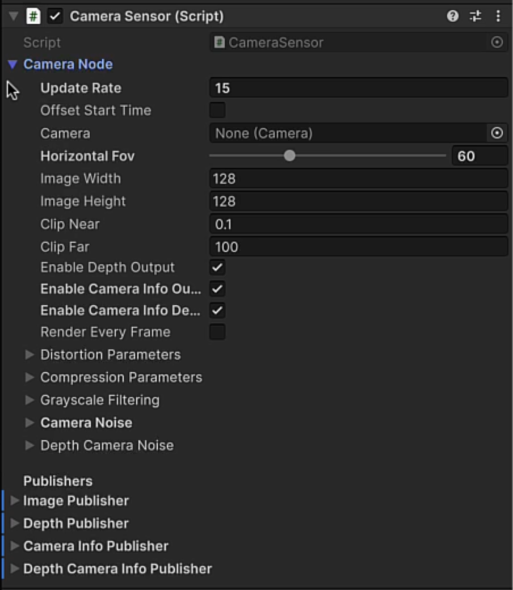

The topic names matter when you are matching an existing system. If your subscriber expects
`/camera/...` rather than `/unity/...`, change it here. The Dummy Connection in the sample is set up
for the default Unity topics, so leave them alone unless you have a reason.

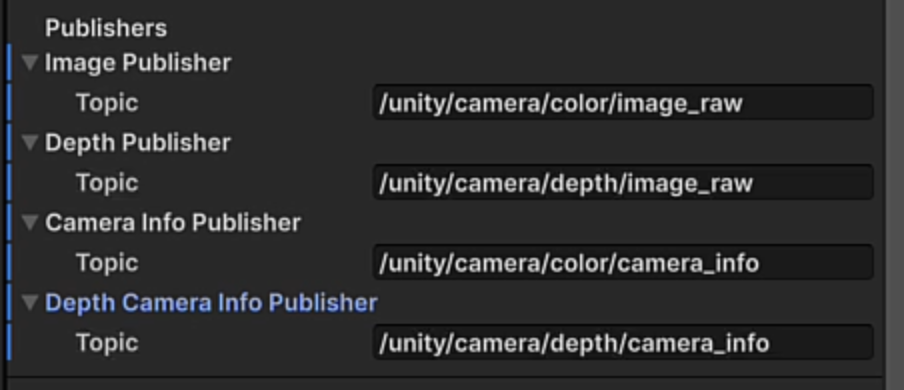

---

## 3. Fisheye camera

**What it simulates.** A wide-angle lens. Same RGB output format as the standard camera, much wider
field of view.

SimPro offers two implementations, and the choice is a coverage/performance trade:

| Sensor | Implementation | Coverage | Speed |
|---|---|---|---|
| **Fisheye cube** | 5 cameras | Entire field of view | Slower |
| **Fisheye left/right** | 2 cameras | Misses some vertical information | Much faster |

Open `Samples/Basic/FisheyeCamera` and press **Play**. Viewing the cube sensor shows a very wide
capture of the Scene. Add a left/right sensor and disable the cube, and the output is nearly
identical apart from a visible notch at the top. Anything above that plane is outside the two
cameras' coverage.

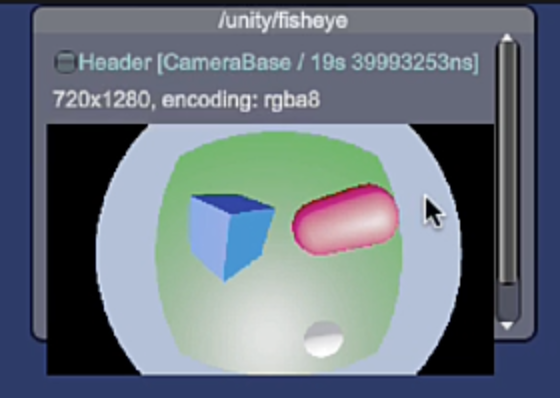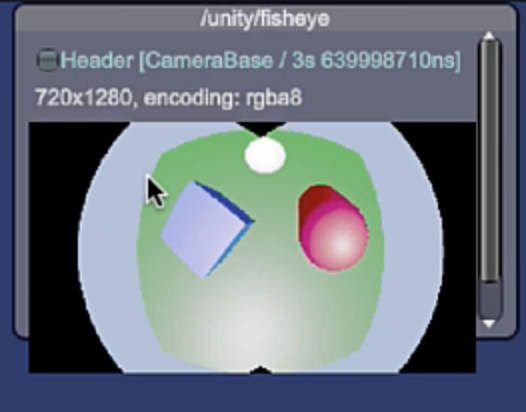

### 3.1 Configure it

| Setting | What it controls |
|---|---|
| **Individual camera transforms** | Position and rotation of each camera making up the sensor |
| **Output format** | RGB or grayscale |
| **Texture size / cubemap texture size** | Output resolution; the sensor can emit a cubemap |
| **Center and focals** | Optical centre and focal lengths |
| **Distortion coefficients** | Lens distortion model |
| **FOV, near / far planes** | View frustum |
| **Auto exposure** | Enable or disable |
| **Publisher topic** | As with the standard camera |

> **Both fisheye variants publish to the same topic.** If you want both in one Scene you need a new
> message to tell them apart — but camera sensors are performance-heavy and running two is rarely
> worth it. Pick one. If performance is the constraint, pick left/right. If you are mirroring real
> hardware, pick whichever matches the physical sensor.

---

## 4. Stereo depth camera

**What it simulates.** A stereo depth camera, which derives depth the way human eyes do: compare the
left and right images and calculate depth from the disparity between them.

Open `Samples/Basic/StereoDepth`. Select the camera base, select the stereo depth sensor, and expand
its node. It contains:

| Child | Purpose |
|---|---|
| **Left camera sensor** | One eye |
| **Right camera sensor** | The other eye |
| **Stereo projector** | A Spotlight that projects a visual texture into the scene |

The projector is there because stereo depth works better against texture. Blank surfaces give the
disparity algorithm nothing to match, so projecting a pattern improves accuracy.

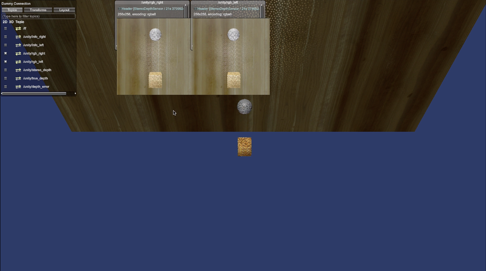

### 4.1 Read the output

The sample Scene has a ball bouncing on a cube. Press **Play** and open the topics.

| Stream | What it shows |
|---|---|
| **Right RGB** | The right camera's view |
| **Left RGB** | The left camera's view — subtly offset; easiest to see against the cube |
| **Stereo depth** | Depth approximated from the two views |
| **True depth** | Depth read straight from the depth buffer, not from disparity |
| **Depth error** | The difference between the two. Black holes mark low-confidence regions |

Comparing stereo depth against true depth is how you judge whether the sensor is giving your robot
usable data in a given scene.

---

## 5. Time of flight camera

**What it simulates.** A ToF sensor emits a pulsed light source and observes the reflection. The
phase shift between emitted and reflected light translates to distance. Output is a **point cloud**.

**How Unity does it.** The simulated sensor approximates the process using the depth buffer, then
builds a point cloud from it.

### 5.1 Read the output — in 3D

Open `Samples/Basic/ToF` and press **Play**, then open **Topics**.

This sensor's visualization has a **3D** button the camera sensors did not. Select it and the point
cloud appears as dots in the Scene.

The useful part: **minimize the Game tab and switch to the Scene view.** The points are drawn on your
GameObjects in real time, as gizmos. You can move around the Scene and inspect what the sensor is
returning against the actual geometry.

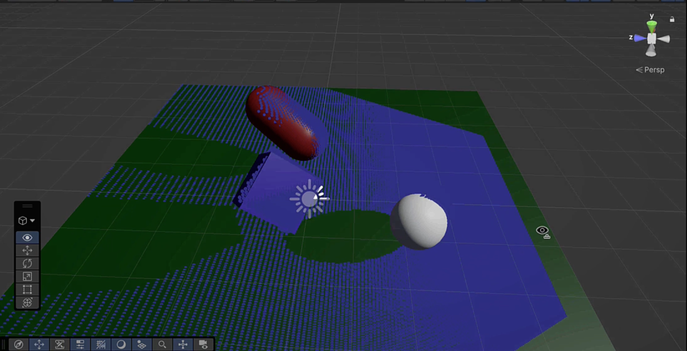

---

## 6. LiDAR sensors

**What it simulates.** LiDAR uses pulsed laser light to measure distance and build precise
three-dimensional maps. It is the workhorse sensor for judging distance and navigating, and Module 4
uses one for exactly that.

The principle is the same in all three implementations: emit a beam, find where it hits, and use the
distance from origin to hit point. What differs is *how the hit is computed*, and that determines
which platforms and which hardware profiles each suits.

| Type | Method | Platforms | Best for |
|---|---|---|---|
| **Ray-traced** | Vulkan Ray Tracing API on the GPU | Windows, Linux — requires Vulkan | Most feature-rich and most accurate |
| **Raster** | Depth buffer | Windows, Linux, macOS | Complex scenes |
| **Physics** | Unity physics raycasting on the CPU | Windows, Linux, macOS | Machines with a strong CPU |

### 6.1 Raster LiDAR

Open `Samples/Basic/RasterLidar` and press **Play**. Open **Topics**, increase the scale, and view the
raster LiDAR output. The sensor origin sits at the centre; around it is the point cloud captured from
the depth buffer, where each pixel is a hit the LiDAR identified.

A **point cloud** is a data type holding a collection of three-dimensional points. The LiDAR builds
one from everything in the scene, and the robot uses it to approximate distance.

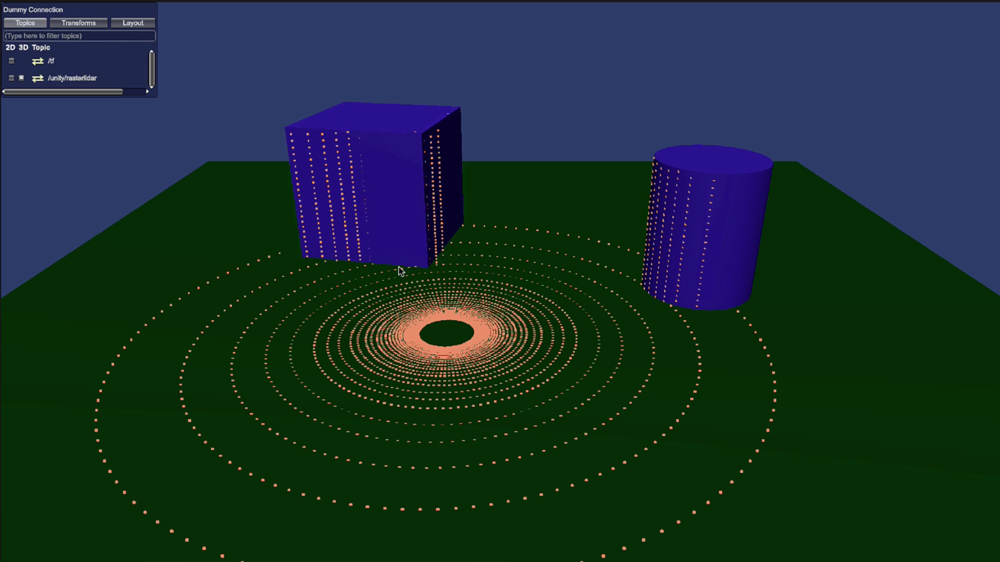

### 6.2 Point cloud vs laser scan

Select the raster LiDAR under the LiDAR base. The **output type** is set to point cloud. Change it to
**laser scan** and press Play again, then view it under **Topics > 3D**.

The output is now a planar range-finder pattern rather than a full point cloud. A laser scan emits
rays at a **constant Y**, as if constrained to a plane, so it does not sample objects top to bottom
the way a point cloud does.

To see this clearly, switch the Inspector to **Debug Mode** and enable **visualize beam direction**
and **visualize point cloud**. Re-enter Play mode and switch to the Scene view: the sensor spins,
firing beams, with each hit marked by a red gizmo, all of them on one plane.

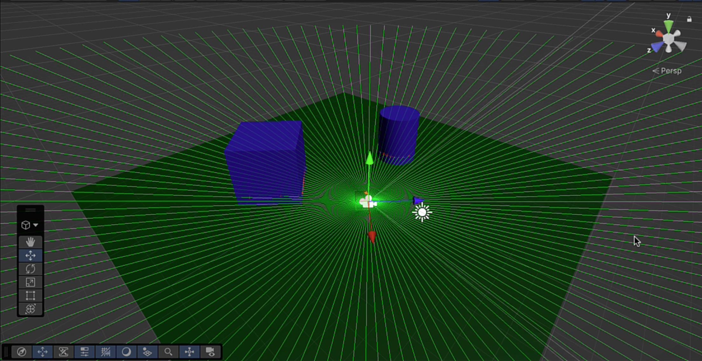

### 6.3 Configure it

| Setting | What it controls | Trade-off |
|---|---|---|
| **Output type** | Point cloud or laser scan | Full 3D coverage vs a single plane |
| **Angle range** | Sweep limits — the full 360° or a restricted arc | Narrower means less data to process |
| **Samples** | Number of beams emitted. Drop it to 16 and the sparseness is obvious in the Scene | Fewer beams costs accuracy but buys performance |
| **Ray range min / max** | How near and how far a ray may travel | |
| **Intensity** | Adds an intensity field to the point cloud output | Leave off unless you consume it |

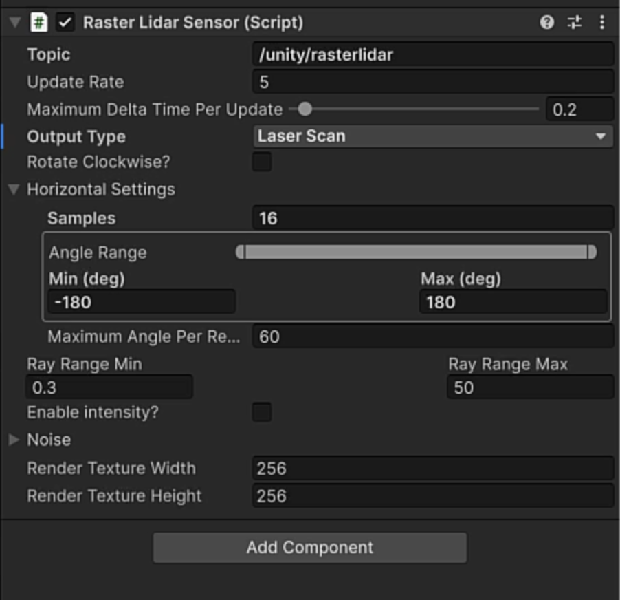

### 6.4 Physics LiDAR

Open `Samples/Basic/PhysicsLidar`. This implementation uses Unity's raycasting, which runs on the CPU
as part of the Unity physics system.

Select the physics LiDAR under the LiDAR base, switch the Inspector to **Debug Mode**, and enable
**show rays**. In Play mode you will see the sensor spinning with green rays marking hits, returning
an accurate reading of the environment.

Switching its output to **laser scan** shows the same planar, constant-Y behaviour as the raster
sensor — this is the clearest view of how the rays are cast and how hits are calculated and returned.

### Checkpoint

- You can state which LiDAR type to use on a given machine and why.
- You can switch a LiDAR between point cloud and laser scan and explain the difference in the output.
- Reducing samples visibly thins the beams in the Scene view.

---

## 7. IMU sensor

**What it simulates.** An **inertial measurement unit** — accelerometers and gyroscopes measuring
position and orientation in 3D space. Real IMUs are used for tracking, balance, and navigation across
every class of robot.

**How Unity does it.** The IMU behaves like a joint state sensor, reading **ArticulationBody
positions, velocities, and efforts** from the robot. From that it returns **orientation**, **angular
velocity**, and **linear acceleration**.

### 7.1 Read the output

Open `Samples/Basic/Imu`. The Scene has two checkered balls, each with an IMU attached:

| Sensor | Setup |
|---|---|
| **IMU roll** | A ball rolling slowly down an inclined plane |
| **IMU bounce** | A ball bouncing on a plane |

Press **Play** and open each sensor's **2D** data:

- **IMU bounce** — linear acceleration spikes every time the ball strikes the surface and is
  propelled back up. Click through the message fields to see the full set of matrices.
- **IMU roll** — the ball's current orientation in 3D space, plus angular velocity (its rotation
  speed) and its motion down the slope.

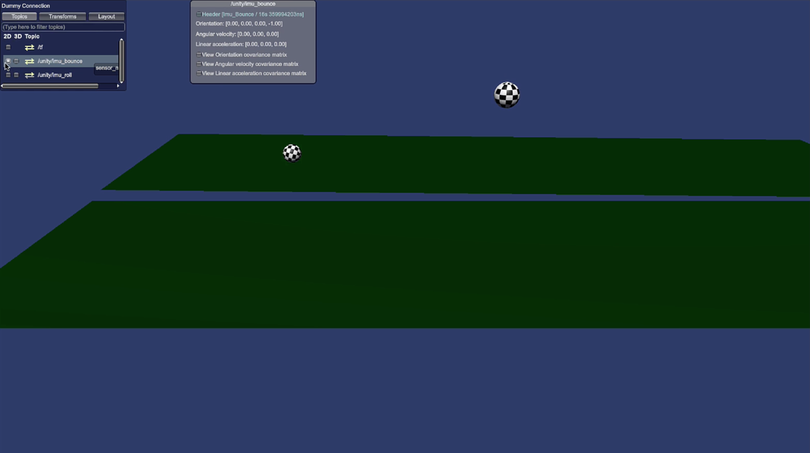

### Checkpoint

- Both IMU topics appear in the topic list.
- The bounce sensor's linear acceleration changes on each impact.
- The roll sensor reports a continuously changing orientation.

---

## 8. Where this goes next

You have now seen every sensor SimPro ships out of the box, all of them running against a Dummy
Connection.

**Next: Module 4 — Creating a Simulation.** It replaces the Dummy Connection with a live ROS 2
environment, covers simulation time and coordinate systems, and uses a LiDAR sensor to navigate a
robot around a Scene while exchanging messages with a running ROS 2 node.
