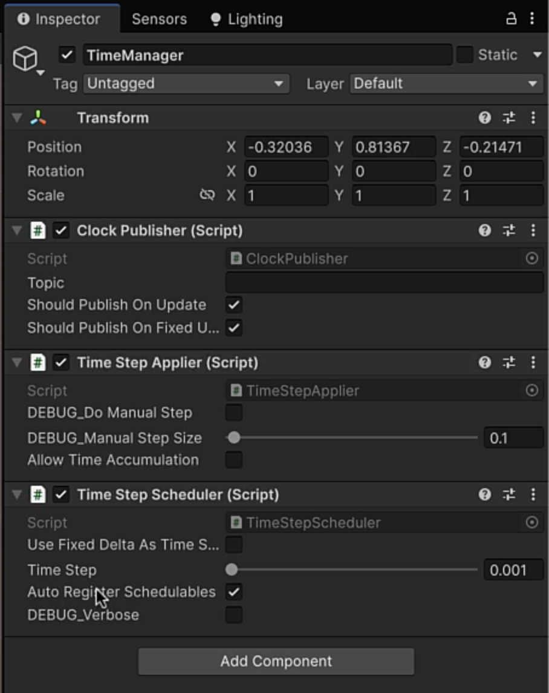
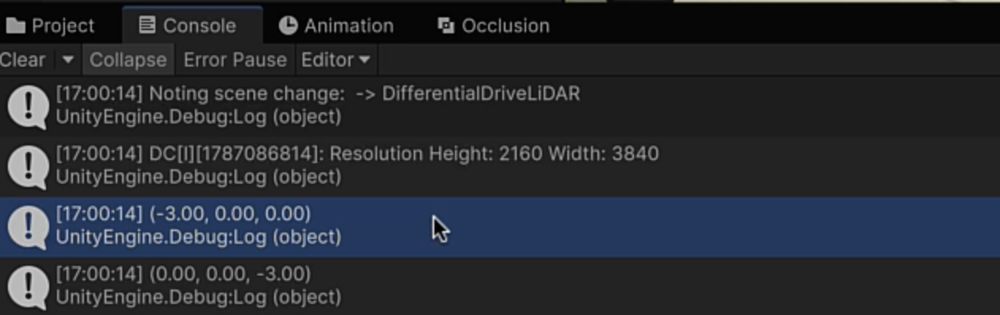
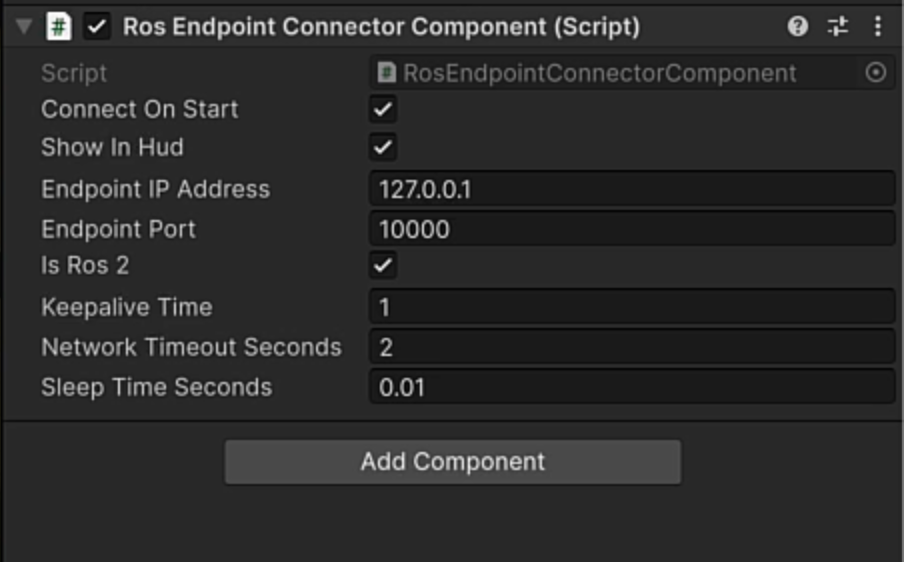
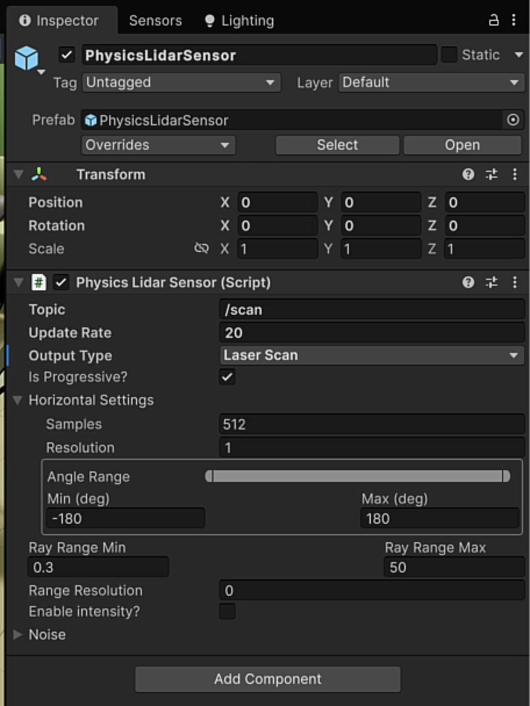
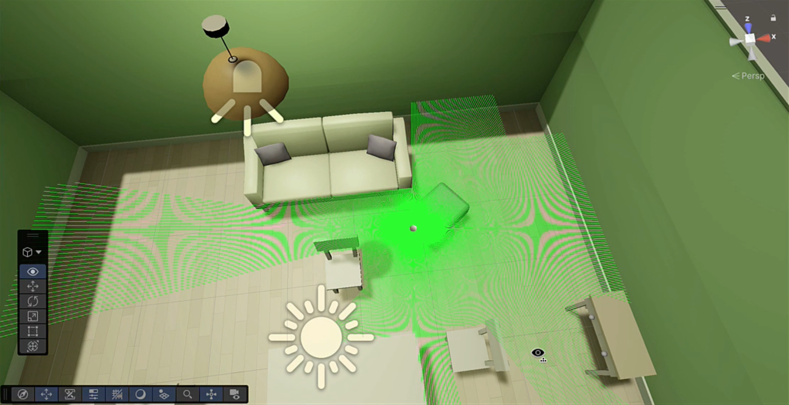

# Module 4 — Creating a Simulation

*Introduction to Unity Robotics and Simulation Pro · Module 4 of 5*

Simulation time, coordinate conversion, and connecting Unity to a live ROS 2 environment — then a
complete simulation in which a Python node navigates a robot around a room using its LiDAR.

By the end of this module you will have a robot driving itself around a Unity Scene under the control
of an `rclpy` node running on a separate machine, exchanging LiDAR, odometry, and velocity messages
over a live connection.

---

## 1. Import the module assets

Go to **Assets > Import Package > Custom Package** and import this module's asset package.

From this point on you work in the **differential drive LiDAR** Scene: a simple room containing the
AMR robot and furniture.

---

## 2. Simulation time

**Every ROS 2 message carries a timestamp.** That is the reason time management matters: whatever
reads your messages downstream needs to know when each one was produced, and the value in that field
depends entirely on who is keeping time.

SimPro's single source of truth for time is:

```csharp
double simulationTime = Clock.Now;
```

`Clock.Now` returns the time in seconds recorded at the *beginning of the current frame*. Called from
`FixedUpdate`, it returns the fixed-update start time; called from `Update`, the frame start time.
Every timestamp in the simulation comes from here.

### 2.1 The three clock modes

The mode is assigned automatically at runtime based on what is in the Scene:

| Mode | Selected when | Time comes from |
|---|---|---|
| **Unity Unscaled** | No GameObject has a `TimeStepApplier` | Unscaled Unity time: `Time.timeAsDouble` and `Time.deltaTimeAsDouble` |
| **Foundation Clock** | A GameObject has an enabled `TimeStepApplier` | The applier, advancing only when its `Step` method is called |
| **External Clock** | Distributed rendering, or an external source publishing clock messages | Outside Unity |

### 2.2 Publishing Unity's time

If Unity keeps time, the simulation should tell ROS 2 what time it thinks it is.

1. Create an empty GameObject named **`Time Manager`**.
2. Add a **Clock Publisher** component.

`ClockPublisher` derives from the `PublisherBehaviour` class from Module 2. On `Update` or
`FixedUpdate` it publishes a clock message carrying the last published time, broadcasting it to any
ROS subscriber that needs it.



### 2.3 Taking manual control of time

You may not want Unity's frame rate deciding how fast the simulation runs. Deterministic stepped
simulation needs time to advance in fixed, explicit increments.

Add a **Time Step Scheduler**. It automatically brings a **Time Step Applier** with it.

| Component | Role |
|---|---|
| **Time Step Scheduler** | Decides *when* to advance. In `LateUpdate` — the end of the frame — it checks whether stepping is currently allowed and calls `StepTimeForward`. |
| **Time Step Applier** | Takes explicit control of Unity's time loop. Advances simulation time only when its `Step` method is called. |

Set **Time step in seconds** on the scheduler to how much time one simulation update represents. With
Unity Unscaled Time, time advances by however long the frame took; here you set it yourself.

**Pause conditions.** The scheduler also accepts **`IPauseCondition`** implementations. While any
registered condition is true, the scheduler stops stepping time and resumes when it no longer
applies. Between the scheduler, the applier, and this interface you have complete control over
simulation time.

### 2.4 Receiving time from ROS 2

The third case: Unity is not the authority on time at all.

Remove the scheduler and add a **Clock Subscriber** instead. It listens for clock updates arriving
through the ROS 2 connector and hands them to the `TimeStepApplier`, which applies them to the
simulation clock.

### 2.5 What this course uses

**Unity Unscaled Time**, and nothing else. Remove the Time Step Scheduler, the Time Step Applier, and
the Clock Subscriber, leaving only a **Clock Publisher** on the Time Manager. Unity keeps its own
unscaled time and publishes it every frame.

### Checkpoint

- `Time Manager` exists in the Hierarchy with a Clock Publisher component.
- No `TimeStepApplier` remains in the Scene, so the simulation runs in Unity Unscaled mode.

---

## 3. Coordinate systems

Unity uses **RUF** - right, up, forward. Positive X points right, positive Y points up, positive Z
points forward.

| System | Convention | Used by |
|---|---|---|
| **RUF** | X right, Y up, Z forward | Unity |
| **LUF** | X left, Y up, Z forward | Unreal Engine |
| **RHR** | X right, Y back, Z up | Blender and other right-hand-rule software |
| **FLU** | X forward, Y left, Z up | ROS and ROS 2 ground vehicles |
| **NED / ENU** | North-east-down / east-north-up | Real-world compass positioning |

A robot that drives the wrong way is very often a coordinate problem. Unity's Z
and ROS's X both mean "forward", so an unconverted position arrives rotated.

One of SimPro's core jobs is converting between Unity and ROS FLU in both directions so your robot
moves the way you intend.

> **Compass settings.** NED and ENU account for `CompassDirection.UnityZAxisDirection`, so geographic
> north, east, south, and west map correctly regardless of how your Scene is oriented. Set this under
> **Simulation > Simulation Settings > Compass Settings**.

### 3.1 Converting in code

SimPro provides conversion methods you call on the value itself:

| Direction | Method | Use when |
|---|---|---|
| Unity → ROS | `.To` with **FLU** | Before publishing a position, orientation, or velocity to ROS 2 |
| ROS → Unity | `.From` with **FLU** | On receiving a message from ROS 2, before using the value in the Scene |

These work on point messages, quaternions, and any other value that needs translating between the two
systems.

```csharp
using UnityEngine;
using Unity.SimulationPro.Foundation;
using Unity.SimulationPro.Foundation.GeometryMessages;

public class MessageConversions : MonoBehaviour
{
    private void Start() {
        var ourMsg = ToMessage(transform.position);
        ToUnity(ourMsg);
    }
    PointMsg ToMessage(Vector3 position)
    {
        Debug.Log(position.To<FLU>());
        return position.To<FLU>();
    }

    Vector3 ToUnity(PointMsg msg)
    {
        Debug.Log(msg.From<FLU>());
        return msg.From<FLU>();
    }
}
```

### 3.2 Read the conversion

The tell is which axis holds which number. If the robot's transform shows **Z = -3**, that value
appears in Unity form on Z and in ROS form on **X**, because the two systems swap those axes. That is
the conversion working.



### Checkpoint

- The Console prints two coordinate values per log cycle.
- The Unity value matches the Inspector's transform; the FLU value has X and Z exchanged.

---

## 4. Connect to a live ROS 2 environment

Modules 1–3 used a **Dummy Connection**, which fakes a ROS environment so messaging can be tested in
isolation. To talk to a real ROS 2 system, swap it for the **ROS Endpoint Connector** - the component
that handles communication with external ROS services.

1. Create an empty GameObject named **`ConnectionManager`**.
2. Add a **Ros Endpoint Connector** component.
3. Remove or disable the Dummy Connection.

Configuration is three fields:

| Field | Value |
|---|---|
| **IP address** | The ROS machine's address (below) |
| **Port** | The endpoint's port: `10000`. |
| **Is ROS 2** | **Checked.** Uncheck it only if you are on ROS 1. |



### 4.1 On the ROS machine

The course uses a virtual machine running **Ubuntu 26.04** and **ROS 2 Lyrical Luth**. Setting up
ROS 2 is documented on the [ROS 2 Wiki](https://docs.ros.org/en/lyrical/). The simulation test files are
included in the course assets.

Get the machine's address:

```bash
hostname -I
```

Open the port through the firewall:

```bash
sudo ufw allow <port>
```

Source the ROS 2 environment:

```bash
source install/setup.bash
```

Start the Unity endpoint server:

```bash
ros2 run ros_tcp_endpoint default_server_endpoint --ros-args -p ROS_IP:=0.0.0.0
```

`ROS_IP:=0.0.0.0` accepts connections on every interface rather than localhost only, which is what
makes the connection possible from a separate Unity machine.

> **Leave the endpoint running.** It must stay open for the whole session. If you need the terminal,
> open a new tab or a second terminal instance rather than stopping it.

### Checkpoint

Press **Play** in Unity.

- Unity's Console reports a successful connection to the IP and port.
- The VM's terminal logs an incoming connection from Unity.


---

## 5. What the simulation actually does

On the ROS 2 side is a package containing **`waypoint_navigator.py`**, written with **`rclpy`** —
the official library for working with ROS 2 from Python. It implements waypoint navigation with
obstacle avoidance, driven by LiDAR data.

```
Unity                                   ROS 2 (rclpy node)
─────                                   ──────────────────
Physics LiDAR ──────/scan──────────►   waypoint_navigator.py
WheelOdometryPublisher ──/odom─────►     ├─ reads scan + odometry
                                          ├─ runs navigation algorithm
CmdVelDifferentialDriveBridge ◄─/cmd_vel─┘
  └─► DifferentialDriveController
        └─► ArticulationBody drives wheels
              └─► new scan and odometry ──► (repeat)
```

The Python script reads the LiDAR and the odometer, computes where to go, and sends back linear and
angular velocity. Unity drives the wheels, the robot moves, and the next scan and odometry reading go
out. Unity is standing in for the physical robot, which also means you can test the same node across different environments before deploying it.

The navigator's internals are mostly trigonometry for angles and waypoints. You do not need to follow
the math to use it.

---

## 6. Add the LiDAR sensor

**Sensor prefabs must sit at position 0, 0, 0.** That is a hard constraint, and it is why you always
add a sensor under a **parent object** and position the parent instead of the sensor.

1. Open the AMR prefab and find the **`front_laser_link`** object.
2. Use it as the LiDAR's parent. Negate its rotation so the sensor faces origin (0, 0, 0).
3. Position it above the middle of the robot.
4. Add a **Physics LiDAR** sensor under it.

Configure the sensor:

| Setting | Value | Why |
|---|---|---|
| **Topic** | `/scan` | What the Python script subscribes to |
| **Update rate** | `20` | Publishes often enough for responsive navigation |
| **Output type** | **Laser scan** | The navigator expects a planar scan, not a point cloud |



### Checkpoint

- The LiDAR sensor's local position is 0, 0, 0 and its parent carries the offset.
- Its topic reads `/scan` and its output type is laser scan.

---

## 7. The differential drive scripts

The AMR prefab carries five scripts. Three participate in ROS messaging; two are pure Unity. Disable
the **Time Step Applier** if one is still present, and delete the `MessageConversions` script from
section 3.

| Script | ROS? | What it does |
|---|---|---|
| **DifferentialDriveController** | No | Pure physics. Turns the wheels through their ArticulationBody components. |
| **DifferentialDriveKeyboardAdapter** | No | Drive the robot from the keyboard through the Input System, to confirm the physics works before involving ROS. |
| **DifferentialAuthoring** | No | Walks an array of the wheels and sets strength, mass, damping, and material on each ArticulationBody. |
| **WheelOdometryPublisher** | Publishes `/odom` | Simulates an odometry sensor. |
| **CmdVelDifferentialDriveBridge** | Subscribes `/cmd_vel` | Receives velocity commands and hands them to the controller. |

### 7.1 DifferentialDriveController

No ROS functionality at all: it neither sends nor receives messages. It holds a differential drive
control message supplied by another script, stores it through `SetCommand` as the last message
received, and in `SetVelocity` reads the message's linear velocity (on Z) and angular velocity and
turns the wheels accordingly.

### 7.2 WheelOdometryPublisher

An odometer measures how far the wheels have turned, in radians. The Python script needs that to
calculate distance travelled.

Its default topic is **`/odom`**. In `CreateMessage` it builds an **odometry message** that is
*already in ROS FLU coordinates*, so no conversion is needed. That message contains two others:

| Contained message | What it holds |
|---|---|
| **Pose with covariance** | The current position and orientation of the wheel |
| **Twist** | The current linear and angular velocity |

A **twist message** expresses velocity in free space, in two parts: **linear** speed (moving forward,
sideways, up, or down) and **angular** speed (turning or spinning on an axis). This is the standard
message type for driving robots.

The distance and radian math is commented in the script if you want to follow it.

### 7.3 CmdVelDifferentialDriveBridge

This is the return leg. It receives **`/cmd_vel`** twist messages from the Python node in a callback,
reads out the linear and angular velocities, clamps them to maximum speeds, and stores them. In
`Update` it calls `ConsumeMessage` on the DifferentialDriveController, passing a differential drive
control message.

Note that the bridge converts coordinates **manually** rather than calling `.To` and `.From`.

### Checkpoint

- Five scripts are present on the AMR prefab, with `MessageConversions` removed.
- Pressing Play with the keyboard adapter enabled drives the robot, confirming the physics works
  independently of ROS.

---

## 8. Run the simulation

On the ROS machine, in order:

```bash
source install/setup.bash
ros2 run ros_tcp_endpoint default_server_endpoint --ros-args -p ROS_IP:=0.0.0.0
```

Then, in a **second terminal**, source again and start the navigator:

```bash
source install/setup.bash
ros2 run simpro_waypoint_nav waypoint_navigator --ros-args \
  -p waypoints:="[0.4, -1.9, 1.8, -2.0, 4.9, -2.2, 4.6, 1.9, 1.5, 2.0, 0.1, 0.0]" \
  -p emergency_stop_cone_deg:=40.0 \
  -p loop_waypoints:=true
```

The waypoints are X/Y pairs. `loop_waypoints:=true` sends the robot back to the first waypoint after
the last one, so it circles indefinitely.

Now press **Play** in Unity.

### Watching it go

The robot begins navigating the living room, using the LiDAR to detect obstacles in its path. Switch
to the **Scene** view to see the scan showing the robot where the gaps are.



### Checkpoint

- The robot moves without being driven by the keyboard.
- The LiDAR scan visibly updates as it advances.
- It reaches waypoints in sequence and loops back to the first.

### 8.1 When it gets stuck

**It may get stuck**, particularly in corners and against walls. In the recording the robot wedges
itself in a corner, works at it for a while, and then heads into a wall.

This is expected behaviour from a navigation algorithm with limited obstacle recovery, not a broken
setup. Stop and replay the Scene. The robot resumes toward the waypoint it was pursuing, finds its
way around the room, and loops back to waypoint one.

That is also the point of simulating first. You find these failures in a Unity living room rather
than a real one, and the next step from here is testing the same node on hardware in a real room.

---

## 9. Where this goes next

You now have a complete simulation: sensors, messaging, and a live ROS 2 Linux environment driving a
robot in Unity.

**Next: [Module 5 — Capturing Data](M5-Capturing-Data.md)**, which covers getting data back *out* of
the simulation: images, point clouds, and CSV logs.
