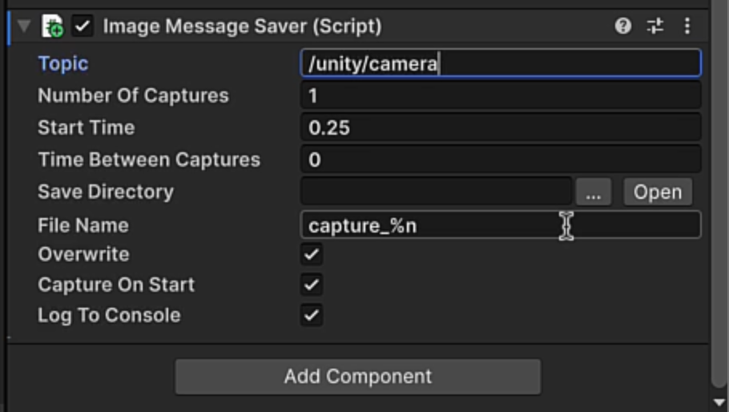
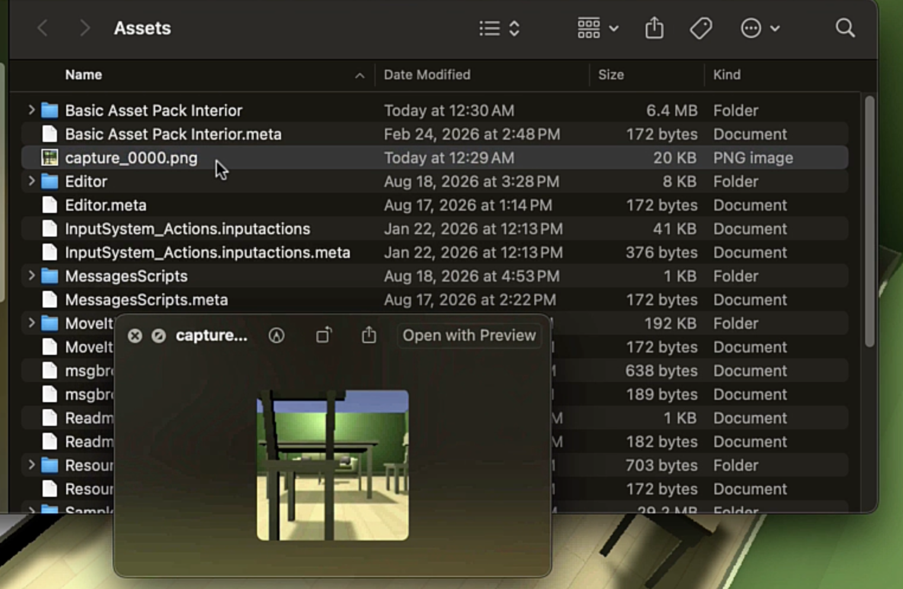
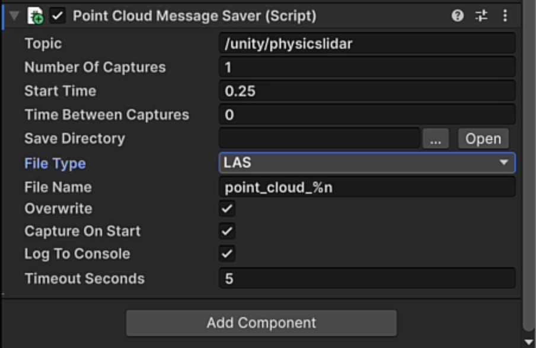
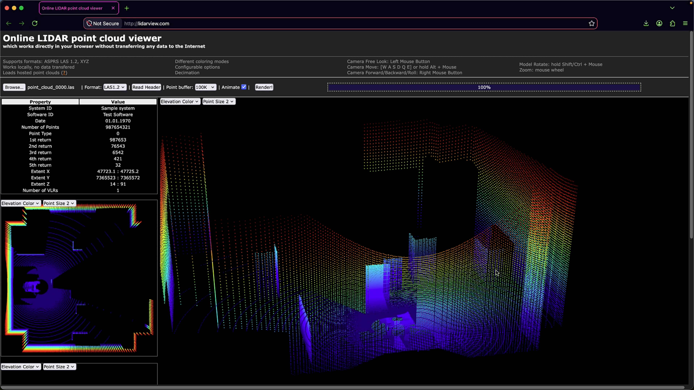
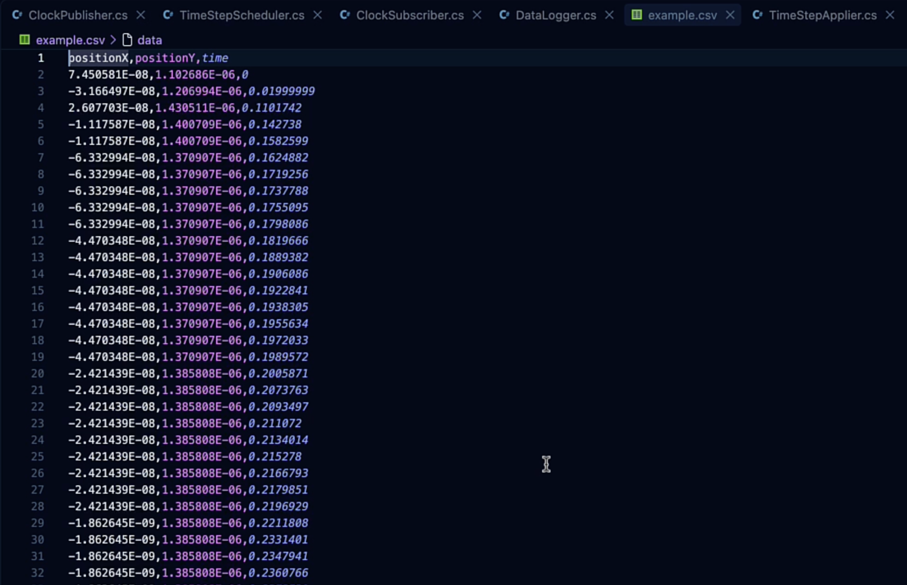

# Module 5 — Capturing Data

*Introduction to Unity Robotics and Simulation Pro · Module 5 of 5*

Getting data out of the simulation and onto disk: sensor images, LiDAR point clouds, and logged values
as CSV.

By the end of this module you will have saved a PNG from a simulated camera, exported a point cloud
and viewed it outside Unity, and written a CSV log of the robot's position over time.

---

## 1. Saving sensor images

Sensors publish messages; they do not write files. Saving output to disk is a separate component you
add alongside the sensor - the **Image Message Saver**. It subscribes to a topic and writes what
arrives.

### 1.1 Add a camera and a saver

1. Select the **`front_laser_link`** object on the robot.
2. Open the **Sensors** panel and add a **Camera** sensor.
3. Add an **Image Message Saver** component. It can go on any GameObject in the Scene; putting it on
   the camera sensor keeps things together.

**The topic must match.** Scroll down on the Camera Sensor component to find the topic it publishes
to - `Unity Camera` by default - and enter that on the saver. The topic must be of type
**`ImageMsg`**, or there is nothing for the saver to write.



Settings:

| Setting | What it controls |
|---|---|
| **Number of captures** | How many images to take |
| **Start time** | When capturing begins |
| **Interval** | Time between captures |
| **Save directory** | Where the files are written |
| **File name** | Base name for the output files |

### 1.2 Capture

1. On **`ConnectionManager`**, disable the ROS Endpoint Connector and enable the **Dummy Connection**.
2. Add the **Default Visualization Suite** to the Scene so you can see what the camera is producing.
3. Save and press **Play**.

When the Camera Sensor's **Status** reads **Ready**, the capture has happened. Select **Open** next to
**Save Directory** to open the folder in your file browser.

The file appears as `capture.png` in your Assets folder. It will be small — the saver writes the
camera's configured resolution, so to change the image size, change **image width** and **height** on
the camera sensor itself, not on the saver.



### Checkpoint

- The Camera Sensor's Status reads Ready in Play mode.
- A `.png` exists in the save directory and shows the Scene from the camera's viewpoint.

---

## 2. Saving point clouds

Same pattern, different saver and a different message type. You need two things: a sensor that
produces a point cloud, and the **Point Cloud Message Saver**.

1. Select **`front_laser_link`** and add a **Physics LiDAR** sensor.
2. Set its **output type** to **Point Cloud**. A laser scan is planar and will not produce a point
   cloud file.
3. Add a **Point Cloud Message Saver** component.
4. Copy the LiDAR's topic into the saver. The topic must be of type **`PointCloud2Msg`**.

The settings are the same as the image saver, with one addition:

| Setting | Options |
|---|---|
| **File type** | **LAS** or **PCD** |

Choose based on what will read the file.



### 2.1 Capture and inspect

Save and press **Play**. The Console confirms that the physics LiDAR's point cloud has been written.
Open the save folder to find the file.



Rendering the cloud shows you what your robot is
actually capturing, which tells you whether the sensor needs repositioning, whether its range or
sample count is wrong, or whether a different sensor type would serve better.

### Checkpoint

- The Console logs the point cloud save.
- A `.las` or `.pcd` file exists in the save directory.
- Rendered externally, the cloud resembles the Scene geometry.

---

## 3. Logging data to CSV

This does not require SimPro. It is ordinary Unity C# writing a file, and it works for any object in
the Editor.

> This section covers CSV only. JSON logging is not covered in this course.

### 3.1 Drive the robot manually

For this you want direct control rather than the waypoint navigator:

1. Enable the **Differential Drive Keyboard Adapter** on the AMR prefab.
2. Leave the waypoint navigator unused.

### 3.2 Write the logger

Create a new MonoBehaviour named **`DataLogger`** in the `Message Scripts` folder. Inside the same
file, add a plain `CSVLogger` class. It does not inherit from MonoBehaviour, since it is just a file
writer.

```csharp
using UnityEngine;
using System.IO;
using System.Linq;

public class DataLogger : MonoBehaviour
{
    CsvLogger csvLogger;
    void Start()
    {
        csvLogger = new CsvLogger("example.csv", "positionX", "positionY", "time");
    }
    // Update is called once per frame
    void Update()
    {
        csvLogger.AddRow(transform.position.x, transform.position.y, Time.time);
    }
    private void OnApplicationQuit() {
        csvLogger.Close();
    }
}

public class CsvLogger
{
    StreamWriter file;
    public CsvLogger(string filename)
    {
        file = new StreamWriter(filename);
    }
    public CsvLogger(string filename, params string[] columnNames): this(filename)
    {
        file.WriteLine(string.Join(",", columnNames));
    }
    public void AddRow(params float[] values)
    {
        file.WriteLine(string.Join(",", values.Select(f=>f.ToString())));
    }
    public void Close()
    {
        file.Close();
    }
}
```

What each piece is for:

| Member | Purpose |
|---|---|
| First constructor | Opens the `StreamWriter` for the given file name |
| Second constructor | Calls the first, then writes the header row from the column names |
| `AddRow` | Converts a float array to strings and writes one comma-joined line |
| `Close` | Closes the file so it is flushed and readable |

Then in `DataLogger`:

1. Hold a `CSVLogger` field.
2. In `Start()`, initialise it with the file name **`example.csv`** and the columns **`positionX`**,
   **`positionY`**, and **`time`**.
3. Add a row containing `transform.position.x`, `transform.position.y`, and `Time.time`.
4. Add `OnApplicationQuit()` and call `Close()` there, so logging stops cleanly and the file saves
   when the application exits.

### 3.3 Read the output

Press **Play** and drive the robot around the Scene to generate positional data, then stop.

`example.csv` is written to the **root project folder**, not the Assets folder. Open it in any editor
or spreadsheet tool and you will find `positionX`, `positionY`, and `time` columns with a row per
logged sample.



### Checkpoint

- `example.csv` exists in the project root after exiting Play mode.
- It has a header row and one row per sample, with values that change as the robot moved.

---

## 4. Course wrap-up

That completes **Introduction to Unity Robotics and Simulation Pro**. Across the five modules you
have:

| Module | What you built |
|---|---|
| **1 — Introduction** | A Unity 6 project with SimPro and its samples, and a Panda arm imported from URDF and configured for stable physics |
| **2 — Messages** | A publisher and subscriber exchanging messages over a Dummy Connection, and TF broadcasting for every joint on the arm |
| **3 — Sensors** | Hands-on with every sensor SimPro ships: camera, fisheye, stereo depth, time of flight, three LiDAR implementations, and IMU |
| **4 — Creating a Simulation** | A complete simulation with a live ROS 2 connection, an `rclpy` node navigating the robot by LiDAR and odometry |
| **5 — Capturing Data** | Images, point clouds, and CSV logs exported from the running simulation |

### Where to go next

- **Robotics and physics fundamentals** - driving ArticulationBodies directly, covered in a later
  course in this pathway.
- **Setting up ROS 2** — this course assumed a working ROS 2 environment. A later course covers
  building one.
- **Deploy to hardware.** The point of the exercise: the `rclpy` node from Module 4 is the same code
  that runs on a physical robot. Having tested it in a Unity living room, the next step is a real one.
