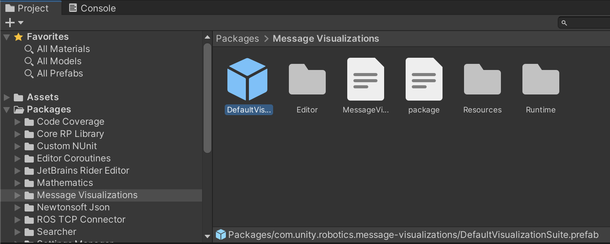
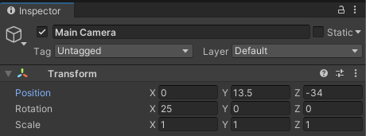
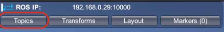
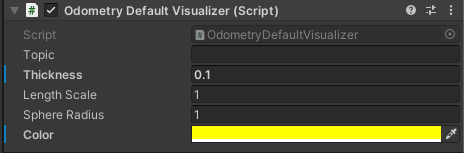
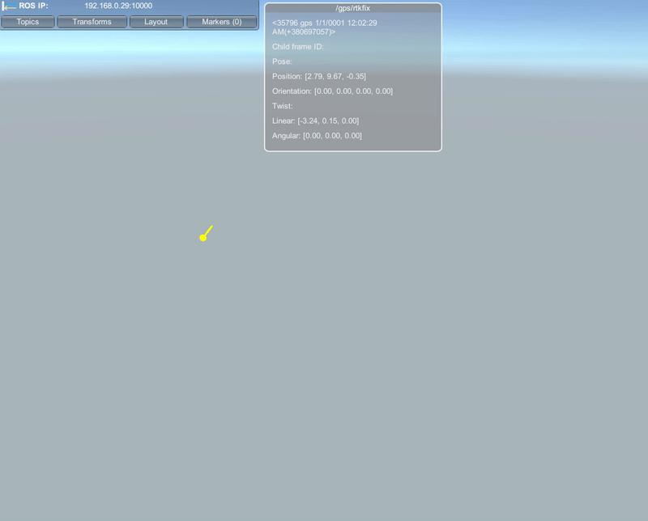
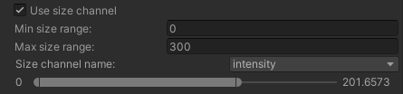
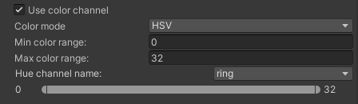
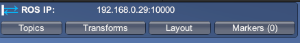
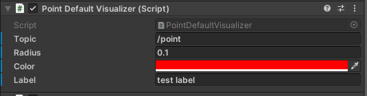
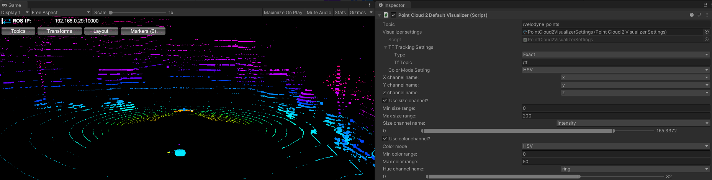

# Message Visualizations

The message visualizations package enables Unity projects to visualize incoming and outgoing information from ROS, such as sensor data, navigation messages, markers, and more. This package provides default configurations for common message types as well as APIs to create custom visualizations.

> This package is compatible with ROS 1 and ROS 2, and Unity versions 2020.2+.

**Table of Contents**
- [Introduction](#introduction)
- [Prerequisites](#prerequisites)
- [Getting Started](#getting-started)
- [Point Clouds](#point-clouds)
- [Configuring a Visualization Suite](#configuring-a-visualization-suite)
- [The HUD](#the-hud)
- [Using the Inspector](#using-the-inspector)
    - [Message Topics](#message-topics)
    - [TF Topics and Tracking](#tf-topics-and-tracking)
    - [Visualization Settings](#visualization-settings)
    - [Joy Messages](#joy-messages)
    - [More on Point Clouds](#more-on-point-clouds)

---

## Introduction

There are a variety of reasons that visualizations can be useful in a simulation. Seeing the data being sent and received within the context of the simulated world offers more information and a better understanding of the state of the simulation, offering insights into data like realtime sensor readings and control signals. Visualizations also enable users to more efficiently debug their robotic simulations with the ability to visually verify coordinate frames, object scaling, offsets, and more.

This page provides steps on how to get started with message visualizations in a Unity project, from installing the package to customizing a visualization suite.

## Prerequisites
- You will need to have ROS—Unity Integration set up in your project in order to send and receive ROS messages. If this is not yet set up, follow the steps [here](../ros_unity_integration/README.md). These steps assume you are continuing to use the project created in the [Setup](../ros_unity_integration/setup.md) step, but these steps can also be done in any Unity project with ROS integration.
- This tutorial will visualize odometry and point cloud data playing back from a rosbag. In your ROS environment, download this demo rosbag from [here](https://open-source-webviz-ui.s3.amazonaws.com/demo.bag), or use the `wget` command:
    ```bash
    wget https://open-source-webviz-ui.s3.amazonaws.com/demo.bag
    ```
    > Please note that while the target rosbag is compatible with ROS 1, the Message Visualizations package is also compatible with ROS 2.

## Getting Started

1. From the Unity Hub, open your Unity project with ROS integration.

2. If you have not already added the Message Visualizations package in your Unity project, follow the [Installation Steps](../quick_setup.md).

3. This package contains a `DefaultVisualizationSuite` prefab that provides visualizer components for many common ROS message types, organized in the hierarchy by package. These components control how messages are displayed in the Unity scene.

    To add the default visualization suite, open the Unity scene that you would like add message visualizations to. In the Project window, expand and select `Packages/Message Visualizations`. Select the `DefaultVisualizationSuite` (indicated by the blue cube Prefab icon) and drag it into your scene Hierarchy.

    

4. We will need to adjust the Main Camera in order to have a better view of the drawings in Game view. In the Hierarchy, select the `Main Camera`. In its Inspector window, set the Transform's position to `(0, 13.5, -34)`, and its rotation to `(25, 0, 0)`.

    

5. In your ROS environment, start the default server endpoint if it is not already running:

    ```
    rosrun ros_tcp_endpoint default_server_endpoint.py
    ```

    > If you have not yet set up the ROS–Unity integration, you can follow the steps [here](../ros_unity_integration/setup.md) to do so now.

6. In Unity, enter Play mode. The heads-up display (HUD) panel in the top left corner of the Game view indicates a successful connection via the colored arrows. If the HUD is not visible, ensure your connection throws no errors, and that `Show HUD` in the ROS Settings is on.

    > If you encounter connection issues, please refer to the [Networking Guide](https://github.com/Unity-Technologies/Unity-Robotics-Hub/blob/main/tutorials/ros_unity_integration/network.md).

7. Once connected, you may begin sending and receiving ROS messages as usual. For this example, we will be playing back the downloaded rosbag. In a new terminal in your ROS workspace, navigate to the directory where you saved the bag file, and run the following command to begin playback on loop:

    ```
    rosbag play -l demo.bag
    ```

8. Topics will, by default, populate in the HUD panel's `Topics` list. Let's begin with visualizing a nav_msgs/Odometry message.

    In Unity, select the `Topics` tab in the HUD. Click the `/gps/rtkfix` topic name to toggle both the `UI` and `Viz` options (alternatively, you can select each individual toggle). `UI` toggles a GUI window that displays a text-formatted version of the message. `Viz` toggles the 3D drawing.

    

9. You should now see a new `UI` window labeled with the `/gps/rtkfix` topic in your Game view, populated with the `nav_msgs/Odometry` data being published.

    You can click and drag the edges of the UI to adjust the size and placement of the topic's window. Additionally, the `Viz` is being drawn and updated in the scene as the rosbag plays! However, you'll notice that it's hard to see from this camera distance--move onto the next step to begin customizing this visualization.

10. Exit Play mode. In the scene Hierarchy, expand the `DefaultVisualizationSuite`. Select the `Nav` child object (for nav_msgs). In its Inspector window, scroll down until you find the `Odometry Default Visualizer`.

    Increase the `Thickness` to `0.1`, and change the color--we chose yellow (and don't forget to increase the color's Alpha value to 1!).

    

2.  Enter Play mode again. Now it's much easier to see the odometry visualization!

    

You've successfully set up visualizations! To proceed with customizing a point cloud visualization, proceed to the [Point Clouds](#point-clouds) section.

## Point Clouds

Using the Message Visualizations package, point cloud visualizations are highly customizable. This section will walk through customization options for a sensor_msgs/PointCloud2 visualization.

1. If you have not already, follow the [Prerequisites](#prerequisites) and [Getting Started](#getting-started) steps to set up the visualizations suite. Exit Play mode if it is still running.

2. We will be visualizing the `/velodyne_points` topic for this tutorial--but we need to find the message type in order to modify the default visualizer for it!

    In your ROS workspace where your sample rosbag is saved, run `rosbag info demo.bag` to view more information about the topic names and types in the rosbag--in this case, we know its ROS message type is sensor_msgs/PointCloud2.

1. In the scene Hierarchy, once again expand the `DefaultVisualizationSuite`. This time, select the `Sensor` child object (for sensor_msgs). In its Inspector window, scroll down until you find the `Point Cloud 2 Default Visualizer`.

2. In the `Topic` field, enter `/velodyne_points`. While the odometry visualization was created based on its message type, you can explicitly set the topic of each visualization to apply customizations to messages on that specific topic.

3. For messages with stamped headers, there is an option to customize the coordinate frame tracking per visualization. This is set via the `TF Tracking Settings`: click it to expand the options. To create each drawing as children of respective *frame_id* GameObjects, change the `Type` to `Track Latest`. The `TF Topic` should be left as default `/tf`.

    > Learn more about TF options in the [TF Topics and Tracking](#tf-topics-and-tracking) section.

4. In your ROS environment, start the default server endpoint and the looped rosbag playback in another terminal if they are not already running:

    ```bash
    # Terminal 1
    rosrun ros_tcp_endpoint default_server_endpoint.py
    ```

    ```bash
    # Terminal 2
    rosbag play -l demo.bag
    ```

5. In Unity, enter Play mode. Open the `Topics` tab, and click the `/velodyne_points` topic to turn on both the `UI` and `Viz`. The point cloud message should now be drawing and updating!

    > Because the TF Tracking Type is set to Track Latest, in your scene Hierarchy, you can expand the `velodyne` frame GameObject all the way down to find the `Drawing/PointCloud` object.

6. We can continue to customize this visualization during runtime. Return to `DefaultVisualizationSuite/Sensor` and scroll back down to the `Point Cloud 2 Default Visualizer`.

    In the Inspector, turn on `Use size channel`. This will add range fields and a slider bar to the Inspector. Leave the `Min size range` to 0, and set the `Max size range` to 300. These values clamp the two ends of the slider range to allow more or less granularity when changing the values on slider.

    Finally, expand the dropdown for `Size channel name` and select `intensity`. This corresponds to the intensity channel in the `/velodyne_points` message, and will now apply size scaling to each point based on the associated intensity reading.

    You may drag the size slider along this range to modify the scaling range of each point, or drag each end of the slider bar. A range approximately between 0-200 works well for this data.

    

7.  Now, turn on the `Use color channel` toggle. The `Color mode` can be left as HSV--this allows you to select one channel for color assignments.

    Under `Hue channel name`, expand the dropdown and select `ring`, corresponding to the ring channel in the `/velodyne_points` message. We know that the `ring` channel defines each of the lidar's 32 lasers, so change the `Max color range` to 32.

    Drag the rightmost end of the color slider bar down so it clamps to 32 as well, leaving your color range clamped between 0-32.

    

1.  You now have a fully configured PointCloud2 visualization! You can learn more about other point cloud-type visualizations (such as LaserScan) in [More on Point Clouds](#more-on-point-clouds) below.

    

---

## Configuring a Visualization Suite

The [Getting Started](#getting-started) steps describes the `DefaultVisualizationSuite` prefab that provides visualizer components for many common ROS message types. You may also create your own visualization suite by creating a GameObject with only the desired default or custom visualizer components for your project.

The UI windows for visualizations will automatically be laid out as they are turned on, but they can also be dragged and resized. The visualizations in the scene can be customized as described in the [Inspector](#using-the-inspector) section. The topics being visualized and the window configurations are saved between sessions and can be exported and loaded via the HUD's `Layout > Export/Import layout` buttons.

## The HUD



<!--  -->

The top-left panel in the Game view provides a GUI system that offers tabs to toggle additional information about the state of the ROS communication and visualizations.

The default tabs on the HUD panel includes:

- **Topics**: Contains a list of all ROS topics on which this current session has sent or received a message. The `UI` toggle enables a window that shows the last message sent or received on that topic. The `Viz` toggle enables an in-scene drawing that represents the last message sent or received on that topic. If no `Viz` toggle is enabled, that topic does not have a default visualizer enabled in the Unity scene.
- **Transforms**: Contains [`tf`](http://wiki.ros.org/tf) visualization options, including displaying the axes, links, and labels for each frame.
- **Layout**: Contains options to save and load this visualization configuration. While the visualization components are by default saved via the scene or the prefab, the window layout and visualized message list is saved as a JSON file. By default, this file is saved to a `RosHudLayout.json` file on your machine's [`Application.persistentDataPath`](https://docs.unity3d.com/ScriptReference/Application-persistentDataPath.html) and loaded on each session. In this Layout tab, you can choose to `Export` this JSON file with a custom name to a chosen location on your device, as well as `Import` a layout JSON file to begin using that saved visualization configuration.
- **Markers**: TODO

The HUD is also designed to be customizable; you may add custom tabs or headers to the HUD. You can write a custom script similar to the [VisualizationLayoutTab](../Runtime/Scripts/VisualizationLayoutTab.cs) to extend the HUD. TODO

## Using the Inspector

The visualizers for each message type are implemented as Unity MonoBehaviours that are added as components to a GameObject in the scene. This is provided via the `DefaultVisualizationSuite` prefab, or in any custom visualization suite. In the `DefaultVisualizationSuite`, each individual default visualizer can be found by expanding the GameObject in the hierarchy and selecting the GameObject corresponding to the message type's package, e.g. `Geometry` for geometry_msgs.

### Message Topics

In the [Getting Started](#getting-started) example, the `/gps/rtkfix` topic is subscribed to and visualized based on the ROS message type. You can also directly assign a topic in the visualizer component's Inspector--you can find the `<Type> Default Visualizer` component by expanding the `DefaultVisualizationSuite` GameObject in the Hierarchy and selecting the child object for the package. In the Inspector window, you will see all the default visualizers provided for this package (you may need to scroll down to see all added components).

The **Topic** field can be specifically assigned to customize visualizations for only that topic. This is particularly useful for adding multiple default visualizers of the same ROS message type, customized for different topics.



### TF Topics and Tracking

For messages with stamped headers, there is an option to customize the coordinate frame tracking per visualization. This is provided in the applicable default visualizers via the `TF Tracking Settings`, which contains options for a topic string and a type.

**TF Topic:** It is important to render 3D visualizations in the proper coordinate frame. By default, the `TF Topic` is assigned to `/tf`, but this can be replaced with a different or namespaced TF topic.

**Tracking Type - Exact:** This setting adds the visualization drawing as a child of the `BasicDrawingManager`. The drawing's transform will be modified directly based on the header contents.

**Tracking Type - Track Latest:** This setting places the visualization drawing as a child GameObject corresponding to the proper `frame_id`. The drawing will have a zeroed local position and rotation, and the *frame* GameObject will be transformed appropriately.

**Tracking Type - None:** This setting will set the local position of the drawing to `Vector3.zero` and the local rotation to be `Quaternion.identity`.

### Visualization Settings

The 3D visualizations offer customizations such as `label` and `color` fields, which will modify the drawing in the scene. Visualizations including lines or arrows (e.g. `sensor_msgs/Imu`) provide options for the length and thickness of the arrow as well as the radius around which any curved arrows are drawn. These customizations will be specific to each message type. Please note that changes to these settings will not be saved during runtime, and you will have to exit Play mode to save these modifications.

> Note: Size-related fields are in Unity coordinates, where 1 unit = 1 meter.


### Joy Messages

TODO

### More on Point Clouds

Similar to the Visualization Settings, point cloud visualizations are highly customizable. Settings for these message visualizers (PointCloud, LaserScan, etc.) will be saved during runtime. For more information on this, you can check out the [base SettingsBasedVisualizer](https://github.com/Unity-Technologies/ROS-TCP-Connector/blob/laurie/VisualizationPackage/com.unity.robotics.message-visualizations/Editor/SettingsBasedVisualizerEditor.cs) class, as well as read more about Unity's [ScriptableObjects](https://docs.unity3d.com/Manual/class-ScriptableObject.html).

The standard settings are provided in ScriptableObjects. Default settings are provided in the [`DefaultVisualizers/Sensor/ScriptableObjects/`]([../Runtime/DefaultVisualizers/Sensor/ScriptableObjects/](https://github.com/Unity-Technologies/ROS-TCP-Connector/tree/laurie/VisualizationPackage/com.unity.robotics.message-visualizations/Runtime/DefaultVisualizers/Sensor/ScriptableObjects)) directory, and can be created by right-clicking in the Project window under `Create > Robotics > Sensor`. After being created, this configuration can be dragged and dropped into the component's Inspector field `Visualizer settings,` or selected by clicking on the small circle to the right of the field.



The settings available will depend on the ROS message type.

**Channel Name**: These settings allow you to choose which channel name corresponds to X, Y, Z, and color channels.

**Size**: Each point is by default a uniform size. This toggle allows you to select a channel that defines the size of each drawn point, e.g. using `intensity` to assign scale based on each point's intensity reading.

**Color**: The color options enable the point clouds to be drawn with configurable colors.

  - The `HSV` option allows you to choose a channel that will be automatically converted to colored points. This can be useful for visualizing individual lasers like a lidar's `ring` channel, for example.

  - The `Combined RGB` option is used for channels that should specifically be parsed into RGB data, e.g. `rgb` channels.

  - The `Separate RGB` is similar to the HSV option, but assigns a different channel to each R, G, and B color channel, which may be used for visualizing X, Y, and Z axes, for example.

**Range**: The min and max value fields configure the ranges for the sliding bar provided. This setting is applied to the respective range field.