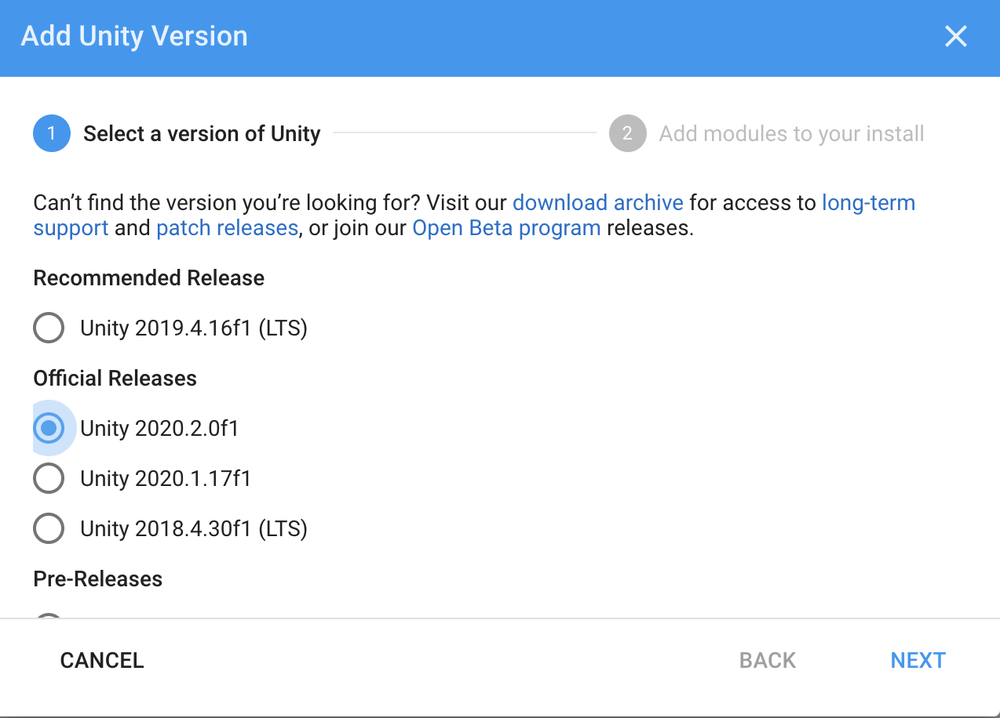

# Installing Unity

_**Unity Version**_: if you want to use the Unity project given by the repository, you need to use a version of Unity at least `2020.2.*`. The easiest way to install Unity is through Unity Hub.

1. Navigate to [this](https://unity3d.com/get-unity/download) page to download Unity Hub 
2. Go to the Unity Hub and in the panel `install`. Then click on `Add` and select the latest release of `Unity 2020.2`.

During the installation of Unity, you will be asked to choose which build support modules you would like to include. For this project, we will not need any of them.

3. You will need a code editor to complete this tutorial. If you do not already have it on your computer, the wizard will give you an option to install _**Visual Studio**_. You may go ahead and check this option if you would like to use _**Visual Studio**_, or you may use a different code editor of your choice.

4. Click on `Install this version with Unity Hub`.