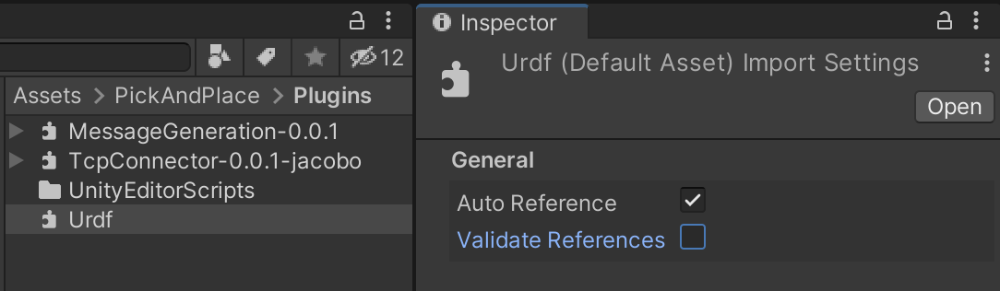
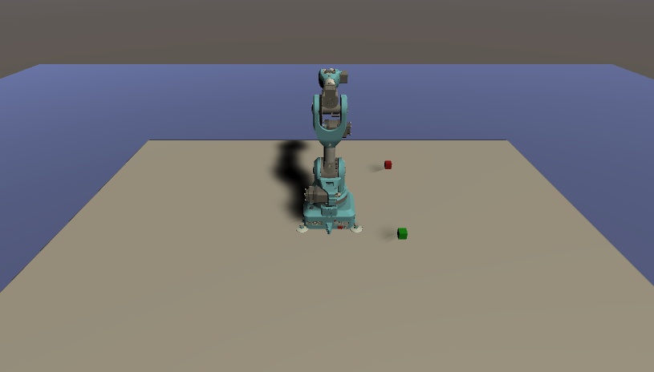

# Pick and Place Tutorial [DRAFT]

## Step 1: Create Unity scene with imported UR3 URDF
  
- Install [Unity Hub](https://unity3d.com/get-unity/download).
  
- Open Unity Hub and navigate to the Installs tab. Select `ADD` to install the latest version of Unity 2020.2 (2020.2.0b7 as of the latest revision).
   
 

- In the Unity Hub, go to the Projects tab. Click the dropdown arrow next to `NEW`, and select the newly downloaded 2020.2 version. Create a new project using the 3D Template.
  
- Download the provided Unity assets [here](https://drive.google.com/file/d/1XVgXX_z_jlbT3s5NeKMbVpBpMrLlT9pY/view?usp=sharing). Once Unity has opened, double click the `.unitypackage` file. In the Import Unity Package window that has opened in Unity, ensure everything is selected, and click `Import`. Once this is done, a folder titled PickAndPlace should be created in the Assets folder, containing Environment, Materials, Models, Prefabs, Plugins, and URDF subfolders.
  
- Load the SampleScene if it is not already open. In the Unity Project window, navigate to `Assets/Prefabs`. Select the Table prefab, and click and drag it into the Hierarchy window. The table should appear in the Scene view with position and rotation `(0,0,0)`. Then, select and drag the Cube into the Hierarchy window. It should appear to sit on the table.

 

- Find and select `Assets/Plugins/Urdf.dll` in the Project window and uncheck `Validate References` in the Inspector.
  
 

- Find and select the URDF file in the Project window (`Assets/PickAndPlace/URDF/ur3_with_gripper/ur3_with_gripper.urdf`). From the menu, click `Assets -> Import Robot from URDF`, or in the Project window, right click on the selected file and click `Import Robot from URDF`.
  
- Keep the default Y Axis type in the Import menu and click `Import URDF`.
  
> Note: Default mesh orientation is Y-up, which is supported by Unity, but some packages often use Z-up and X-up configuration.

- The UR3 should now be visible in the scene! Select the `ur3_with_gripper` object and set its position to `(0,0.77,0)` to place it on top of the table.
  
- In the Hierarchy window, click the arrow to the left of the name to expand the GameObject tree, down to `ur3/world/base_link`. Toggle on `Immovable` for the `base_link`.

 

> Note: A controller is pre-built in the Unity URDF importer to help showcase the movement of the UR3. The Controller script is added to the imported URDF by default. This will add FKrobot and Joint Control components at runtime. 

- Press Play. If everything imported correctly, no errors should appear in the Console window. The robot arm should stay “mounted” to the table, and nothing should fall through the floor. 
  
> Note: If the controller was enabled, joints can be selected using the arrow keys. Use the left/right arrow keys to navigate through the joints, where the selected index will be highlighted in red.

 

- Learn more about the URDF importer tool [here](https://github.com/Unity-Technologies/Robotics-Tutorials/blob/master/urdf_tutorial.md).