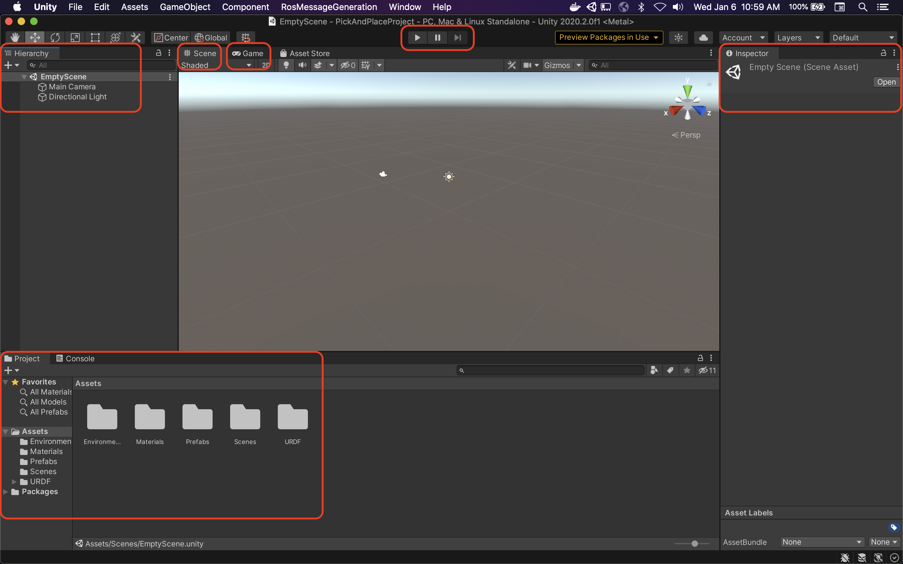
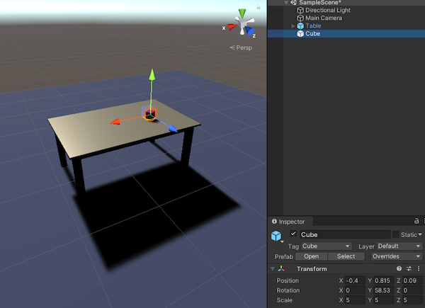
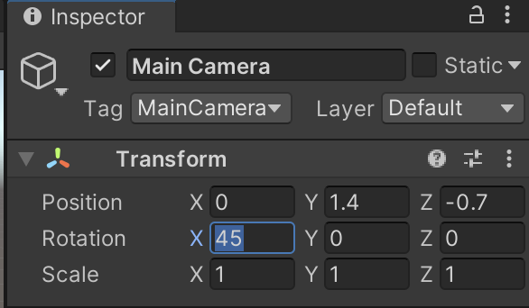
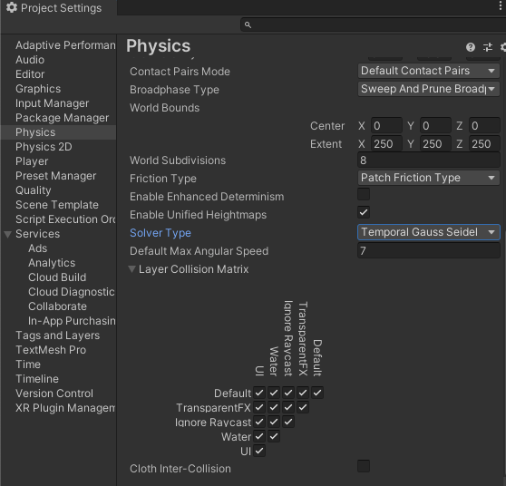
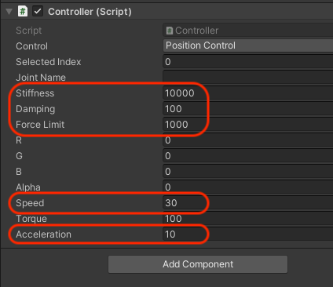
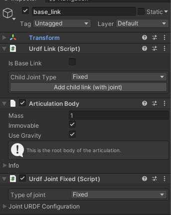

# Pick-and-Place Tutorial: Part 1

This part includes downloading and installing the Unity Editor, setting up a basic Unity scene, and importing a robot using the URDF Importer.
> Note: If you are familiar with Unity and the URDF Importer, or just want to skip directly to setting up ROS, you can do so by opening the `Assets/Scenes/Part1Done` scene and going directly to [Part 2](2_ros_tcp.md).

**Table of Contents**
  - [Setting up the Unity Scene](#setting-up-the-unity-scene)
  - [Create Unity scene with imported URDF](#setting-up-the-robot)
  - [Troubleshooting](#troubleshooting)
  - [Resources](#resources)
  - [Proceed to Part 2](#proceed-to-part-2)

---

## Setting up the Unity Scene

1. If you have not already cloned this project to your local machine, do so now:

    ```bash
    git clone --recurse-submodules https://github.com/Unity-Technologies/Unity-Robotics-Hub.git
    ```

1. Install [Unity Hub](https://unity3d.com/get-unity/download).

1. Go it the "Installs" tab in the Unity Hub, and click the "Add" button. Select Unity **2020.3.11f1 (LTS)**. If this version is no longer available through the hub, you can find it in the [Unity Download Archive](https://unity3d.com/get-unity/download/archive).
   > Note: If you want to use another Unity version, the following versions work for the Pick-and-Place tutorial:

   > - Unity 2020.3: 2020.3.10f1 or later
   > - Unity 2021.1: 2021.1.8f1 or later
   > - Unity 2021.2: 2021.2.a16 or later

1. Go to the "Projects" tab in the Unity Hub, click the "Add" button, and navigate to and select the PickAndPlaceProject directory within this cloned repository (`/PATH/TO/Unity-Robotics-Hub/tutorials/pick_and_place/PickAndPlaceProject/`) to add the tutorial project to your Hub.

   

1. Click the newly added project to open it.

1. In Unity, double click to open the `Assets/Scenes/EmptyScene` scene if it is not already open.
    > Note: If you have some experience with Unity and would like to skip the scene setup portion, you can open the scene named `TutorialScene` now and skip ahead to [Setting up the robot](#setting-up-the-robot).

    > Note: Only one Unity scene should be open at a time. If you see multiple scenes open in the Hierarchy view, double-click the desired scene, e.g. `Assets/Scenes/EmptyScene`, to open it and close the other scenes.

    > The Hierarchy, Scene View, Game View, Play/Pause/Step toolbar, Inspector, Project, and Console windows of the Unity Editor have been highlighted below for reference, based on the default layout. Custom Unity Editor layouts may vary slightly. A top menu bar option is available to re-open any of these windows: Window > General.
    

1. In the Unity Project window, navigate to `Assets/Prefabs`. Select the Table prefab, and click and drag it into the Hierarchy window. The table should appear in the Scene view. Then, select and drag the Target into the Hierarchy window, as well as the TargetPlacement. They should appear to sit on the table.

    


1. Select the `Main Camera` in the Hierarchy. Move the camera to a more convenient location for viewing the robot by assigning the `Main Camera`'s Position to `(0, 1.4, -0.7)`, and the Rotation to `(45, 0, 0)` in the Inspector, which can be found in the Transform component.

    

## Setting Up the Robot

> Note: Presumably when you opened this project, the Package Manager automatically checked out and built the URDF-Importer package for you. You can double-check this now by looking for `Packages/URDF-Importer` in the Project window or by opening the Package Manager window. See the [Quick Setup](../quick_setup.md) steps for adding this package to your own project.

1. Open the Physics Project Settings (in the top menu bar, Edit > Project Settings > Physics) and ensure the `Solver Type` is set to `Temporal Gauss Seidel`. This prevents erratic behavior in the joints that may be caused by the default solver.

    

1. Find and select the URDF file in the Project window (`Assets/URDF/niryo_one/niryo_one.urdf`). From the menu, click `Assets -> Import Robot from URDF`, or in the Project window, right click on the selected file and click `Import Robot from URDF`.
    > Note: The file extension may not appear in the Project window. The niryo_one.urdf file will appear in the root of the `Assets/URDF/niryo_one` directory.

1. Keep the default Y Axis type and VHACD mesh decomposer in the Import menu and click `Import URDF`.

    > Note: Default mesh orientation is Y-up, which is supported by Unity, but some packages often use Z-up and X-up configuration.

    > Note: VHACD algorithm produces higher quality convex hull for collision detection than the default algorithm.

    > Note: The world-space origin of the robot is defined in its URDF file. In this sample, we have assigned it to sit on top of the table, which is at `(0, 0.63, 0)` in Unity coordinates.

    ```xml
    <joint name="joint_world" type="fixed">
        <parent link="world" />
            <child link="base_link" />
        <origin xyz="0 0 0.63" rpy="0 0 0" />
    </joint>
    ```

    > Note: Going from Unity world space to ROS world space requires a conversion. Unity's `(x,y,z)` is equivalent to the ROS `(z,-x,y)` coordinate.

1. Select the newly imported `niryo_one` object in the Scene Hierarchy, and from the Inspector window, find the Controller (Script) component. Set the Stiffness to `10000`, the Damping to `100` and `Force Limit` to `1000`. Set the Speed to `30` and the Acceleration to `10`.
    > Note: You can find information on how these parameters are used in calculations by articulation bodies by referencing [this](https://github.com/Unity-Technologies/Unity-Robotics-Hub/blob/master/tutorials/urdf_importer/urdf_appendix.md#guide-to-write-your-own-controller) technical guide for writing a custom controller. For our purposes, these settings will allow the robot to stay in position without the joints slipping.

    

1. In the Hierarchy window, click the arrow to the left of the name to expand the GameObject tree, down to `niryo_one/world/base_link`. Toggle on `Immovable` for the `base_link`.

    

    > Note: A controller is pre-built in the Unity URDF Importer to help showcase the movement of the Niryo. The Controller script is added to the imported URDF by default. This will add FKrobot and Joint Control components at runtime. The Controller script can be found in the project at `Assets/Packages/URDF Importer/Runtime/Controller/Controller.cs`.

1. Press the Play button at the top of the Unity Editor to enter Play Mode. If everything imported correctly, no errors should appear in the Console window. The robot arm should stay “mounted” to the table, and nothing should fall through the floor.

    Using the Controller, joints can be selected using the arrow keys. Use the left/right arrow keys to navigate through the joints, where the selected index will be highlighted in red. Use the up/down arrow keys to control the selected joint movement. The Controller script on the niryo_one object will describe the actively `Selected Index` as well as the `Joint Name`.

   

---

## Troubleshooting
- If you are not seeing `Import Robot from URDF` in the `Assets` menu, check the console for compile errors. The project must compile correctly before the editor tools become available.
- If the robot appears loose/wiggly or is not moving with no console errors, ensure that the Stiffness and Damping values on the Controller script of the `niryo_one` object are set to `10000` and `100`, respectively.

---

## Resources

- More on the URDF Importer tool [here](https://github.com/Unity-Technologies/URDF-Importer)
- Unity [Articulation Body Manual](https://docs.unity3d.com/2020.2/Documentation/Manual/class-ArticulationBody.html)
- For an introduction to Unity, check out the [Roll-a-Ball tutorial](https://learn.unity.com/project/roll-a-ball)

---


### Proceed to [Part 2](2_ros_tcp.md).
