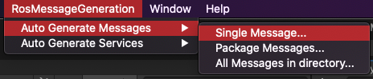

# Pick-and-Place Tutorial: Part 2

This part assumes you have access to a functional ROS workspace. If you do not yet have a working ROS setup, refer to the [Resources](#resources) section below to get started. 

If you're new to ROS, check out the [Start Guide](http://wiki.ros.org/ROS/StartGuide) on the ROS Wiki to get started.

Steps covered in this tutorial include creating a TCP connection between Unity and ROS, generating C# scripts from a ROS message, and publishing and subscribing to a ROS Topic. These steps are adapted from the [ROS–Unity Integration Tutorials](../ros_unity_integration/README.md).

**Table of Contents**
  - [Setup](#setup)
  - [The Unity Side](#the-unity-side)
  - [The ROS side](#the-ros-side)
  - [Troubleshooting](#troubleshooting)
  - [Resources](#resources)
  - [Proceed to Part 3](#proceed-to-part-3)

---

## Part 2: ROS–Unity Integration


**Quick Description:**

To enable communication between Unity and ROS, a TCP endpoint running as a ROS node handles all message passing. On the Unity side, a `ROSConnection` component provides the necessary functions to publish, subscribe, or call a service using the TCP endpoint ROS node. The ROS messages being passed between Unity and ROS are expected to be serialized exactly as ROS serializes them internally. This is achieved with the MessageGeneration plugin which generates C# classes, including serialization and deserialization functions, from ROS messages.

---

## Setup

1. If you have not already, complete [Part 1](1_urdf.md) to set up the Unity project. 

1. Navigate to the `Unity-Robotics-Hub/tutorials/pick_and_place/ROS` directory of this downloaded repo. 
   - This directory will be used as the [ROS catkin workspace](http://wiki.ros.org/catkin/Tutorials/using_a_workspace).
   - If you cloned the project and forgot to use `--recurse-submodules`, or if any submodule in this directory doesn't have content, you can run the command `git submodule update --init --recursive` to download packages for Git submodules. 
   - Copy or download this directory to your ROS operating system if you are doing ROS operations in another machine, VM, or container.
   - This contains ROS packages for the pick-and-place task, including [ROS TCP Endpoint](https://github.com/Unity-Technologies/ROS-TCP-Endpoint), [Niryo One ROS stack](https://github.com/NiryoRobotics/niryo_one_ros), [MoveIt Msgs](https://github.com/ros-planning/moveit_msgs), `niryo_moveit`, and `niryo_one_urdf`.

---

## The Unity Side

1. If the PickAndPlaceProject Unity project is not already open, select and open it from the Unity Hub.

   > Note: The Package Manager automatically checked out and built the ROS-TCP-Connection package in this project. You can verify this now by looking for `Packages/ROS-TCP-Connector` in the Project Browser or by opening the Package Manager window.

   > The ROS-TCP-Connector package includes two pieces: TcpConnector, which contains the `ROSConnection` script described above, and MessageGeneration, which generates C# scripts from ROS msg and srv files.

   > Using this MessageGeneration component, three C# message scripts will be generated. Like their ROS msg counterparts, these scripts define the data values and contents that will be passed between Unity and ROS.

   > Note: Read more about the ROS msg [here](http://wiki.ros.org/msg).

   > Note: Read more about the ROS srv [here](http://wiki.ros.org/srv).

1. We will start with generating the MoveItMsg: RobotTrajectory. 

   Select `RosMessageGeneration -> Auto Generate Messages -> Single Message` from the menu.

   

   In the Message Auto Generation window click `Browse File...` and navigate to the MoveIt Msgs repository. Select `moveit_msgs/msg/RobotTrajectory.msg`, and then click `GENERATE!` 
	- One new C# script should populate the `Assets/RosMessages/Moveit/msg` directory: RobotTrajectory.
  
   > Note: If any of these ROS directories appear to be empty, you can run the command `git submodule update --init --recursive` to download the packages via Git submodules.
   
1. Next, the custom message scripts for this tutorial will be generated. 

   Select `RosMessageGeneration -> Auto Generate Messages -> All Messages in Directory`. 
   
   In the Message Auto Generation window, click `Select Folder…` and navigate to the `niryo_moveit` directory, e.g. `Unity-Robotics-Hub/tutorials/pick_and_place/ROS/src/niryo_moveit/`. Select the `msg` folder, and then click `GENERATE!`

	- Two new C# scripts should populate the `Assets/RosMessages/NiryoMoveit/msg` directory: NiryoMoveitJoints and NiryoTrajectory.
	
  
   > MessageGeneration generates a C# class from a ROS msg file with protections for use of C# reserved keywords and conversion to C# datatypes. Learn more about [ROS Messages](https://wiki.ros.org/Messages).

1. Now that the messages have been generated, the service for moving the robot will be created. 

   In the menu, select `RosMessageGeneration -> Auto Generate Services -> Single Service`. 

1. In the Service Auto Generation window, click `Browse File...` and navigate to the niryo_moveit/srv directory, e.g. `Unity-Robotics-Hub/tutorials/pick_and_place/ROS/src/niryo_moveit/srv`. Choose the `MoverService.srv` file, and then click `GENERATE!` 

   - Two new C# scripts should populate the `Assets/RosMessages/NiryoMoveit/srv` directory: MoverServiceRequest and MoverServiceResponse. 
   

   > MessageGeneration generates two C# classes, a request and response, from a ROS srv file with protections for use of C# reserved keywords and conversion to C# datatypes. Learn more about [ROS Services](https://wiki.ros.org/Services).

1. In this repo, navigate to `Unity-Robotics-Hub/tutorials/pick_and_place`. Select and copy the `Scripts` folder and contents into the `Assets` folder of your Unity project. You should now find two C# scripts in your project's `Assets/Scripts`.

   > Note: The SourceDestinationPublisher script is included. This script will communicate with ROS, grabbing the positions of the target and destination objects and sending it to the ROS Topic `"SourceDestination_input"`. On `Start()`, the TCP connector is instantiated with a ROS host name and port, and the articulation body values are assigned based on the GameObjects that will be assigned shortly. The `Publish()` function is defined as follows:

   ```csharp
   public void Publish()
   {
      NiryoMoveitJoints sourceDestinationMessage = new NiryoMoveitJoints();

      sourceDestinationMessage.joint_00 = jointArticulationBodies[0].xDrive.target;
      sourceDestinationMessage.joint_01 = jointArticulationBodies[1].xDrive.target;
      sourceDestinationMessage.joint_02 = jointArticulationBodies[2].xDrive.target;
      sourceDestinationMessage.joint_03 = jointArticulationBodies[3].xDrive.target;
      sourceDestinationMessage.joint_04 = jointArticulationBodies[4].xDrive.target;
      sourceDestinationMessage.joint_05 = jointArticulationBodies[5].xDrive.target;

      // Pick Pose
      sourceDestinationMessage.pick_pose = new RosMessageTypes.Geometry.Pose
      {
         position = new Point(
               target.transform.position.z,
               -target.transform.position.x,
               target.transform.position.y
         ),
         orientation = pickOrientation
      };

      // Place Pose
      sourceDestinationMessage.place_pose = new RosMessageTypes.Geometry.Pose
      {
         position = new Point(
               targetPlacement.transform.position.z,
               -targetPlacement.transform.position.x,
               targetPlacement.transform.position.y
         ),
         orientation = pickOrientation
      };

      // Finally send the message to server_endpoint.py running in ROS
      ros.Send(topicName, sourceDestinationMessage);
   }
   ```

   > This function first takes in the current joint target values. Then, it grabs the poses of the `target` and the `targetPlacement` objects, adds them to the newly created message `sourceDestinationMessage`, and calls `Send()` to send this information to the ROS topic `topicName` (defined as `"SourceDestination_input"`). 

   > Note: Going from Unity world space to ROS world space requires a conversion. Unity's `(x,y,z)` is equivalent to the ROS `(z,-x,y)` coordinate.

1. Return to the Unity Editor. Now that the message contents have been defined and the publisher script added, it needs to be added to the Unity world to run its functionality. 

   Right click in the Hierarchy window and select "Create Empty" to add a new empty GameObject. Name it `Publisher`. Add the newly created SourceDestinationPublisher component to the Publisher GameObject by selecting the Publisher object. Click "Add Component" in the Inspector, and begin typing "SourceDestinationPublisher." Select the component when it appears.       
   > Note: Alternatively, you can drag the script from the Project window onto the Publisher object in the Hierarchy window.

   

1. Next, the object that will hold the TCP functionality needs to be added. 

   Create another GameObject, name it RosConnect, and add the script `Assets/Plugins/TCPConnector/ROSConnection` to it in the same way.

1. Note that these components show empty member variables in the Inspector window, which need to be assigned. 

   Select the Target object in the Hierarchy and assign it to the `Target` field in the Publisher. Similarly, assign the TargetPlacement object to the `TargetPlacement` field. Assign the niryo_one robot to the `Niryo One` field. Finally, assign the newly created RosConnect object to the `Ros` field.

   

1.  Once again, select the RosConnect object. The `Host Name` should be the IP address of your ROS machine (*not* the one running Unity).

    - Find the IP address of your ROS machine. In Ubuntu, open a terminal window, and enter `hostname -I`.

    - Replace the `Host Name` value with the IP address of your ROS machine. Ensure that the `Host Port` is set to `10000`.

    - If you are going to run ROS services with docker container introduced [below](#the-ros-side), fill `Host Name` and `Override Unity IP` with the loopback IP address `127.0.0.1`.

1. To call the `Publish()` function, a UI element will be added for user input. In the Hierarchy window, right click to add a new UI > Button. Note that this will create a new Canvas parent as well. 
	> Note: In the `Game` view, you will see the button appear in the bottom left corner as an overlay. In `Scene` view the button will be rendered on a canvas object that may not be visible.
   
   > Note: In case the Button does not start in the bottom left, it can be moved by setting the `Pos X` and `Pos Y` values in its Rect Transform component. For example, setting its Position to `(-200, -200, 0)` would set its position to the bottom right area of the screen. 
  
1. Select the newly made Button object, and scroll to see the Button component in the Inspector. Click the `+` button under the empty `OnClick()` header to add a new event. Select the `Publisher` object in the Hierarchy window and drag it into the new OnClick() event, where it says `None (Object)`. Click the dropdown where it says `No Function`. Select SourceDestinationPublisher > `Publish()`.

   

1. To change the text of the Button, expand the Button Hierarchy and select Text. Change the value in Text on the associated component.

   

---

## The ROS side

> Note: This project has been tested with Python 2 and ROS Melodic, as well as Python 3 and ROS Noetic.

Most of the ROS setup has been provided via the `niryo_moveit` package. This section will describe the `.launch` files and start the necessary ROS nodes for communication. Two methods are provideds to launch ROS nodes and services: either using a ROS docker container or doing it manually in your own ROS environment.

### Use Docker Container

1. [Install Docker Engine](https://docs.docker.com/engine/install/)

1. Build the ROS docker image

  ```bash
  cd /YOUR/UNITY-ROBOTICS-HUB/REPOSITORY/tutorials/pick_and_place &&
  git submodule update --init --recursive &&
  docker build -t unity-robotics:pick-and-place -f docker/Dockerfile .
  ```

1. Run ROS in a new docker container

  ```bash
  docker run -it --rm -p 10000:10000 -p 5005:5005 unity-robotics:pick-and-place part_2 /bin/bash
  ```

1. Terminate docker container

Press `Ctrl + C` or `Cmd + C` to terminate the docker container.

### Manually Setup ROS

1. The provided files require the following packages to be installed. ROS Melodic users should run the following commands if the packages are not already present:

   ```bash
   sudo apt-get update && sudo apt-get upgrade
   sudo apt-get install python-pip ros-melodic-robot-state-publisher ros-melodic-moveit ros-melodic-rosbridge-suite ros-melodic-joy ros-melodic-ros-control ros-melodic-ros-controllers ros-melodic-tf2-web-republisher
   sudo -H pip install rospkg jsonpickle
   ```

   ROS Noetic users should run:

   ```bash
   sudo apt-get update && sudo apt-get upgrade
   sudo apt-get install python3-pip ros-noetic-robot-state-publisher ros-noetic-moveit ros-noetic-rosbridge-suite ros-noetic-joy ros-noetic-ros-control ros-noetic-ros-controllers
   sudo -H pip3 install rospkg jsonpickle
   ```

   > In your ROS workspace, find the directory `src/niryo_moveit/scripts`. Note the file `server_endpoint.py`. This script imports the necessary dependencies from tcp_endpoint and starts the server. `rospy.spin()` ensures the node does not exit until it is shut down.

   ```python
   ...
   tcp_server.start()
   rospy.spin()
   ...
   ```

   > Additionally, note the file `src/niryo_moveit/scripts/trajectory_subscriber.py`. This script subscribes to the SourceDestination topic. When something is published to this topic, this script will print out the information heard. 

1. If you have not already built and sourced the ROS workspace since importing the new ROS packages, navigate to your ROS workplace, and run `catkin_make && source devel/setup.bash`. Ensure there are no errors.

1. The ROS parameters will need to be set to your configuration in order to allow the server endpoint to fetch values for the TCP connection. Navigate to `src/niryo_moveit/config/params.yaml` and open the file for editing. You will need to know the IP address of your ROS machine as well as the IP address of the machine running Unity. 
   - The ROS machine IP, i.e. `ROS_IP` should be the same value as the one set as `Host Name` on the RosConnect component in Unity.
   - Update the `ROS_IP` below with the appropriate addresses and copy the contents into the `params.yaml` file.

      ```yaml
      ROS_IP: <your ROS IP>
      ```
      
      e.g.

      ```yaml
      ROS_IP: 192.168.50.149
      ```

      > Note: Learn more about the server endpoint and ROS parameters [here](../ros_unity_integration/server_endpoint.md).

   > This YAML file is `rosparam set` from the launch files provided for this tutorial, which has been copied below for reference. Additionally, the server_endpoint and trajectory_subscriber nodes are launched from this file. 

   ```xml
   <launch>
      <rosparam file="$(find niryo_moveit)/config/params.yaml" command="load"/>
      <node name="server_endpoint" pkg="niryo_moveit" type="server_endpoint.py" args="--wait" output="screen" respawn="true" />
      <node name="trajectory_subscriber" pkg="niryo_moveit" type="trajectory_subscriber.py" args="--wait" output="screen"/>
   </launch>
   ```

   > Note: The launch files for this project are available in the package's `launch` directory, i.e. `src/niryo_moveit/launch/`.

1. Open a new terminal window in the ROS workspace. Once again, source the workspace. Then, run the following `roslaunch` in order to set the ROS parameters, start the server endpoint, and start the trajectory subscriber.

    ```bash
    roslaunch niryo_moveit part_2.launch
    ```

    > Note: Running `roslaunch` automatically starts [ROS Core](http://wiki.ros.org/roscore) if it is not already running. 

    This launch will print various messages to the console, including the set parameters and the nodes launched. 
    
    Ensure that the `process[server_endpoint]` and `process[trajectory_subscriber]` were successfully started, and that a message similar to `[INFO] [1603488341.950794]: Starting server on 192.168.50.149:10000` is printed.

1. Return to Unity, and press Play. Click the UI Button in the Game view to call SourceDestinationPublisher's `Publish()` function, publishing the associated data to the ROS topic. View the terminal in which the `roslaunch` command is running. It should now print `I heard:` with the data.
  
ROS and Unity have now successfully connected!

   

---

## Troubleshooting
- If the error `[rosrun] Found the following, but they're either not files, or not executable: server_endpoint.py` appears, the Python script may need to be marked as executable via `chmod +x Unity-Robotics-Hub/tutorials/pick_and_place/ROS/src/niryo_moveit/scripts/server_endpoint.py`.

- `...failed because unknown error handler name 'rosmsg'` This is due to a bug in an outdated package version. Try running `sudo apt-get update && sudo apt-get upgrade` to upgrade.
  
- If Unity fails to find a network connection, ensure that the ROS IP address is entered correctly as the Host Name in the RosConnect in Unity, and that the `src/niryo_moveit/config/params.yaml` values are set correctly. 

---

## Resources

- Setting up a ROS workspace:
   
   > Note: this tutorial was made using ROS Melodic.
   -  http://wiki.ros.org/ROS/Installation
   -  http://wiki.ros.org/ROS/Tutorials/InstallingandConfiguringROSEnvironment
   - http://wiki.ros.org/catkin/Tutorials/create_a_workspace
- More on [ROS Topics](http://wiki.ros.org/Topics)
- [ROS–Unity Integration Tutorials](../ros_unity_integration/README.md)
- [ROS TCP Connector](https://github.com/Unity-Technologies/ROS-TCP-Connector) package
- [TCP Endpoint](https://github.com/Unity-Technologies/ROS-TCP-Endpoint) package
- [Niryo One ROS stack](https://github.com/NiryoRobotics/niryo_one_ros)
- [MoveIt Msgs](https://github.com/ros-planning/moveit_msgs)
  
---

#### Proceed to [Part 3](3_pick_and_place.md).