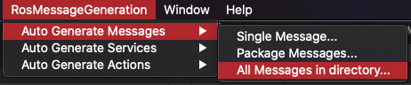
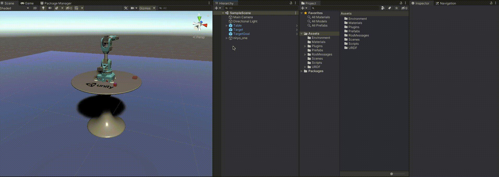
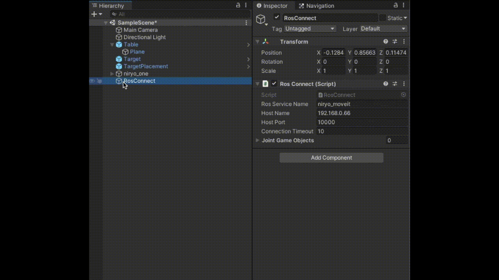

# Pick and Place Tutorial

This step assumes you have access to a functional ROS workspace. If you do not yet have a working ROS setup, refer to the [Resources](#resources) section below to get started. 

Steps covered in this tutorial include creating a TCP connection between Unity and ROS, generating C# scripts from a ROS message, and publishing and subscribing to a ROS Topic.

## Table of Contents
- [Pick and Place Tutorial](#pick-and-place-tutorial)
  - [Table of Contents](#table-of-contents)
  - [Step 2: Unity & ROS Integration](#step-2-unity--ros-integration)
  - [The Unity Side](#the-unity-side)
  - [The ROS side](#the-ros-side)
  - [Troubleshooting](#troubleshooting)
  - [Resources](#resources)

---

## Step 2: Unity & ROS Integration


**Quick Descripton:**

To enable communication between Unity and ROS a TCP endpoint running as a ROS node handles all message passing. On the Unity side, a TCPConnector plugin provides the necessary scripts to publish, subscribe, or call a service using the TCP endpoint ROS node. The ROS messages being passed between Unity and ROS are expected to be serialized exactly as ROS serializes them internally. This is achieved with the MessageGeneration plugin which generates C# classes, including serialization and deserialization functions, from ROS messages.

---

- If you have not already, complete [Step 1](1_urdf.md) to set up the Unity project. 

- Navigate to the `Unity-Robotics-Hub/tutorials/pick_and_place/ROS` directory of this downloaded repo. Place the `niryo_moveit` directory inside the `src` directory of your ROS workspace, e.g. `~/catkin_ws/src`. 
	- This package contains Python scripts, MoveIt configurations, and other necessary files for the pick and place task.
	
   > Note: The reduced version of all the packages needed in this tutorial can be downloaded on the [Pick and Place Release](https://github.com/Unity-Technologies/Unity-Robotics-Hub/releases) as only a small subset of the files in the packages to be downloaded below are required for this demo.

- Download or clone the latest [ROS TCP Endpoint](https://github.com/Unity-Technologies/ROS_TCP_Endpoint) repository, and add the `tcp_endpoint` package to the `src` directory of your ROS workspace. This package creates the endpoint to accept ROS messages from Unity.

-  Download or clone the latest [Niryo One ROS stack](https://github.com/NiryoRobotics/niryo_one_ros) repository. Add the subdirectories (e.g. dynamixel_sdk/, mcp_can_rpi/, niryo_one/, etc.) to the `src` directory of your ROS workspace.

- Download or clone the latest [MoveIt Msgs](https://github.com/ros-planning/moveit_msgs) repository. Add the entire `moveit_msgs` directory to the `src` directory of your ROS workspace.

## The Unity Side

- If the current Unity project is not already open, select and open it from the Unity Hub.

- Download or clone the latest [TCP Connector](https://github.com/Unity-Technologies/ROS-TCP-Connector) repository. In the ROS-TCP-Connector, copy the `MessageGeneration` and `TcpConnector` directories to the Unity project's Assets/Plugins directory.

- Adding `MessageGeneration` creates a new Unity menu option, “RosMessageGeneration.” Select `RosMessageGeneration -> Auto Generate Messages` and select `Single Message`.



-  In the Message Auto Generation window that appears, next to the Input Package Path, click `Browse File...` and navigate to the newly downloaded MoveIt Msgs repository. Select `moveit_msgs/msg/RobotTrajectory.msg`, and then click `GENERATE!` A window will appear to notify that the Code Generation is Complete. 
	-  If this is successful, 1 new C# script should populate the `Assets/RosMessages/Moveit/msg` directory: RobotTrajectory.
   
- Once again go to the `RosMessageGeneration -> Auto Generate Messages` and select `All Messages in Directory`. In the Message Auto Generation window that appears, next to the Input Package Path, click `Browse Package…` and navigate to the `niryo_moveit` directory, e.g. `~/catkin_ws/src/niryo_moveit/`. Select the `msg` folder, and then click `GENERATE!` A window will appear to notify that the Code Generation is Complete. 
	- If this is successful, 2 new C# scripts should populate the `Assets/RosMessages/NiryoMoveit/msg` directory: NiryoMoveitJoints and NiryoTrajectory.
  
   > MessageGeneration generates a C# class from a ROS msg file with protections for use of C# reserved keywords and conversion to C# datatypes.

- Now that the messages have been generated, the service will be created. In the menu, select `RosMessageGeneration -> Auto Generate Services` and select `Single Service`. 

- In the Service Auto Generation window that appears, next to the Input Package Path, click `Browse Package…` and navigate to the niryo_moveit/srv directory, e.g. `~/catkin_ws/src/niryo_moveit/srv`. Choose the `MoverService.srv` file, and then click `GENERATE!` If this is successful, 2 new C# scripts should populate the `Assets/RosMessages/NiryoMoveit/srv` directory: MoverServiceRequest and MoverServiceResponse. 
  
   > MessageGeneration generates two C# classes, a request and response, from a ROS srv file with protections for use of C# reserved keywords and conversion to C# datatypes.

- In this cloned or downloaded repo, navigate to `Unity-Robotics-Hub/tutorials/pick_and_place`. Select and copy the `Scripts` folder and contents into the `Assets` folder of your Unity project. You should now find two C# scripts in your project's `Assets/Scripts`.

- Note the SourceDestinationPublisher script. This script will communicate with ROS, grabbing the positions of the target and destination objects and sending it to the ROS Topic `"SourceDestination_input"`. On `Start()`, the TCP connector is instantiated with a ROS host name and port, and the articulation body values are assigned based on the GameObjects that will be assigned shortly. The `Publish()` function is defined as follows:

```csharp
public void Publish()
{
   NiryoMoveitJoints sourceDestinationMessage = new NiryoMoveitJoints();

   sourceDestinationMessage.joint_00 = jointArticulationBodies[0].xDrive.target;
   sourceDestinationMessage.joint_01 = jointArticulationBodies[1].xDrive.target;
   sourceDestinationMessage.joint_02 = jointArticulationBodies[2].xDrive.target;
   sourceDestinationMessage.joint_03 = jointArticulationBodies[3].xDrive.target;
   sourceDestinationMessage.joint_04 = jointArticulationBodies[4].xDrive.target;
   sourceDestinationMessage.joint_05 = jointArticulationBodies[5].xDrive.target;

   // Pick Pose
   sourceDestinationMessage.pick_pose = new RosMessageTypes.Geometry.Pose
   {
      position = new Point(
            target.transform.position.z,
            -target.transform.position.x,
            target.transform.position.y
      ),
      orientation = pickOrientation
   };

   // Place Pose
   sourceDestinationMessage.place_pose = new RosMessageTypes.Geometry.Pose
   {
      position = new Point(
            targetPlacement.transform.position.z,
            -targetPlacement.transform.position.x,
            targetPlacement.transform.position.y
      ),
      orientation = pickOrientation
   };

   // Finally send the message to server_endpoint.py running in ROS
   tcpCon.SendMessage(topicName, sourceDestinationMessage);
}
```

This function first takes in the current joint target values. Then, it grabs the poses of the `target` and the `targetPlacement` objects, adds them to the newly created message `sourceDestinationMessage`, and calls `SendMessage()` to send this information to the ROS topic `topicName` (defined as `"SourceDestination_input"`). 

> Note that going from Unity world space to ROS world space requires a conversion. Unity's `(x,y,z)` is equivalent to the ROS `(z,-x,y)` coordinate.

- Return to the Unity Editor. Right click in the Hierarchy window and select Create Empty to add a new empty GameObject. Name it RosConnect. Add the newly created SourceDestinationPublisher component to the RosConnect GameObject by selecting the SourceDestinationPublisher script in the Project window and dragging it onto the RosConnect object in the Hierarchy window.



Confirm that the component has been added to the RosConnect object successfully by checking for it in the Inspector.

- Select the Target object in the Hierarchy and assign it to the `Target` field in the SourceDestinationPublisher. Similarly, assign the TargetPlacement object to the `TargetPlacement` field. Finally, assign the niryo_one robot to the `Niryo One` field.


<!-- - Expand the Joint Game Objects list. In this order, drag and drop the following objects into the Joint Game Objects list: shoulder_link, arm_link, elbow_link, forearm_link, wrist_link, hand_link. 
  - This can be done by expanding the niryo_one Hierarchy through `niryo_one/world/base_link/shoulder_link/arm_link/...`, or by searching for these objects in the Hierarchy.

 -->

- The `hostName` should be the IP address of your ROS machine (*not* the one running Unity).

  - Find the IP address of your ROS machine. In Ubuntu, open a terminal window, and enter `hostname -I`.

  - In the RosConnect component in the Inspector, replace the `Host Name` value with the IP address of your ROS machine. Ensure that the `Host Port` is set to `10000`.

- In the Hierarchy window, right click to add a new UI > Button. Note that this will create a new Canvas parent as well. 
	- **NOTE** In the `Game` view, you will see the button appear in the bottom left corner as an overlay. In `Scene` view the button will be rendered on a canvas object that may not be visible.
  
- Select the newly made Button object, and scroll to see the Button component in the Inspector. Click the `+` button under the empty `OnClick()` header to add a new event. Select the RosConnect object in the Hierarchy window and drag it into the new OnClick() event, where it says `None (Object)`. Click the dropdown where it says `No Function`. Select SourceDestinationPublisher > `Publish()`.
  - To change the text of the Button, expand the Button Hierarchy and select Text. Change the value in Text on the associated component.


---

## The ROS side

> Note: This project was built using the ROS Melodic distro, and Python 2.

- The provided files require the following packages to be installed; run the following if the packages are not already present:

   ```bash
   sudo apt-get update && sudo apt-get upgrade
   sudo apt-get install python-pip ros-melodic-robot-state-publisher ros-melodic-moveit ros-melodic-rosbridge-suite ros-melodic-joy ros-melodic-ros-control ros-melodic-ros-controllers ros-melodic-tf2-web-republisher
   ```

   ```bash
   sudo -H pip install rospkg jsonpickle
   ```

- In your ROS workspace, find the directory `~/catkin_ws/niryo_moveit/scripts`. Note the file `server_endpoint.py`. This script imports the necessary dependencies from tcp_endpoint, defines the TCP host address and port values, and starts the server. `rospy.spin()` ensures the node does not exit until it is shut down.

```python
...
tcp_server = TCPServer(ros_tcp_ip, ros_tcp_port, ros_node_name, source_destination_dict)
tcp_server.start()
rospy.spin()
...
```

- Additionally, note the file `niryo_moveit/scripts/TrajectorySubscriber.py`. This script subscribes to the SourceDestination topic. When something is published to this topic, this script will print out the information heard. 

- If you have not already built and sourced the catkin workspace since importing the new ROS packages, run `cd ~/catkin_ws/ && catkin_make && source devel/setup.bash`. Ensure there are no errors.

- Open a new terminal in the ROS workspace and navigate to your catkin workspace. Run:
   ```bash
   cd ~/catkin_ws/ && source devel/setup.bash
   
   roscore &
   ```

Once ROS Core has started, it will print `started core service [/rosout]` to the terminal window.

- Note that in the `server_endpoint`, the script fetches parameters for the TCP connection. You will need to know the IP address of your ROS machine as well as the IP address of the machine running Unity. 
   - The ROS machine IP, i.e. `ROS_IP` should be the same value as the one set as `hostName` on the RosConnect component in Unity.
   - Finding the IP address of your local machine (the one running Unity), i.e. `UNITY_IP` depends on your operating system. 
     - On a Mac, open `System Preferences > Network`. The IP address should be listed on the active connection.
     - On Windows, open `Wi-Fi network` on the taskbar, and open `Properties`. The IP address should be listed next to "IPv4 address."

- Set the parameter values by running the following commands:

   ```bash
   rosparam set ROS_IP <your ROS IP>
   rosparam set ROS_TCP_PORT 10000
   rosparam set UNITY_IP <your Unity IP>
   rosparam set UNITY_SERVER_PORT 5005
   ```
   e.g.,

   ```bash
   rosparam set ROS_IP 192.168.50.149
   rosparam set ROS_TCP_PORT 10000
   rosparam set UNITY_IP 192.168.50.13
   rosparam set UNITY_SERVER_PORT 5005
   ```

- Once the parameter values have been set, you can run the server_endpoint. In this same terminal, run:
  
   ```bash
   rosrun niryo_moveit server_endpoint.py
   ```
Once the server_endpoint has started, it will print something similar to `[INFO] [1603488341.950794]: Starting server on 192.168.50.149:10000`.

- Open a second terminal in the ROS workspace. `rosrun` the subscriber script, e.g.
  ```bash
  cd ~/catkin_ws/ && source devel/setup.bash

  rosrun niryo_moveit TrajectorySubscriber.py
  ```

This won't print anything to the terminal window until something is published to the ROS Topic it's subscribed to. 

- Return to Unity, and press Play. Click the UI Button in the Game view to call SourceDestinationPublisher's `Publish()` function, publishing the associated data to the ROS topic. View the terminal in which the `rosrun niryo_moveit TrajectorySubscriber.py` command is running--it should now print `I heard:` with the data.
  
ROS and Unity have now successfully connected!


---

## Troubleshooting

- If the error `[rosrun] Found the following, but they're either not files, or not executable: server_endpoint.py` appears, the Python script may need to be marked as executable via `chmod +x ~/catkin_ws/src/niryo_moveit/scripts/server_endpoint.py`.

- `...failed because unknown error handler name 'rosmsg'` This is due to a bug in an outdated version. Try running `sudo apt-get update && sudo apt-get upgrade` to upgrade.
  
- If Unity fails to find a network connection, ensure that the ROS IP address is entered correctly as the Host Name in the RosConnect in Unity. 

---

## Resources

- Setting up a ROS workspace:
   -  http://wiki.ros.org/ROS/Installation
   > Note: this tutorial was made using ROS Melodic.
   -  http://wiki.ros.org/ROS/Tutorials/InstallingandConfiguringROSEnvironment
   - http://wiki.ros.org/catkin/Tutorials/create_a_workspace
- More on [ROS Topics](http://wiki.ros.org/Topics)
- [ROS TCP Connector](https://github.com/Unity-Technologies/ROS-TCP-Connector) package
- [TCP Endpoint](https://github.com/Unity-Technologies/ROS_TCP_Endpoint) package
- [Niryo One ROS stack](https://github.com/NiryoRobotics/niryo_one_ros)
- [MoveIt Msgs](https://github.com/ros-planning/moveit_msgs)
<!-- - All of the launch and config files used were copied from [Niryo One ROS Stack](https://github.com/NiryoRobotics/niryo_one_ros) and edited to suit our reduced use case -->
  
---

Proceed to [Step 3](3_naive.md).