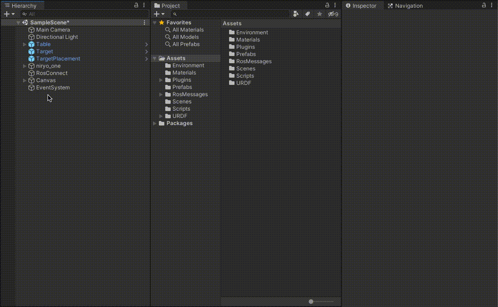
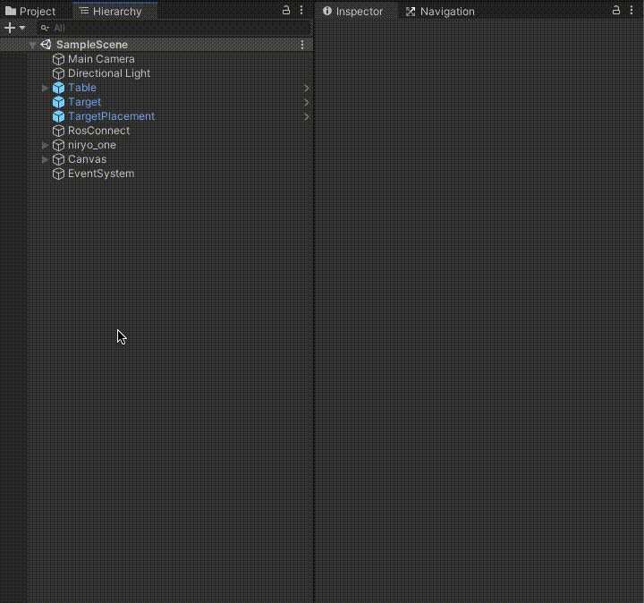

# Pick and Place Tutorial

This step assumes you have access to a functional ROS workspace and that the previous two steps ([Step 1](1_urdf.md), [Step 2](2_ros_tcp.md)) have been completed.

Steps covered in this tutorial includes invoking a motion planning service in ROS, moving a Unity Articulation Body based on the calculated trajectory, and controlling a gripping tool to successfully grasp a cube.

## Table of Contents
- [Pick and Place Tutorial](#pick-and-place-tutorial)
  - [Table of Contents](#table-of-contents)
  - [Step 3: Naive Pick & Place](#step-3-naive-pick--place)
  - [The Unity Side](#the-unity-side)
  - [The ROS Side](#the-ros-side)
  - [Unity & ROS Communication](#unity--ros-communication)
  - [Resources](#resources)
  - [Troubleshooting](#troubleshooting)
    - [Errors and Warnings](#errors-and-warnings)
    - [Hangs, Timeouts, and Freezes](#hangs-timeouts-and-freezes)
    - [Miscellaneous Issues](#miscellaneous-issues)

---

## Step 3: Naive Pick & Place

## The Unity Side

- If you have not already cloned or downloaded this repository, do so now, and follow the steps in [Step 1](1_urdf.md) to set up the Unity project, and [Step 2](2_ros_tcp.md) to integrate ROS with Unity. 

- If the current Unity project is not already open, select and open it from the Unity Hub.

- Note the `Assets/Scripts/TrajectoryPlanner.cs` script. This is where all of the logic to invoke a motion planning service lives, as well as the logic to control the gripper end effector tool.

The UI button `OnClick` callback will be reassigned later in this tutorial to the following function, `PublishJoints`, as defined:

```csharp
public void PublishJoints()
{
    MoverServiceRequest request = new MoverServiceRequest();
    request.joints_input = CurrentJointConfig();
    
    // Pick Pose
    request.pick_pose = new RosMessageTypes.Geometry.Pose
    {
        position = new Point(
            target.transform.position.z,
            -target.transform.position.x,
            target.transform.position.y + pickPoseOffset
        ),
        orientation = pickOrientation
    };

    // Place Pose
    request.place_pose = new RosMessageTypes.Geometry.Pose
    {
        position = new Point(
            targetPlacement.transform.position.z,
            -targetPlacement.transform.position.x,
            targetPlacement.transform.position.y + pickPoseOffset
        ),
        orientation = pickOrientation
    };

    var response = (MoverServiceResponse)tcpCon.SendServiceMessage(rosServiceName, request, new MoverServiceResponse());
    if (response.trajectories != null)
    {
        Debug.Log("Trajectory returned.");
        StartCoroutine(ExecuteTrajectories(response));
    }
}
```

This is similar to the `SourceDestinationPublisher.Publish()` function, but with a few key differences. There is an added `pickPoseOffset` to the `pick` and `place_pose` `y` component. This is because the calculated trajectory to grasp the `target` object will hover slightly above the object before grasping it in order to avoid potentially colliding with the object. Additionally, this function calls `CurrentJointConfig()` to assign the `request.joints_input` instead of assigning the values individually.

At the end of the function, the `MoverServiceResponse` receives a `response.trajectories`. This is passed to the `ExecuteTrajectories` method below:

```csharp
private IEnumerator ExecuteTrajectories(MoverServiceResponse response)
{
    if (response.trajectories != null)
    {
        for (int poseIndex  = 0 ; poseIndex < response.trajectories.Length; poseIndex++)
        {
            for (int jointConfigIndex  = 0 ; jointConfigIndex < response.trajectories[poseIndex].joint_trajectory.points.Length; jointConfigIndex++)
            {
                var jointPositions = response.trajectories[poseIndex].joint_trajectory.points[jointConfigIndex].positions;
                float[] result = jointPositions.Select(r=> (float)r * Mathf.Rad2Deg).ToArray();
                
                for (int joint = 0; joint < jointArticulationBodies.Length; joint++)
                {
                    var joint1XDrive  = jointArticulationBodies[joint].xDrive;
                    joint1XDrive.target = result[joint];
                    jointArticulationBodies[joint].xDrive = joint1XDrive;
                }
                yield return new WaitForSeconds(jointAssignmentWait);
            }

            if (poseIndex == (int)Poses.Grasp)
                CloseGripper();
            
            yield return new WaitForSeconds(poseAssignmentWait);
        }
        // Open Gripper at end of sequence
        OpenGripper();
    }
}
```

`ExecuteTrajectories` iterates through the joints to assign a new `xDrive.target` value based on the ROS service response, until the goal trajectories have been reached. Based on the pose assignment, this function may call the `Open` or `Close` gripper methods as is appropriate.

- Return to Unity. Select the RosConnector GameObject. Disable the SourceDestinationPublisher component by toggling off the script's checkmark in the Inspector window. Add the `TrajectoryPlanner` script to the RosConnector object.

 

- Note that the TrajectoryPlanner component shows its member variables in the Inspector window, which are unassigned. Drag and drop the `Target` and `TargetPlacement` objects onto the Target and Target Placement Inspector fields, respectively. Finally, assign the `niryo_one` robot to the Niryo One field.


- The `hostName` should be the IP address of your ROS machine (*not* the one running Unity).
  - In the RosConnect component in the Inspector, replace the `Host Name` value with the IP address of your ROS machine. Ensure that the `Host Port` is set to `10000`.

- Select the previously made Button object in Canvas/Button, and scroll to see the Button component. Under the `OnClick()` header, click the dropdown where it is currently assigned to the SourceDestinationPublisher.Publish(). Replace this call with TrajectoryPlanner > `PublishJoints()`.


- The gripper may need some adjustment to fully be able to pick and place the cube. In the Hierarchy window, search for `gripper_base`. Expand this object in the hierarchy to `gripper_base/Collisions/unnamed`, and disable the unnamed object.



- The Unity side is now ready to communicate with ROS to motion plan!

---

## The ROS Side

> Note: This project was built using the ROS Melodic distro, and Python 2.

- The provided files require the following packages to be installed; run the following if the packages are not already present:

   ```bash
   sudo apt-get update && sudo apt-get upgrade
   sudo apt-get install python-pip ros-melodic-robot-state-publisher ros-melodic-moveit ros-melodic-rosbridge-suite ros-melodic-joy ros-melodic-ros-control ros-melodic-ros-controllers ros-melodic-tf2-web-republisher
   ```

   ```bash
   sudo -H pip install rospkg jsonpickle
   ```

- Note the file `niryo_moveit/scripts/mover.py`. This script holds the ROS-side logic for the MoverService. When the service is called, the function `plan_pick_and_place()` runs. This calls `plan_trajectory` on the current joint configurations (sent from Unity) to a destination pose (dependent on the phase of pick and place).

```python
def plan_trajectory(move_group, destination_pose, start_joint_angles): 
    current_joint_state = JointState()
    current_joint_state.name = joint_names
    current_joint_state.position = start_joint_angles

    moveit_robot_state = RobotState()
    moveit_robot_state.joint_state = current_joint_state
    move_group.set_start_state(moveit_robot_state)

    move_group.set_pose_target(destination_pose)
    plan = move_group.go(wait=True)

    if not plan:
        print("RAISE NO PLAN ERROR")

    return move_group.plan()
```

This creates a set of planned trajectories, iterating through a pre-grasp, grasp, pick up, and place set of poses. Finally, this set of trajectories is sent back to Unity.

- PLACEHOLDER discussion on moveit configs 

- If you have not already built and sourced the ROS workspace since importing the new ROS packages, run `cd ~/catkin_ws/ && catkin_make && source devel/setup.bash`. Ensure there are no errors.

--- 

## Unity & ROS Communication

- The ROS side is now ready to interface with Unity! Open a new terminal window and navigate to your catkin workspace. Start ROS Core, set the parameter values, and begin the server_endpoint as follows:

``` bash
cd ~/catkin_ws/ && source devel/setup.bash

roscore &

rosparam set ROS_IP <your ROS IP>
rosparam set ROS_TCP_PORT 10000
rosparam set UNITY_IP <your Unity IP>
rosparam set UNITY_SERVER_PORT 5005

rosrun niryo_moveit server_endpoint.py
```

Once ROS Core has started, it will print `started core service [/rosout]` to the terminal window. Once the server_endpoint has started, it will print something similar to `[INFO] [1603488341.950794]: Starting server on 192.168.50.149:10000`.

- Open a new terminal window and start the Mover Service node.

``` bash
cd ~/catkin_ws/ && source devel/setup.bash

rosrun niryo_moveit mover.py
```

Once this process is ready, it will print `Ready to plan` to the console.

- Open a new terminal window and launch MoveIt. PLACEHOLDER what does this do?

``` bash
cd ~/catkin_ws/ && source devel/setup.bash

roslaunch niryo_moveit demo.launch
```

This may print out various error messages regarding the controller_spawner, such as `[controller_spawner-4] process has died`. These messages are safe to ignore, so long as the final message to the console is `You can start planning now!`.

- The ROS side of the setup is ready! 

- Return to the Unity Editor and press Play. Press the UI Button to send the joint configurations to ROS, and watch the robot arm pick and place the cube! 
  - The target object and placement positions can be moved around during runtime for different trajectory calculations. 
  


---

## Resources

- [MoveIt!](https://github.com/ros-planning/moveit)
- Unity [Articulation Body Documentation](https://docs.unity3d.com/2020.1/Documentation/ScriptReference/ArticulationBody.html)
- All of the launch and config files used were copied from [Niryo One ROS Stack](https://github.com/NiryoRobotics/niryo_one_ros) and edited to suit our reduced use case

---

## Troubleshooting

### Errors and Warnings

- If the motion planning script throws a `RuntimeError: Unable to connect to move_group action server 'move_group' within allotted time (5s)`, ensure the `roslaunch niryo_moveit demo.launch` process launched correctly and has printed `You can start planning now!`.
  
- `...failed because unknown error handler name 'rosmsg'` This is due to a bug in an outdated version. Try running `sudo apt-get update && sudo apt-get upgrade` to upgrade.

### Hangs, Timeouts, and Freezes

- If Unity fails to find a network connection, ensure that the ROS IP address is entered into the Host Name in the RosConnector component in Unity. Additionally, ensure that the ROS parameter values are set correctly.

### Miscellaneous Issues

- If the robot appears loose/wiggly or is not moving with no console errors, ensure that the Stiffness and Damping values on the Controller script of the `ur3_with_gripper` object are set to `10000` and `100`, respectively.

- If the robot moves to the incorrect location, or executes the poses in an expected order, verify that the shoulder_link (i.e. `niryo_one/world/base_link/shoulder_link`) X Drive Force Limit is `5`.
<!-- -  Also verify that the forearm_link, wrist_link, hand_link, right_gripper, and left_gripper, (i.e. `niryo_one/world/base_link/shoulder_link/arm_link/elbow_link/forearm_link/...` etc.) X Drive Force Limit is `1000`. -->

- Before entering Play mode in the Unity Editor, ensure that all ROS processes are still running. The `server_endpoint.py` script may time out, and will need to be re-run.