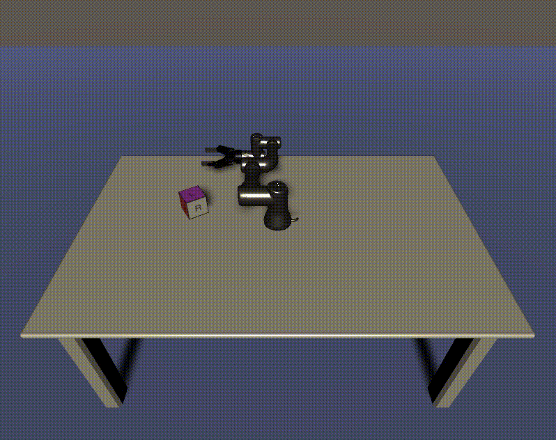

# Pick and Place Tutorial [DRAFT]

## Table of Contents
- [Pick and Place Tutorial [DRAFT]](#pick-and-place-tutorial-draft)
  - [Table of Contents](#table-of-contents)
  - [Step 3: Naive Pick & Place](#step-3-naive-pick--place)
  - [The Unity Side](#the-unity-side)
  - [The ROS Side](#the-ros-side)
  - [Unity & ROS Communication](#unity--ros-communication)
  - [Troubleshooting](#troubleshooting)
    - [Errors and Warnings](#errors-and-warnings)
    - [Hangs, Timeouts, and Freezes](#hangs-timeouts-and-freezes)
    - [Miscellaneous Issues](#miscellaneous-issues)

---

## Step 3: Naive Pick & Place

## The Unity Side

- The `PickAndPlace.unitypackage` includes a Plugins folder. This contains the MessageGeneration scripts, which have created a new menu option, “RosMessageGeneration.” Select `RosMessageGeneration -> Auto Generate Services` and select `Single Service`. 

- In the Service Auto Generation window that appears, next to the Input Package Path, click `Browse Package…` and navigate to the ros_unity_control/srv directory, e.g. `~/catkin_ws/src/ros_unity_control/srv`.. Choose the `MotionPlanningService.srv` file, and then click `GENERATE!` If this is successful, 2 new C# scripts should populate the `Assets/RosMessages/RosUnityControl/srv` directory: MotionPlanningServiceRequest and MotionPlanningServiceResponse. 
  
> [PLACEHOLDER]: what’s happening in Service Generation?

[PLACEHOLDER] everything that will be changed significantly

- Create MotionPlanningService

- Update controller stiffness/damping

- Enter Play mode. The robot arm should initialize to the default joint configuration!



- Create GripperController?

- Return to the MotionPlanningService script. The previously written `MoveToInitialPosition()` function had a commented out call to a `SendPose()` method--uncomment that line, and create the `SendPose()` method:

``` csharp
/// <summary>
/// Send the cube pose to create gripping information.
/// </summary>
private void SendPose()
{
   var pos = m_cube.transform.position;
   var rot = m_cube.transform.rotation;
 
   float[] position = { (float)pos.x, (float)pos.y, (float)pos.z };
   Quaternion quaternion = new Quaternion((float)rot.x, (float)rot.y, (float)rot.z , (float) rot.w);
   float[] rotation = {quaternion.eulerAngles.x, quaternion.eulerAngles.y, quaternion.eulerAngles.z};
   PickPlaceCube(position, rotation);
}
```
This will format the cube’s position and rotation to be later read by the motion planning service.

- Pick place cube 

- Invoke motion planning

- Verify things compile in the Unity Editor, and fix any syntax errors that may have appeared. Add the GripperController script to the `ur3_with_gripper` object. In the Hierarchy window, click and drag the Cube object into the cube Inspector field on the MotionPlanningService script. In the search bar on the Hierarchy window, search `ee_link`. Drag and drop this component onto the End Effector Inspector field of the MotionPlanningService Script.

- The Unity side is now ready to communicate with ROS to motion plan!

---

## The ROS Side

- Open the server_endpoint.py script. In the `source_destination_dict`, add the RosService:

``` python
source_destination_dict = {
   'ur3_topic': RosPublisher('ur3_topic', Pose, queue_size=10),
   'motion_planning_srv': RosService('motion_planning_service', MotionPlanningService)
}
```

This will add the motion planning service to the list of destinations for the RosCommunicator class.

- Install MoveIt on your ROS machine via `sudo apt install ros-<distro>-moveit`. This tutorial was created using Melodic, i.e. `sudo apt install ros-melodic-moveit`.

> Note: A class wrapper for MoveIt has been provided in the ROS package. This class returns an explicit motion plan for a given robot, including functions to add objects to the MoveIt planning scene, format pose values, and create a constrained motion plan. This can be viewed in the `robot_motion_planning_interface.py` script. 

[PLACEHOLDER] everything that will be changed significantly

- create motion planning script (motion planner, trajectory solution, format ros response)

- discussion on moveit configs 

- Save all of the edited scripts. Navigate to your ROS workspace directory (e.g. `cd ~/catkin_ws`) and run `catkin_make`. Source the workspace (e.g. `source /opt/ros/melodic/setup.bash`).

--- 

## Unity & ROS Communication

- The ROS side is now ready to interface with the Unity side! There are now four ROS commands that are necessary to begin the communication process. In a new terminal window, start ROS core:

``` bash
cd ~/catkin_ws/ && source devel/setup.bash
roscore
```

Once ROS Core has started, it will print `started core service [/rosout]` to the terminal window.

- Open a new terminal window and start the MoveIt Planning Environment Node. This is the node that will actually run motion planning computations and load the UR3 configuration.

``` bash
cd ~/catkin_ws/ && source devel/setup.bash

# Start the ur3 MoveIt planning environment
roslaunch ur3_with_gripper_moveit gazebo.launch sim:=true
```

This may print out various error messages regarding the controller_spawner, such as `[controller_spawner-4] process has died`. These messages are safe to ignore, so long as the final message to the console is `You can start planning now!`.

- Open a new terminal window and start the Motion Planning Node. This is the node that controls which pose the UR3 will travel to within the Unity Editor.

``` bash
cd ~/catkin_ws/ && source devel/setup.bash

# Start motion planning script
rosrun ros_unity_control ur3_gripper_motion_planning_script.py
```

Once this process is ready, it will print `Ready to motion plan!` to the console.

- Open a new terminal window and start the server. This is the node that will communicate with Unity.

``` bash
cd ~/catkin_ws/ && source devel/setup.bash

# Start the server endpoint
rosrun ros_unity_control server_endpoint.py
```

Once this process is ready, it will print a message similar to `[INFO] [1600461327.722720, 0.000000]: Starting server on 192.168.0.66:10000`.

- The ROS side of the setup is ready! Ensure you now have four active ROS processes running each of the above steps.

- Return to the Unity Editor, or open the Pick & Place project if it is not already open. Ensure all of the ROS processes are still running. Press Play in the editor. The robot should initialize to the defined starting position as before, “think” for a moment, then pick and place the cube!
  
  - The pick-and-place process should repeat is initially set to run twice. This Number of Runs value can be changed on the `ur3_with_gripper` object.

  - There may be a slight delay between the robot arm "waking up," calculating a path, and sending the information to Unity, causing the ROS messages to be missed. Refer to the [Troubleshooting](#troubleshooting) section if issues arise.

---

## Troubleshooting

### Errors and Warnings

- If the motion planning script throws a `RuntimeError: Unable to connect to move_group action server 'move_group' within allotted time (5s)`, ensure the `roslaunch ur3_with_gripper_moveit gazebo.launch sim:=true` process launched correctly and has printed `You can start planning now!`.
  
- `[ WARN] [1600887082.269260191, 1270.407000000]: Fail: ABORTED: No motion plan found. No execution attempted. WARNING: the motion planner failed because unknown error handler name 'rosmsg'` This is due to a bug in an outdated version. Try running `sudo apt-get update && sudo apt-get upgrade` to upgrade.

### Hangs, Timeouts, and Freezes

- If Unity fails to find a network connection, ensure that the ROS IP address is entered into the Host Name in the Motion Planning Service component in Unity. Additionally, ensure that the `ros_tcp_ip` address matches in the `server_endpoint.py` value, and that `unity_machine_ip` is your Unity machine's IP.
  
- The VM-side calculations may take longer than expected on different machines. If the Unity console throws an error saying `No data available on network stream after <number> attempts`, open the `Unity3D/Assets/Scripts/ROS Services/PoseEstimationService.cs` script. Edit the number after `serviceResponseRetry`.
    > E.g. `tcpCon = new TcpConnector(hostName, hostPort, networkTimeout: 3000, serviceResponseRetry: 30, serviceResponseSleep: 2000);`

- If running `roslaunch ur3_with_gripper_moveit gazebo.launch sim:=true` does not appear to throw breaking errors but does not proceed to print `You can start planning now!`, wait for up to five minutes. If it still does not proceed, the memory allowance may need to be increased.

### Miscellaneous Issues

- If the robot appears loose/wiggly or is not moving with no console errors, ensure that the Stiffness and Damping values on the Controller script of the `ur3_with_gripper` object are set to `10000` and `1000`, respectively.

- Before entering Play mode in the Unity Editor, ensure that all ROS processes are still running. The `server_endpoint.py` script may time out, and will need to be re-run.