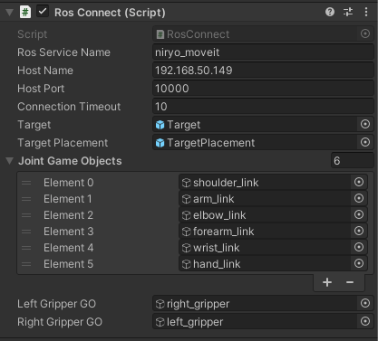

# Pick and Place Tutorial [DRAFT]

## Table of Contents
- [Pick and Place Tutorial [DRAFT]](#pick-and-place-tutorial-draft)
  - [Table of Contents](#table-of-contents)
  - [Step 3: Naive Pick & Place](#step-3-naive-pick--place)
  - [The Unity Side](#the-unity-side)
  - [The ROS Side](#the-ros-side)
  - [Unity & ROS Communication](#unity--ros-communication)
  - [Troubleshooting](#troubleshooting)
    - [Errors and Warnings](#errors-and-warnings)
    - [Hangs, Timeouts, and Freezes](#hangs-timeouts-and-freezes)
    - [Miscellaneous Issues](#miscellaneous-issues)

---

## Step 3: Naive Pick & Place

## The Unity Side

- The `PLACEHOLDER.unitypackage` includes a Plugins folder. This contains the MessageGeneration scripts, which have created a new menu option, “RosMessageGeneration.” Select `RosMessageGeneration -> Auto Generate Services` and select `Single Service`. 

- In the Service Auto Generation window that appears, next to the Input Package Path, click `Browse Package…` and navigate to the niryo_moveit/srv directory, e.g. `~/catkin_ws/src/niryo_moveit/srv`. Choose the `MoverService.srv` file, and then click `GENERATE!` If this is successful, 2 new C# scripts should populate the `Assets/RosMessages/NiryoMoveit/srv` directory: MoverServiceRequest and MoverServiceResponse. 
  
> [PLACEHOLDER]: what’s happening in Service Generation?

- PLACEHOLDER add pick and place to RosController (Poses enum, gripper)

- Edit the member variables of the RosConnect script to be as follows:

```csharp
// ROS Connector
private TcpConnector tcpCon;

private readonly float jointAssignmentWait = 0.06f;
private readonly float poseAssignmentWait = 1f;
private readonly float pickPoseOffset = 0.08f;
private readonly RosQuaternion pickOrientation = new RosQuaternion(0.5,0.5,-0.5,0.5);

// Variables required for ROS communication
public string rosServiceName = "niryo_moveit";
public string hostName = "192.168.50.149";
public int hostPort = 10000;
public int connectionTimeout = 10;

// The game objects
public GameObject target;
public GameObject targetPlacement;

// GameObjects used to get Articulation Bodies
public GameObject[] jointGameObjects;
public GameObject leftGripperGO;
public GameObject rightGripperGO;

// Articulation Bodies
private ArticulationBody[] jointArticulationBodies;
private ArticulationBody leftGripper;
private ArticulationBody rightGripper;

private enum Poses
{
    PreGrasp,
    Grasp,
    PickUp,
    Place
};
```

This adds references to enable grasping.

- PLACEHOLDER

```csharp
public void PublishJoints()
{
    MoverServiceRequest request = new MoverServiceRequest();
    request.joints_input = CurrentJointConfig();
    
    // Pick Pose
    request.pick_pose = new RosMessageTypes.Geometry.Pose
    {
        position = new Point(
            target.transform.position.z,
            -target.transform.position.x,
            target.transform.position.y + pickPoseOffset
        ),
        orientation = pickOrientation
    };

    // Place Pose
    request.place_pose = new RosMessageTypes.Geometry.Pose
    {
        position = new Point(
            targetPlacement.transform.position.z,
            -targetPlacement.transform.position.x,
            targetPlacement.transform.position.y + pickPoseOffset
        ),
        orientation = pickOrientation
    };

    var response = (MoverServiceResponse)tcpCon.SendServiceMessage(rosServiceName, request, new MoverServiceResponse());
    if (response.trajectories != null)
    {
        Debug.Log("Trajectory returned.");
        StartCoroutine(PrintTrajectories(response));
    }
}
```

> PLACEHOLDER Unity (x,y,z) -> ROS (z, -x, y)

- PLACEHOLDER Define the gripping functions as follows:

```csharp
private void CloseGripper()
{
    var leftDrive = leftGripper.xDrive;
    var rightDrive = rightGripper.xDrive;

    leftDrive.target = -0.01f;
    rightDrive.target = 0.01f;

    leftGripper.xDrive = leftDrive;
    rightGripper.xDrive = rightDrive;
}

private void OpenGripper()
{
    var leftDrive = leftGripper.xDrive;
    var rightDrive = rightGripper.xDrive;

    leftDrive.target = 0;
    rightDrive.target = 0;

    leftGripper.xDrive = leftDrive;
    rightGripper.xDrive = rightDrive;
}
```

PLACEHOLDER 

- Edit the `Start()` function to assign the appropriate ArticulationBody variables for the gripper.

```csharp
void Start()
{ 
    TcpClient client = new TcpClient();

    // Instantiate the connector with ROS host name and port.
    tcpCon = new TcpConnector(hostName, hostPort, serviceResponseRetry: 10, serviceResponseSleep: 1000);
    
    jointArticulationBodies = new ArticulationBody[jointGameObjects.Length];
    // Setup articulation bodies
    for (int i = 0; i < jointGameObjects.Length; i++)
    {
        jointArticulationBodies[i] = jointGameObjects[i].GetComponent<ArticulationBody>();
    }

    leftGripper = leftGripperGO.GetComponent<ArticulationBody>();
    rightGripper = rightGripperGO.GetComponent<ArticulationBody>();
}
```

- Save the edited script and return to Unity! Ensure there are no syntax errors.

- Select the RosConnector GameObject. Note that the RosConnect component now shows the new member variables in the Inspector window, which are unassigned. Drag and drop the Target and TargetPlacement objects onto the Target and Target Placement Inspector fields, respectively.

- In the Search bar in the Hierarchy, search for "_gripper". Drag the left_gripper object to the PLACEHOLDER Right Gripper GO field, and the right_gripper object to the Left Gripper GO field.

- Expand the Joint Game Objects list. In this order, drag and drop the following objects into the Joint Game Objects list: shoulder_link, arm_link, elbow_link, forearm_link, wrist_link, hand_link. 
  - This can be done by expanding the niryo_one Hierarchy through `niryo_one/world/base_link/shoulder_link/arm_link/...`, or by searching for these objects in the Hierarchy.



- In the Hierarchy window, right click to add a new UI > Button. Note that this will create a new Canvas parent as well. In the Game view, you will see the button appear in the bottom left corner as an overlay. 
  
- Select the newly made Button object, and scroll to see the Button component. Click the `+` button under the empty `OnClick()` header to add a new event. Select the RosConnector object in the Hierarchy window and drag it into the new OnClick() event, where it says `None (Object)`. Click the dropdown where it says `No Function`. Select RosConnect > PublishJoints().
  - To change the text of the Button, expand the Button Hierarchy and select Text. Change the value in Text on the associated component.


- The Unity side is now ready to communicate with ROS to motion plan!

---

## The ROS Side

- Ensure MoveIt is installed on your ROS machine via `sudo apt install ros-<distro>-moveit`. This tutorial was created using Melodic, i.e. `sudo apt install ros-melodic-moveit`.

[PLACEHOLDER] everything that will be changed significantly

- update plan_pick_and_place()

- discussion on moveit configs 

- Save all of the edited scripts. Navigate to your ROS workspace directory (e.g. `cd ~/catkin_ws`) and run `catkin_make`. Source the workspace (e.g. `source /opt/ros/melodic/setup.bash`).

--- 

## Unity & ROS Communication

- The ROS side is now ready to interface with the Unity side! Open a new terminal window and navigate to your catkin workspace. Start ROS Core, set the parameter values, and begin the server_endpoint as follows:

``` bash
cd ~/catkin_ws/ && source devel/setup.bash
roscore &
rosparam set ROS_IP <your ROS IP>
rosparam set ROS_TCP_PORT 10000
rosparam set UNITY_IP <your Unity IP>
rosparam set UNITY_SERVER_PORT 5005
rosrun niryo_moveit server_endpoint.py
```

Once ROS Core has started, it will print `started core service [/rosout]` to the terminal window. Once the server_endpoint has started, it will print something similar to `[INFO] [1603488341.950794]: Starting server on 192.168.50.149:10000`.

- Open a new terminal window and start the Motion Planning Node. This is the node that controls which pose the UR3 will travel to within the Unity Editor.

``` bash
cd ~/catkin_ws/ && source devel/setup.bash

# Start motion planning script
rosrun niryo_moveit mover.py
```

Once this process is ready, it will print `Ready to motion plan!` to the console.

- Open a new terminal window and start the Moveit Node. This is the node that will actually run motion planning computations and load the configuration.

``` bash
cd ~/catkin_ws/ && source devel/setup.bash

# Start the planning environment
roslaunch niryo_moveit demo.launch
```

This may print out various error messages regarding the controller_spawner, such as `[controller_spawner-4] process has died`. These messages are safe to ignore, so long as the final message to the console is `You can start planning now!`.

- The ROS side of the setup is ready! 

- Return to the Unity Editor, or open the Pick & Place project if it is not already open. Ensure all of the ROS processes are still running. Press Play in the editor. Press the UI Button to send the joint configurations to ROS, and watch the robot arm pick and place the cube! 
  - The cubes can be moved around during runtime for different pick and place calculations. 
  
---

## Troubleshooting

### Errors and Warnings

- If the motion planning script throws a `RuntimeError: Unable to connect to move_group action server 'move_group' within allotted time (5s)`, ensure the `roslaunch ur3_with_gripper_moveit gazebo.launch sim:=true` process launched correctly and has printed `You can start planning now!`.
  
- `[ WARN] [1600887082.269260191, 1270.407000000]: Fail: ABORTED: No motion plan found. No execution attempted. WARNING: the motion planner failed because unknown error handler name 'rosmsg'` This is due to a bug in an outdated version. Try running `sudo apt-get update && sudo apt-get upgrade` to upgrade.

### Hangs, Timeouts, and Freezes

- If Unity fails to find a network connection, ensure that the ROS IP address is entered into the Host Name in the Motion Planning Service component in Unity. Additionally, ensure that the `ros_tcp_ip` address matches in the `server_endpoint.py` value, and that `unity_machine_ip` is your Unity machine's IP.
  
- The VM-side calculations may take longer than expected on different machines. If the Unity console throws an error saying `No data available on network stream after <number> attempts`, open the `Unity3D/Assets/Scripts/ROS Services/PoseEstimationService.cs` script. Edit the number after `serviceResponseRetry`.
    > E.g. `tcpCon = new TcpConnector(hostName, hostPort, networkTimeout: 3000, serviceResponseRetry: 30, serviceResponseSleep: 2000);`

- If running `roslaunch ur3_with_gripper_moveit gazebo.launch sim:=true` does not appear to throw breaking errors but does not proceed to print `You can start planning now!`, wait for up to five minutes. If it still does not proceed, the memory allowance may need to be increased.

### Miscellaneous Issues

- If the robot appears loose/wiggly or is not moving with no console errors, ensure that the Stiffness and Damping values on the Controller script of the `ur3_with_gripper` object are set to `10000` and `1000`, respectively.

- Before entering Play mode in the Unity Editor, ensure that all ROS processes are still running. The `server_endpoint.py` script may time out, and will need to be re-run.