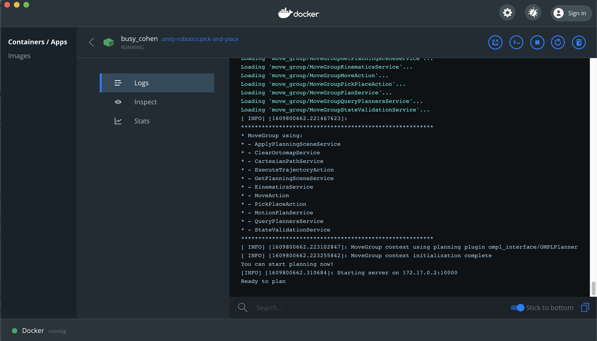
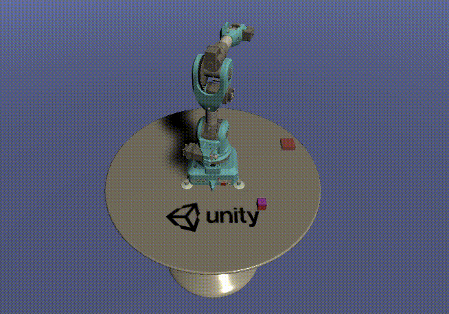

<p align="center"></p>

# Pick-and-Place Tutorial

Unity's tools for robotic simulation enable users to integrate Unity with ROS-based workflows. [ROS](http://wiki.ros.org/ROS/Introduction) (Robot Operating System) provides services such as message-passing, package management, low-level device control, and hardware abstraction. Unity's robotics tools are able to support **importing URDF files** and **sending and receiving messages between ROS and Unity**. This tutorial will go through the steps necessary to integrate ROS with Unity, from installing the Unity Editor to creating a scene with an imported URDF to completing a pick-and-place task with known poses using [MoveIt](https://moveit.ros.org/) trajectory planning.

This tutorial is designed such that you do not need prior experience with Unity or C# in order to follow the scene setup steps, and you do not need prior robotics experience to get started with ROS integration. The tutorial is divided into high-level phases, from basic Unity and ROS initial setup through executing a pick-and-place task.

**Want to skip the tutorial and run the full demo? Check out our [Quick Demo](quick_demo.md)**

> Note: This project has been tested with Python 2 and ROS Melodic, as well as Python 3 and ROS Noetic.

---

We're currently working on lots of things! As a first step for this tutorial, please take a short moment fill out our [survey](https://unitysoftware.co1.qualtrics.com/jfe/form/SV_0ojVkDVW0nNrHkW) to help us identify what products and packages to build next.

---

### Pick-and-Place Tutorial
  - [Requirements](#requirements)
  - [Part 0: ROS Setup](#part-0-ros-setup)
  - [Part 1: Create Unity scene with imported URDF](#part-1-create-unity-scene-with-imported-urdf)
  - [Part 2: ROS–Unity Integration](#part-2-rosunity-integration)
  - [Part 3: Pick-and-Place In Unity](#part-3-pick-and-place-in-unity)
  - [Part 4: Pick-and-Place on the Real Robot](#part-4-pick-and-place-on-the-real-robot)

## Requirements

This repository provides project files for the pick-and-place tutorial, including Unity assets, URDF files, and ROS scripts. Clone this repository to a location on your local machine:
  ```bash
  git clone --recurse-submodules https://github.com/Unity-Technologies/Unity-Robotics-Hub.git
  ```

## [Part 0: ROS Setup](0_ros_setup.md)



This part provides two options for setting up your ROS workspace: using Docker, or manually setting up a catkin workspace.

## [Part 1: Create Unity scene with imported URDF](1_urdf.md)



This part includes downloading and installing the Unity Editor, setting up a basic Unity scene, and importing a robot--the [Niryo One](https://niryo.com/niryo-one/)--using the URDF Importer.

## [Part 2: ROS–Unity Integration](2_ros_tcp.md)


This part covers creating a TCP connection between Unity and ROS, generating C# scripts from a ROS msg and srv files, and publishing to a ROS topic.

## [Part 3: Pick-and-Place In Unity](3_pick_and_place.md)


This part includes the preparation and setup necessary to run a pick-and-place task with known poses using MoveIt. Steps covered include creating and invoking a motion planning service in ROS, moving a Unity Articulation Body based on a calculated trajectory, and controlling a gripping tool to successfully grasp and drop an object.

## [Part 4: Pick-and-Place on the Real Robot](4_pick_and_place.md)


This part is going to be a little different than the previous tutorials in that it will utilize a real Niryo One robot. We do not assume that everyone has access to a Niryo One outside of simulation. As such this tutorial should mostly be used as a reference for how to move from executing commands on a simulated robot to a real one.