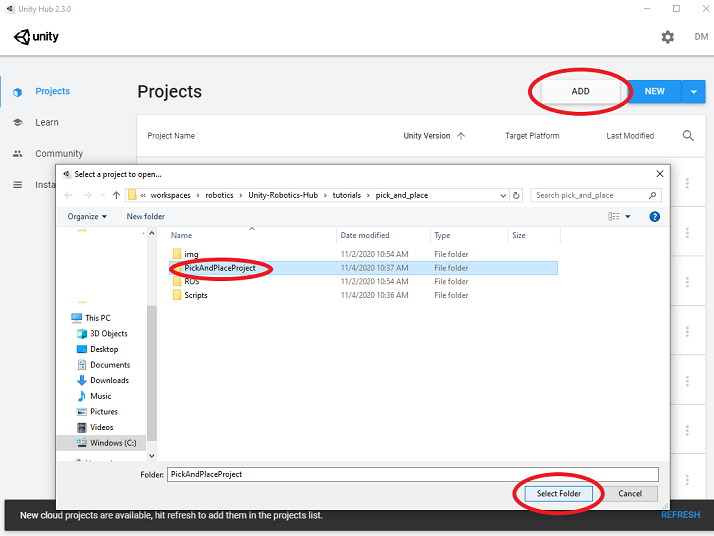

# Pick-and-Place Tutorial: Quick Demo

This part uses scripts to automatically set up and run the Niryo One pick-and-place demo in the Unity Editor.

**Table of Contents**
  - [Prerequisites](#prerequisites)
  - [Start ROS](#start-ros)
  - [Start Demo](#start-demo)

## Prerequisites

1. Clone this repo to a location on your local machine:
    ```bash
    git clone --recurse-submodules https://github.com/Unity-Technologies/Unity-Robotics-Hub.git
    ```

1. Install [Docker Engine](https://docs.docker.com/engine/install/)

1. Install [Unity Hub](https://unity3d.com/get-unity/download).

1. Go to the [Unity 2020.2 Beta website](https://unity3d.com/unity/beta/2020.2.0b9) to install this project's version of Unity: **2020.2.0b9**.

## Start ROS

1. Follow the [Option A: Use Docker](0_ros_setup.md#option-a-use-docker) to start a new ROS docker container

2. Run the following command to start ROS services

    ```bash
    roslaunch niryo_moveit part_3.launch
    ```


## Start Demo

1. Open Unity Hub and click the "Add" button in the top right of the "Projects" tab on Unity Hub, and navigate to and select the PickAndPlaceProject directory (`./Unity-Robotics-Hub/tutorials/pick_and_place/PickAndPlaceProject/`) to add the tutorial project to your Hub.

   

1. Click the newly added project to open it.

1. Look for the `DemoScene` in the Project browser in the Assets/Scenes directory, and double-click to open it.

1. Click the `Play` button to watch the full demo.
	> Note: the planning process will take about ten seconds before the Niryo One starts to move

    > Note: several game objects will be created in the Hierarchy window at runtime
	>
	> * **Table**: the table where the robot stands on; instantiated from the Table prefab
	> * **Target**: the cube that the robot is going to pick up; instantiated from the Target prefab
	> * **TargetPlacement**: the area that the target cube will be placed; instantiation of the TargetPlacement prefab
	> * **niryo_one**: the Niryo One robot imported from URDF
	> * **ROSConnect**: the object that operates ROS communication
	> * **Publisher**: the object that publish joint configurations to the ROS network for planning

    > Note: the configurations of ROS communication can be found in the Inspector window of ROSConnect object
	>
	> * Joint configurations are published to ROS nodes running in the Docker container (127.0.0.1:10000)
	> * ROS nodes in the Docker container will be notified that Unity's IP address is 127.0.0.1:5005

### If you'd now like to follow the full tutorial to learn how to build the pick-and-place simulation from scratch, proceed to [Part 1](1_urdf.md).
