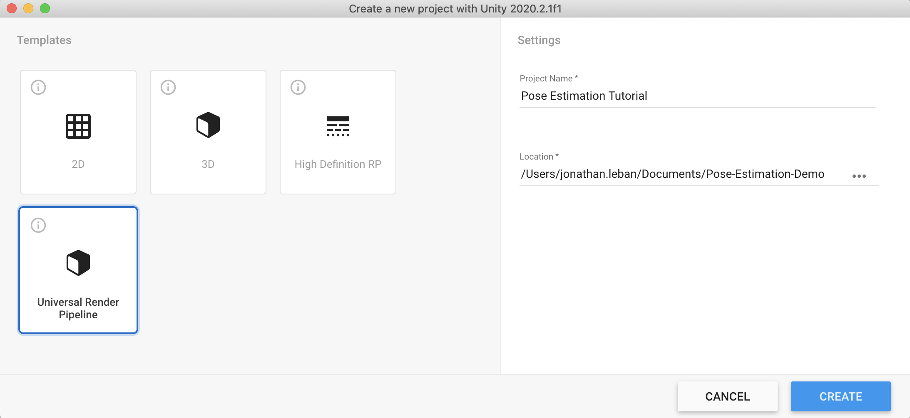
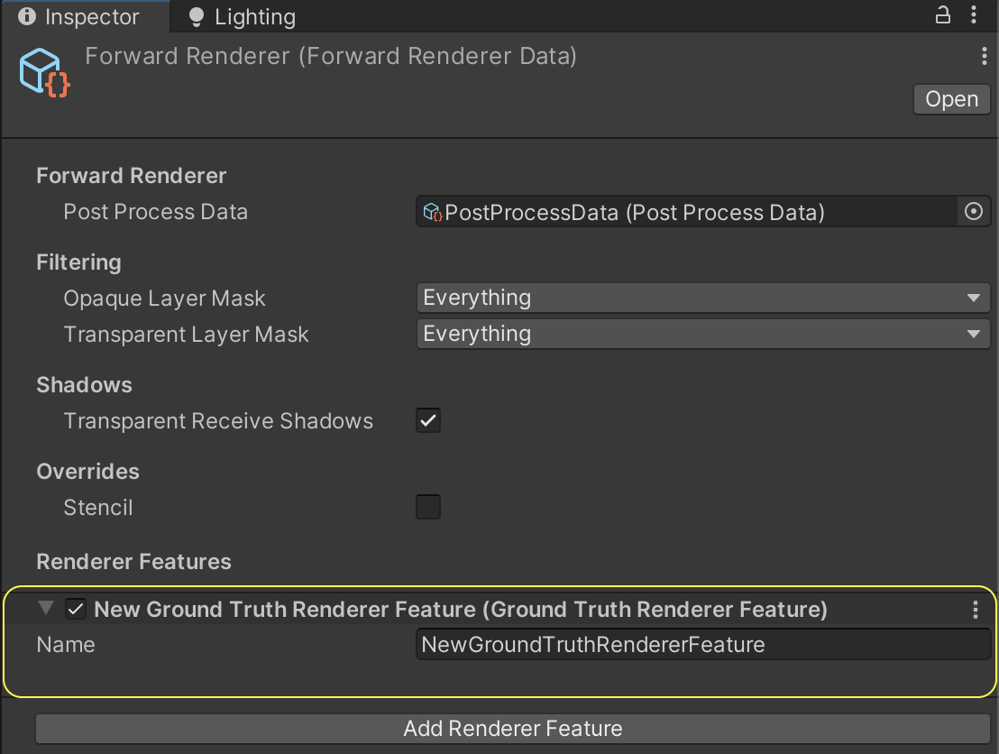
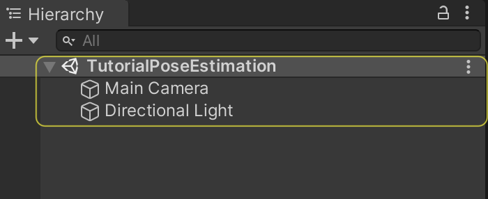
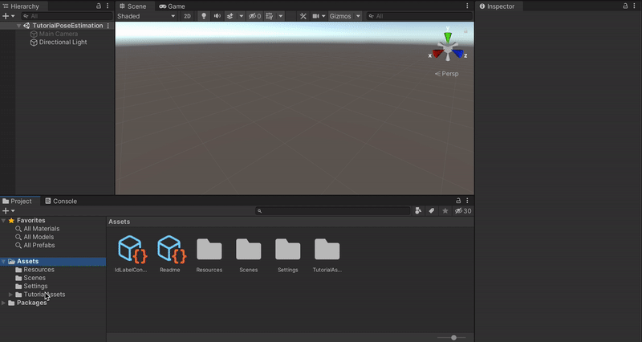
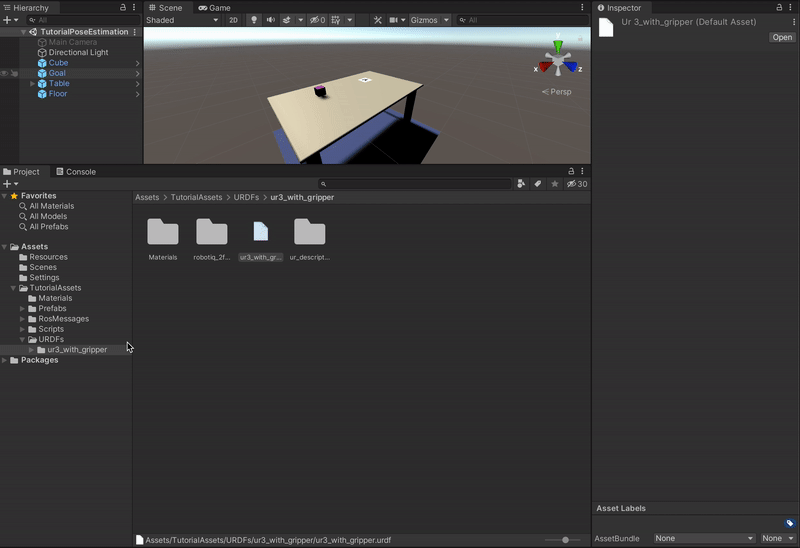
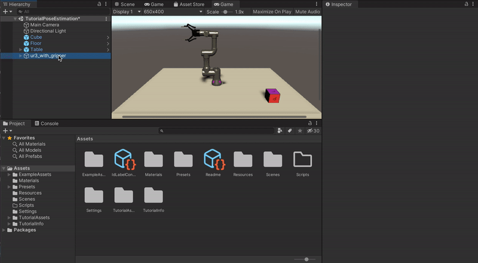

# Pose Estimation Demo: Phase 1

In this first phase of the tutorial, we will start by downloading and installing the Unity Editor. We will install our project's dependencies: the Perception, URDF, and TCP Connector packages. We will then use a set of provided prefabs to easily prepare a simulated environment containing a table, a cube, and a working robot arm. 


**Table of Contents**
  - [Requirements](#reqs)
  - [Step 1: Create a New Project](#step-1)
  - [Step 2: Download the Perception, the URDF and the TCP connector Packages](#step-2)
  - [Step 3: Setup the Ground Truth Render Feature](#step-3)
  - [Step 4: Setup the Scene](#step-4)

---

### <a name="reqs">Requirements</a>

To follow this tutorial you need to **clone** this repository even if you want to create your Unity project from scratch. In fact, we need the ROS folder of the repository which is dependent of gitsubmodules (hence the command `--recurse-submodules`). 


**Note For Windows users**:

You need to have a software enabling you to run bash files. One option is to download [GIT](https://git-scm.com/downloads). During installation of GIT, add GIT Bash to windows context menu by selecting its option. After installation, right click in your folder, and select `GIT Bash Here`. 

**Action**: Open a terminal and put yourself where you want to host the repository. 
```bash
git clone --recurse-submodules https://github.com/Unity-Technologies/Unity-Robotics-Hub.git
```

Then we need to be in the `Unity-Robotics-Hub/tutorials/pose_estimation` folder and generate the contents of the `universal_robot`, `moveit_msgs`, `ros_tcp_endpoint`, and the `robotiq` folders. 
```bash
cd Unity-Robotics-Hub/tutorials/pose_estimation
./submodule.sh
```

**Action**: [Install Unity `2020.2.*`.](install_unity.md)


### <a name="step-1">Step 1: Create a New Project</a> 
When you first run Unity, you will be asked to open an existing project, or create a new one.

* **Action**: Open Unity and create a new project using the **Universal Render Pipeline**. Name your new project _**Pose Estimation Tutorial**_, and specify a desired location as shown below.

<p align="center">

</p>

### <a name="step-2">Step 2: Download the Perception, the URDF and the TCP connector Packages</a>

Once your new project is created and loaded, you will be presented with the Unity Editor interface. From this point on, whenever we refer to the "editor", we mean the Unity Editor.

#### How to install packages
We will need to download and install several packages. In general, packages can be installed in Unity with the following steps:

1. From the top menu bar, open _**Window**_ -> _**Package Manager**_. As the name suggests, the _**Package Manager**_ is where you can download new packages, update or remove existing ones, and access a variety of information and additional actions for each package.

2. Click on the _**+**_ sign at the top-left corner of the _**Package Manager**_ window and then choose the option _**Add package from git URL...**_. 

3. Enter the package address and click _**Add**_. It will take some time for the manager to download and import the package.

Installing the different packages may take some time (few minutes). 

<p align="center">

</p>


#### Install Dependencies
**Action**: Install the following packages with the provided git URLs:
* [Perception package](https://github.com/Unity-Technologies/com.unity.perception) - `com.unity.perception@0.7.0-preview.1`
  * This will help us collect training data for our machine learning model. 

* [URDF Importer package](https://github.com/Unity-Technologies/URDF-Importer) - `https://github.com/Unity-Technologies/URDF-Importer.git#v0.1.2`
  * This package will help us import a robot into our scene from a file in the [Unified Robot Description Format (URDF)](http://wiki.ros.org/urdf).

* [TCP Connector package](https://github.com/Unity-Technologies/ROS-TCP-Connector) - `https://github.com/Unity-Technologies/ROS-TCP-Connector.git#v0.1.2`
  * This package will enable a connection between ROS and Unity. 

**Note**: If you encounter a Package Manager issue, check the [Troubleshooting Guide](troubleshooting.md) for potential solutions.

### <a name="step-3">Step 3: Setup Ground Truth Render Feature</a>

The Hierarchy, Scene View, Game View, Play/Pause/Step toolbar, Inspector, Project, and Console windows of the Unity Editor have been highlighted below for reference, based on the default layout. Custom Unity Editor layouts may vary slightly. A top menu bar option is available to re-open any of these windows: Window > General.

<p align="center">

</p>


The perception packages relies on a "ground truth render feature" to save out labeled images as training data. You don't need to worry about the details, but follow the steps below to add this component:

* **Action**: The _**Project**_ tab contains a search bar; use it to find the file named `ForwardRenderer`, and click on the file named `ForwardRenderer.asset` as shown below:

<p align="center">

</p>

* **Action**: Click on the found file to select it. Then, from the _**Inspector**_ tab of the editor, click on the _**Add Renderer Feature**_ button, and select _**Ground Truth Renderer Feature**_ from the dropdown menu:

<p align="center">

</p>


### <a name="step-4">Step 4: Setup the Scene</a>

#### The Scene
Simply put in Unity, Scenes contain any object that exists in the world. This world can be a game, or in this case, a data-collection oriented simulation. Every new project contains a Scene named SampleScene, which is automatically opened when the project is created. This Scene comes with several objects and settings that we do not need, so let's create a new one.

* **Action**: In the _**Project**_ tab, right-click on the `Assets > Scenes` folder and click _**Create -> Scene**_. Name this new Scene `TutorialPoseEstimation` and double-click on it to open it. 

The _**Hierarchy**_ tab of the editor displays all the Scenes currently loaded, and all the objects currently present in each loaded Scene, as shown below:
<p align="center">

</p>

As seen above, the new Scene already contains a camera (`Main Camera`) and a light (`Directional Light`). We will now modify the camera's field of view and position to prepare it for the tutorial.

* **Action**: Still in the _**Inspector**_ tab of the `Main Camera`, modify the camera's `Position` and `Rotation` to match the values shown below. This orients the camera so that it will have a good view of the objects we are about to add to the scene.   

<p align="center">

</p>

* **Action**: Click on `Directional Light` and in the _**Inspector**_ tab, modify the light's `Position` and `Rotation` to match the screenshot below. 

<p align="center">

</p>

#### Adding Tutorial Files
Now it is time to add some more objects to our scene. Before doing so, we need to import some folders containing the required assets. 

* **Action**: Download [TutorialAssets.zip](https://github.com/Unity-Technologies/Unity-Robotics-Hub/releases/download/Pose-Estimation/TutorialAssets.zip), and unzip it. It should contain the following subfolders: `Materials`, `Prefabs`, `RosMessages`, `Scripts`, `URDFs`.

* **Action**: Drag and Drop the `TutorialAssets` folder onto the `Assets` folder in the _**Project**_ tab. 

Your `Assets` folder should like this: 

<p align="center">

</p>

#### Using Prefabs
Unity’s [Prefab](https://docs.unity3d.com/Manual/Prefabs.html) system allows you to create, configure, and store a **GameObject** complete with all its components, property values, and child **GameObjects** as a reusable **Asset**. It is a convenient way to store complex objects. 

A prefab is just a file, and you can easily create an instance of the object in the scene from a prefab by dragging it into the _**Hierarchy panel**_.

For your convenience, we have provided prefabs for most of the components of the scene (the cube, goal, table, and floor).

* **Action**: In the _**Project**_ tab, go to `Assets > TutorialAssets > Prefabs > Part1` and drag and drop the `Cube` prefab inside the _**Hierarchy panel**_.

* **Action**: Repeat the action with the `Goal`, `Table` and the `Floor`. 


<p align="center">

</p>

**Note**: If you encounter an issue with the imported prefab materials, check the [Troubleshooting Guide](troubleshooting.md) for potential solutions.


#### Importing the Robot
Finally we will add the robot and the URDF files in order to import the UR3 Robot. 

* **Action**: In the _**Project**_ tab, go to `Assets > TutorialAssets > URDFs > ur3_with_gripper` and right click on the `ur3_with_gripper.urdf` file and select `Import Robot From Selected URDF file`. A window will pop up, keep the default **Y Axis** type in the Import menu and the **Mesh Decomposer** to `VHACD`. Then, click Import URDF. These set of actions are showed in the following video. 

**Note**: Unity uses a "left handed" coordinate system in which the y-axis points up. However, many robotics packages use a right-handed coordinate system in which the z-axis or x-axis points up. For this reason, it is important to pay attention to the coordinate system when importing URDF files or interfacing with other robotics software.

**Note**: VHACD algorithm produces higher quality convex hull for collision detection than the default algorithm.

<p align="center">

</p>

**Note**: If you encounter an issue with importing the robot, check the [Troubleshooting Guide](troubleshooting.md) for potential solutions.

#### Setting up the Robot

* **Action**: Select the `ur3_with_gripper` GameObject and in the _**Inspector**_ view, go to the `Controller` script and set the `Stiffness` to **10000**, the `Damping` to **1000** and the `Force Limit` to **1000**. These are physics properties that control how the robot moves.

* **Action**: In the _**Hierarchy**_ tab, select the `ur3_with_gripper` GameObject and click on the arrow on the left, then click on the arrow on the left of `world`, then on `base_link`. In the `Articulation Body` component, toggle on `Immovable` for the `base link`. This will fix the robot base to its current position.

<p align="center">

</p>


### Proceed to [Phase 2](2_set_up_the_data_collection_scene.md).


