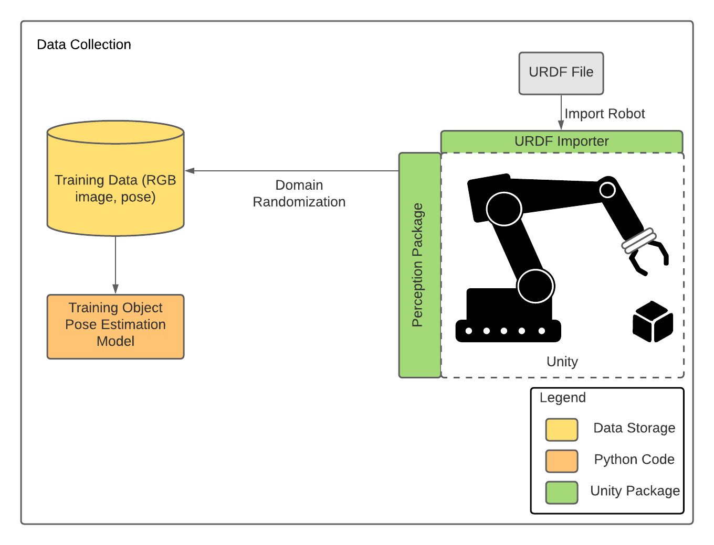
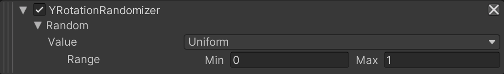
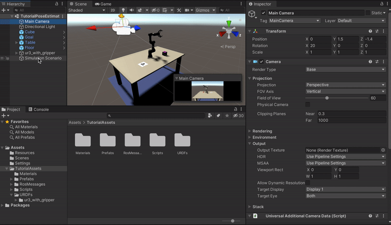
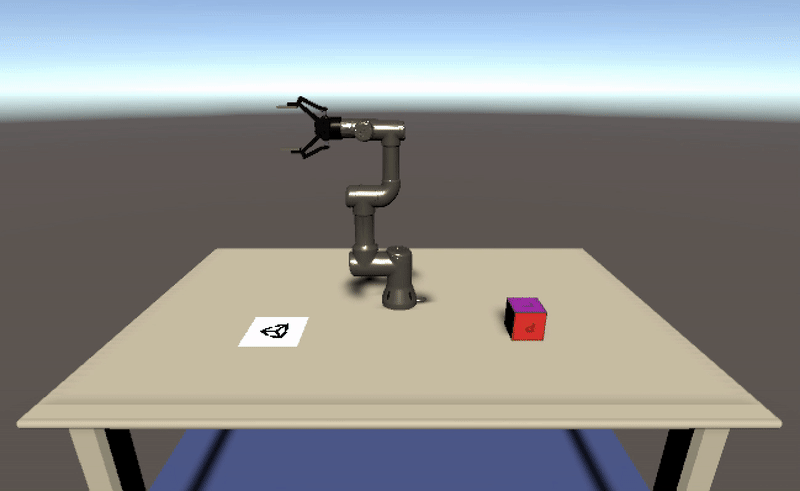
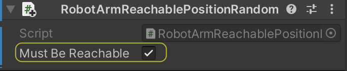
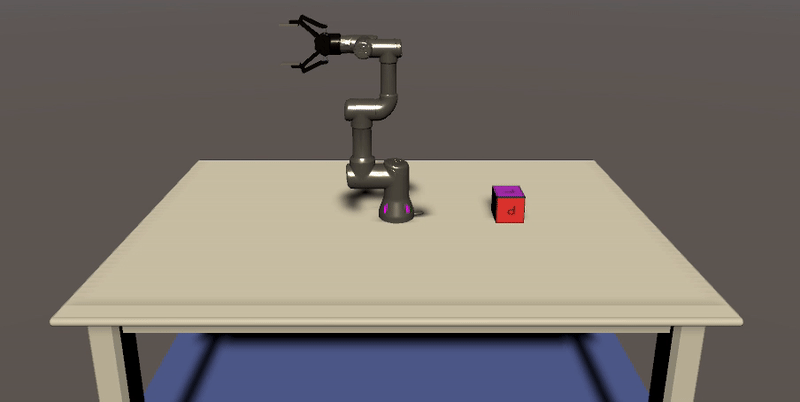
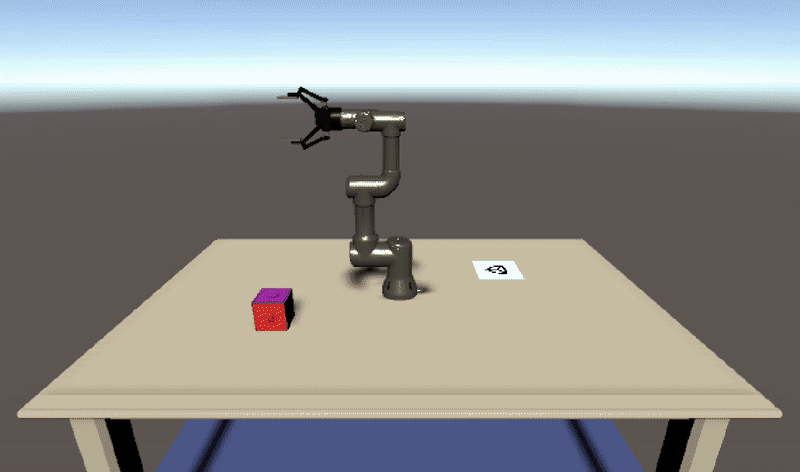

# Pose Estimation Demo: Phase 2

In [Phase 1](1_set_up_the_scene.md) of the tutorial, we learned:
* How to create a Unity Scene
* How to use Unity's Package Manager to download packages
* How to move and rotate objects in the scene
* How to instantiate Game Objects with Prefabs
* How to import a robot from a URDF file  
    
You should now have a table, cube, camera, and working robot arm in your scene. In this phase we will prepare the scene for data collection with the Perception package. 

<p align="center">

</p>

**Table of Contents**
  - [Equipping the Camera for Data Collection](#step-1)
  - [Equipping the Cube for Data Collection](#step-2-equipping-the-cube-for-data-collection)
  - [Add and set up randomizers](#step-3-add-and-setup-randomizers)

---

### <a name="step-1">Equipping the Camera for Data Collection</a>

We need to have a fixed aspect ratio so that you are sure to have the same size of images we have when you collect the data. 
1. Select the `Game` view and select `Free Aspect`. Then select the **+**, with the message `Add new item` on it if you put your mouse over the + sign. For the Width select `650` and for the Height select `400`. A gif below shows you how to do it. 

<p align="center">

</p>

We need to add a few components to our camera in order to equip it for the perception workflow. 

2. Select the `Main Camera` GameObject in the _**Hierarchy**_ tab and in the _**Inspector**_ tab, click on _**Add Component**_.

3. Start typing `Perception Camera` in the search bar that appears, until the `Perception Camera` script is found, with a **#** icon to the left.

4. Click on this script to add it as a component. Your camera is now a `Perception` camera.

5. Go to `Edit > Project Settings > Editor` and uncheck `Asynchronous Shader Compilation`.

As you can see in the Inspector view for the Perception Camera component, the list of Camera Labelers is currently empty as you can see with `List is Empty`. For each type of ground-truth you wish to generate alongside your captured frames, you will need to add a corresponding Camera Labeler to this list. In our project we want to extract the position and orientation of an object, so we will use the `BoudingBox3DLabeler`. 

There are several other types of labelers available, and you can even write your own. If you want more information on labelers, you can consult the [Perception package documentation](https://github.com/Unity-Technologies/com.unity.perception).

6. In the _**Inspector**_ tab, in the `Perception Camera` script, click on the _**+**_ button at the bottom right corner of the `List is Empty` field, and select `BoundingBox3DLabeler`. Once applied, the labeler will highlight the edges of the labeled `GameObjects`. Don't worry, this highlighting won't show up in the image data we collect, it is just there to help us visualize the labeler.

Once you add the labeler, the Inspector view of the Perception Camera component will look like this:

<p align="center">

</p>


### <a name="step-2">Equipping the Cube for Data Collection</a>

Our work above prepares us to collect RGB images from the camera and some associated 3D bounding box(es) for objects in our scene. However, we still need to specify _which_ objects we'd like to collect poses for. In this tutorial, we will only collect the pose of the cube, but you can add more objects if you'd like.

You will notice that the `BoundingBox3DLabeler` component has a field named `Id Label Config`. The label configuration we link here will determine which object poses get saved in our dataset. 

1.  In the _**Project**_ tab, right-click the `Assets` folder, then click `Create -> Perception -> Id Label Config`.

This will create a new asset file named `IdLabelConfig` inside the `Assets` folder.

Now that you have created your label configuration, we need to assign them to the labeler that you previously added to your `Perception Camera` component.

2. Select the `Main Camera` object from the _**Hierarchy**_ tab, and in the _**Inspector**_ tab, assign the newly created `IdLabelConfig` to the `IdLabelConfig`. To do so, you can either drag and drop the former into the corresponding fields for the label, or click on the small circular button in front of the `Id Label Config field`, which brings up an asset selection window filtered to only show compatible assets. 

The `Perception Camera` component will now look like the image below:

<p align="center">

</p>

Now we need to assign the same `IdLabelConfig` object to the cube, since it is the pose of the cube we wish to collect. 

3. Select the `Cube` GameObject and in the _**Inspector**_ tab, click on the _**Add Component**_ button.

4. Start typing `Labeling` in the search bar that appears, until the `Labeling` script is found, with a **#** icon to the left and double click on it. 

5. Press the **Add New Label** button and change `New Label` to `cube_position`. Then, click on `Add to Label Config...` and below `Other Label Configs in Project` there should be `IdLabelConfig`. Click on `Add Label` and then press the red X to close the window. 

The _**Inspector**_ view of the `Cube` should look like the following:

<p align="center">

</p>


### <a name="step-3">Add and setup randomizers</a>

#### Domain Randomization
We will be collecting training data from a simulation, but most real perception use-cases occur in the real world. 
To train a model to be robust enough to generalize to the real domain, we rely on a technique called [Domain Randomization](https://arxiv.org/pdf/1703.06907.pdf). Instead of training a model in a single fixed environment, we _randomize_ aspects of the environment during training in order to introduce sufficient variation into the generated data. This forces the machine learning model to handle many small visual variations, making it more robust.

In this tutorial we will randomize the position and the orientation of the cube on the table but also the color, intensity and position of the light. However, the Randomizers in the Perception package can be extended to many other aspects of the environment.


#### The Scenario
To start randomizing your simulation, you will first need to add a **Scenario** to your scene. Scenarios control the execution flow of your simulation by coordinating all Randomizer components added to them. If you want to know more about it, you can go see [this tutorial](https://github.com/Unity-Technologies/com.unity.perception/blob/master/com.unity.perception/Documentation~/Tutorial/Phase1.md#step-5-set-up-background-randomizers). There are several pre-built randomizers provided by the Perception package, but they don't fit our specific problem. Fortunately, the Perception package also allows one to write [custom randomizers](https://github.com/Unity-Technologies/com.unity.perception/blob/master/com.unity.perception/Documentation~/Tutorial/Phase2.md), which we will do here.


1. In the _**Hierarchy**_, select the **+** and `Create Empty`. Rename this GameObject `Simulation Scenario`.

2. Select the `Simulation Scenario` GameObject and in the _**Inspector**_ tab, click on the _**Add Component**_ button. Start typing `Fixed Length Scenario` in the search bar that appears, until the `Fixed Length Scenario` script is found, with a **#** icon to the left. Then double click on it. 

Each Scenario executes a number of Iterations, and each Iteration carries on for a number of frames. These are timing elements you can leverage in order to customize your Scenarios and the timing of your randomizations. 


#### Writing our Custom Object Rotation Randomizer
Each new randomizer requires two C# scripts: a **Randomizer** and **RandomizerTag**. The **Randomizer** will go on the scenario to orchestrate the randomization. The corresponding **RandomizerTag** is added to any GameObject(s) we want to _apply_ the randomization to. 

First, we will write a randomizer to randomly rotate the cube around its y-axis each iteration. 

3. In the _**Project**_ tab, right-click on the **Scripts** folder and select `Create -> C# Script`. Name your new script file `YRotationRandomizer`.

4. Create another script and name it `YRotationRandomizerTag`.

5. Double-click `YRotationRandomizer.cs` to open it in _**Visual Studio**_.

Note that while _**Visual Studio**_ is the default option, you can choose any text editor of your choice. You can change this setting in _**Preferences -> External Tools -> External Script Editor**_.

6. Remove the contents of the class and copy/paste the code below:

```
using System.Collections;
using System.Collections.Generic;
using System;
using UnityEngine;
using UnityEngine.Perception.Randomization.Parameters;
using UnityEngine.Perception.Randomization.Randomizers;

[Serializable]
[AddRandomizerMenu("Perception/Y Rotation Randomizer")]
public class YRotationRandomizer : InferenceRandomizer
{
    public FloatParameter random; // in range (0, 1)

    protected override void OnIterationStart()
    {
        OnCustomIteration();
    }

    public override void OnCustomIteration()
    {
        /* Runs at the start of every iteration. */

        IEnumerable<YRotationRandomizerTag> tags = tagManager.Query<YRotationRandomizerTag>();
        foreach (YRotationRandomizerTag tag in tags)
        {
            float yRotation = random.Sample() * 360.0f;

            // sets rotation
            tag.SetYRotation(yRotation);
        }
    }
}

```

The purpose of this piece of code is to rotate a set of objects randomly about their y-axes every iteration. In Unity, the y-axis points "up". 

>Note: If you look at the Console tab of the editor now, you will see an error regarding `YRotationRandomizerTag` not being found. This is to be expected, since we have not yet created this class; the error will go away once we create the class later.

Let's go through the code above and understand each part:
* Near the top, you'll notice the line `[AddRandomizerMenu("Perception/Y Rotation Randomizer")]`. This gives the name we see in the UI when we add the randomizer in the `Fixed Length Scenario`. 
* The `YRotationRandomizer` class extends `Randomizer`, which is the base class for all Randomizers that can be added to a Scenario. This base class provides a plethora of useful functions and properties that can help catalyze the process of creating new Randomizers.
* The `FloatParameter` field contains a seeded random number generator. We can set the range, and the distribution of this value in the editor UI. 
* The `OnIterationStart()` function is a life-cycle method on all `Randomizer`s. It is called by the scenario every iteration (e.g., once per frame). 
* The `OnCustomiteration()` function is responsible of the actions to randomize the Y-axis of the cube. Although you could incorporate the content of the `OnCustomIteration()` function inside the `OnIterationStart()` function, We chose this architecture so that we can call the method reponsible for the Y rotation axis in other scripts. 
* The `tagManager` is an object available to every `Randomizer` that can help us find game objects tagged with a given `RandomizerTag`. In our case, we query the `tagManager` to gather references to all the objects with a `YRotationRandomizerTag` on them.
* We then loop through these `tags` to rotate each object having one:
    * `random.Sample()` gives us a random float between 0 and 1, which we multiply by 360 to convert to degrees.
    * We then rotate this object using the `SetYRotation()` method the tag, which we will write in a moment.

7. Open `YRotationRandomizerTag.cs` and replace its contents with the code below:

```
using System.Collections;
using System.Collections.Generic;
using UnityEngine;
using UnityEngine.Perception.Randomization.Randomizers;

public class YRotationRandomizerTag : RandomizerTag
{
    private Vector3 originalRotation;

    private void Start()
    {
        originalRotation = transform.eulerAngles;
    }

    public void SetYRotation(float yRotation)
    {
        transform.eulerAngles = new Vector3(originalRotation.x, yRotation, originalRotation.z);
    }
}

```
The `Start` method is automatically called once, at runtime, before the first frame. Here, we use the `Start` method to save this object's original rotation in a variable. When `SetYRotation` is called by the Randomizer every iteration, it updates the rotation around the y-axis, but keeps the x and z components of the rotation the same. 


#### Adding our Custom Object Rotation Randomizer

If you return to your list of Randomizers in the Inspector view of SimulationScenario, you can now add this new Randomizer.

8. Add `YRotationRandomizer` to the list of Randomizers in SimulationScenario (see gif after the next action). You will notice that you can adjust the distribution here, as mentioned above.

<p align="center">

</p>

9. Select the `Cube` GameObject and in the _**Inspector**_ tab, add a `YRotationRandomizerTag` component. 

<p align="center">

</p>

Before running, we will to make a little modification on the `Controller.cs` file inside the URDF importer package in order to remove a UI message not useful for this tutorial (the message is to give commands to move the robot using the keyboard).

10. Select the `ur3_with_gripper` GameObject and in the _**Inspector**_ tab, on the `Controller` component, selects the three dots at the right extremity and click on `Edit Script`. 


11. Run the simulation again and inspect how the cube now switches between different orientations. You can pause the simulation and then use the step button (to the right of the pause button) to move the simulation one frame forward and clearly see the variation of the cube's y-rotation. You should see something similar to the following. 

<p align="center">

</p>

#### Randomizing Object Positions

It is great that we can now rotate the cube, but we also want to move it around the table. However, not all positions on the table are valid - we also need it to be within the robot arm's reach. 

To save time, we have provided a pre-written custom randomizer to do this. 

12. Select the `Simulation Scenario` GameObject, and do the following:
    * In the _**Inspector**_ tab, on the `Fixed Length Scenario` component, click `Add Randomizer` and start typing `RobotArmObjectPositionRandomizer`. 
    * Set the `MinRobotReachability` to `0.2` and the `MaxRobotReachability` to `0.4`. 
    * Under `Plane`, click on the circle and start typing `ObjectPlacementPlane` and then double click on the GameObject that appears. 
    * Under `base`, you need to drag and drop the base (`ur3_with_gripper/world/base_link/base`) of the robot.

<p align="center">

</p>

13. Now we need to add the RandomizerTag to the cube. 
    * Select the `Cube` GameObject and in the _**Inspector**_ tab, click on the _**Add Component**_ button. Start typing `RobotArmObjectPositionRandomizerTag` in the search bar that appears, until the `RobotArmObjectPositionRandomizerTag` script is found, with a **#** icon to the left. Then double click on it. 
    * Click on the arrow on the left of the `script` icon, and check the property `Must Be Reachable`. 

The `RobotArmObjectPositionRandomizerTag` component should look like the following:

<p align="center">

</p>

If you press play, you should now see the cube and goal moving around the robot with the cube rotating at each frame.

<p align="center">

</p>

### Light Randomizer

Now we will add the light Randomizer. 

14. Select the `Simulation Scenario` GameObject and in the _**Inspector**_ tab, on the `Fixed Length Scenario` component, click on `Add Randomizer` and start typing `LightRandomizer`. 
    * For the `Light Intensity Parameter`, for the range parameter set the `Min` to `0.9` and the `Max` to `1.1`. 
    * For the range parameter of the `Rotation X`, set the `Min` to `40` and the `Max` to `80`. 
    * For the range parameter of the `Rotation Y`, set the `Min` to `-180` and the `Max` to `180`. 
    * For the range parameter of the `Red`, `Green` and `Blue` of the `color` parameter, set the `Min` to `0.5`. 
    
The Randomizer should now look like the following: 

<p align="center">

</p>

15. Now we need to add the RandomizerTag to the light. Select the `Directional Light` GameObject and in the _**Inspector**_ tab, click on the _**Add Component**_ button. Start typing `LightRandomizerTag` in the search bar that appears, until the `LightRandomizerTag` script is found, with a **#** icon to the left. Then double click on it.

To view this script, you can right click on the three dots are the end of the component and select `Edit Script`. 
This randomizer is a bit different from the previous ones as you can see by the line `[RequireComponent(typeof(Light))]` at line 7. This line makes it so that you can only add the `LightRandomizerTag` component to an object that already has a **Light** component attached. This way, the Randomizers that query for this tag can be confident that the found objects have a **Light** component.

If you press play, you should see the color, direction, and intensity of the lighting now changes with each frame.

<p align="center">

</p>

### Proceed to [Phase 3](3_data_collection_model_training.md).

### Go back to [Phase 1](1_set_up_the_scene.md)