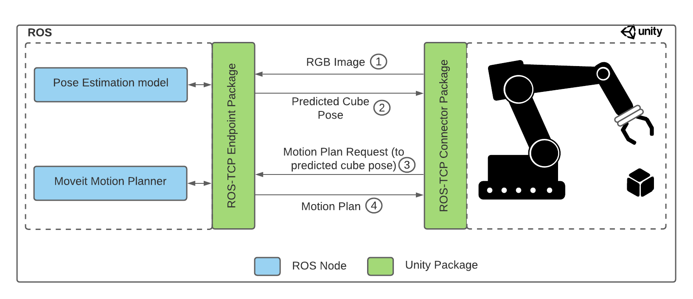

# Pose Estimation Demo: Phase 4


In [Phase 1](1_set_up_the_scene.md) of the tutorial, we learned how to create our scene in the Unity editor. In [Phase 2](2_set_up_the_data_collection_scene.md), we set up the scene for data collection. 

In [Phase 3](3_data_collection_model_training.md) we have learned: 
* How to collect the data 
* How to train the deep learning model

In this phase, we will use our trained deep learning model to predict the pose of the cube, and pick it up with our robot arm.  

<p align="center">

</p>

**Table of Contents**
  - [Setup](#setup)
  - [Adding the Pose Estimation Model](#step-2)
  - [Set up the ROS side](#step-3)
  - [Set up the Unity side](#step-4)
  - [Putting it together](#step-5)

---

### <a name="setup">Setup</a>
If you have correctly followed phases 1 and 2, whether or not you choose to use the Unity project given by us or start it from scratch, you should have cloned the repository. 

>Note: If you cloned the project and forgot to use `--recurse-submodules`, or if any submodule in this directory doesn't have content (e.g. moveit_msgs or ros_tcp_endpoint), you can run the following command to grab the Git submodules. But before you need to be in the `pose_estimation` folder. 
>```bash
>cd /PATH/TO/Unity-Robotics-Hub/tutorials/pose_estimation &&
>git submodule update --init --recursive 
>```

Three package dependencies for this project, [Universal Robot](https://github.com/ros-industrial/universal_robot) for the UR3 arm configurations, [Robotiq](https://github.com/ros-industrial/robotiq) for the gripper, and [MoveIt Msgs](https://github.com/ros-planning/moveit_msgs) are large repositories. A bash script has been provided to run a sparse clone to only copy the files required for this tutorial, as well as the [ROS TCP Endpoint](https://github.com/Unity-Technologies/ROS-TCP-Endpoint/).

1. Open a terminal and go to the directory of the `pose_estimation` folder. Then run:
```bash
./submodule.sh 
```

In your `pose_estimation` folder, you should have a `ROS` folder. Inside that folder you should have a `src` folder and inside that one 5 folders: `moveit_msgs`, `robotiq`, `ros_tcp_endpoint`, `universal_robot` and `ur3_moveit`. 

### <a name="step-2">Adding the Pose Estimation Model</a>

Here you have two options for the model:

#### Option A: Use Our Pre-trained Model

1. To save time, you may use the model we have trained. Download this [UR3_single_cube_model.tar](https://github.com/Unity-Technologies/Unity-Robotics-Hub/releases/download/Pose-Estimation/UR3_single_cube_model.tar) file, which contains the pre-trained model weights.

#### Option B: Use Your Own Model

2. You can also use the model you have trained in [Phase 3](3_data_collection_mode_training.md). However, be sure to rename your model `UR3_single_cube_model.tar` as the script that will call the model is expecting this name.

#### Moving the Model to the ROS Folder

3. Go inside the `ROS/SRC/ur3_moveit` folder and create a folder called `models`. Then copy your model file (.tar) into it.

### <a name="step-3">Set up the ROS side</a>

>Note: This project has been developed with Python 3 and ROS Noetic.

The provided ROS files require the following packages to be installed. The following section steps through configuring a Docker container as the ROS workspace for this tutorial. If you would like to manually set up your own ROS workspace with the provided files instead, follow the steps in [Phase 0: ROS Setup](0_ros_setup.md) to do so.

Building this Docker container will install the necessary packages for this tutorial.

1. Install the [Docker Engine](https://docs.docker.com/engine/install/) if not already installed. Start the Docker daemon. To check if the Docker daemon is running, when you open you Docker application you should see something similar to the following (green dot on the bottom left corner with the word running at the foot of Docker): 

<p align="center">

</p>

2. In the terminal, ensure the current location is at the root of the `pose_estimation` directory. Build the provided ROS Docker image as follows:

```bash
docker build -t unity-robotics:pose-estimation -f docker/Dockerfile .
```

>Note: The provided Dockerfile uses the [ROS Noetic base Image](https://hub.docker.com/_/ros/). Building the image will install the necessary packages as well as copy the [provided ROS packages and submodules](../ROS/) to the container, predownload and cache the [VGG16 model](https://pytorch.org/docs/stable/torchvision/models.html#torchvision.models.vgg16), and build the catkin workspace.

3. Start the newly built Docker container: 

```docker
docker run -it --rm -p 10000:10000 -p 5005:5005 unity-robotics:pose-estimation /bin/bash
```

When this is complete, it will print: `Successfully tagged unity-robotics:pose-estimation`. This console should open into a bash shell at the ROS workspace root, e.g. `root@8d88ed579657:/catkin_ws#`. 

>Note: If you encounter issues with Docker, check the [Troubleshooting Guide](troubleshooting.md) for potential solutions.

4. Source your ROS workspace: 

```bash
source devel/setup.bash
```

The ROS workspace is now ready to accept commands!

>Note: The Docker-related files (Dockerfile, bash scripts for setup) are located in `PATH-TO-pose_estimation/docker`. 

---

### <a name="step-4">Set up the Unity side</a>

If your Pose Estimation Tutorial Unity project is not already open, select and open it from the Unity Hub.

>Note: A complete version of this step has been provided in this repository, called `PoseEstimationDemoProject`. If you have some experience with Unity and would like to skip the scene setup portion, you can open this provided project via Unity Hub and open the scene TutorialPoseEstimation. You will need to update the ROS Settings as described below, then skip to [Step 5: Putting it together](#step-5).

We will work on the same scene that was created in the [Phase 1](1_set_up_the_scene.md) and [Phase 2](2_set_up_the_data_collection_scene.md), so if you have not already, complete Phases 1 and 2 to set up the Unity project. 

#### Connecting with ROS

Prefabs have been provided for the UI elements and trajectory planner for convenience. These are grouped under the parent `ROSObjects` tag.

1. In the Project tab, go to `Assets > TutorialAssets > Prefabs > Part4` and drag and drop the `ROSObjects` prefab inside the _**Hierarchy**_ panel.

**Action**: The ROS TCP connection needs to be created. In the top menu bar in the Unity Editor, select `Robotics -> ROS Settings`. Find the IP address of your ROS machine. 
  * If you are going to run ROS services with the Docker container introduced [above](#step-3), fill `ROS IP Address` and `Override Unity IP` with the loopback IP address `127.0.0.1`. If you will be running ROS services via a non-Dockerized setup, you will most likely want to have the `Override Unity IP` field blank, which will let the Unity IP be determined automatically. 

  * If you are **not** going to run ROS services with the Docker container, e.g. a dedicated Linux machine or VM, open a terminal window in this ROS workspace. Set the ROS IP Address field as the output of the following command:

```bash
hostname -I
```

2. Ensure that the ROS Port is set to `10000` and the Unity Port is set to `5005`. You can leave the Show HUD box unchecked. This HUD can be helpful for debugging message and service requests with ROS. You may turn this on if you encounter connection issues.

<p align="center">

</p>

Opening the ROS Settings has created a ROSConnectionPrefab in `Assets/Resources` with the user-input settings. When the static `ROSConnection.instance` is referenced in a script, if a `ROSConnection` instance is not already present, the prefab will be instantiated in the Unity scene, and the connection will begin.

>Note: While using the ROS Settings menu is the suggested workflow, you may still manually create a GameObject with an attached ROSConnection component.

The provided script `Assets/TutorialAssets/Scripts/TrajectoryPlanner.cs` contains the logic to invoke the motion planning services, as well as the logic to control the gripper and end effector tool. This has been adapted from the [Pick-and-Place tutorial](https://github.com/Unity-Technologies/Unity-Robotics-Hub/blob/main/tutorials/pick_and_place/3_pick_and_place.md). The component has been added to the ROSObjects/Publisher object.

In this TrajectoryPlanner script, there are two functions that are defined, but not yet implemented. `InvokePoseEstimationService()` and `PoseEstimationCallback()` will create a [ROS Service](http://wiki.ros.org/Services) Request and manage on the ROS Service Response, respectively. The following steps will provide the code and explanations for these functions.

3. Open the `TrajectoryPlanner.cs` script in an editor. Find the empty `InvokePoseEstimationService(byte[] imageData)` function definition, starting at line 165. Replace the empty function with the following:

```csharp
private void InvokePoseEstimationService(byte[] imageData)
{
    uint imageHeight = (uint)renderTexture.height;
    uint imageWidth = (uint)renderTexture.width;

    RosMessageTypes.Sensor.Image rosImage = new RosMessageTypes.Sensor.Image(new RosMessageTypes.Std.Header(), imageWidth, imageHeight, "RGBA", isBigEndian, step, imageData);
    PoseEstimationServiceRequest poseServiceRequest = new PoseEstimationServiceRequest(rosImage);
    ros.SendServiceMessage<PoseEstimationServiceResponse>("pose_estimation_srv", poseServiceRequest, PoseEstimationCallback);
}
```

The `InvokePoseEstimationService` function will be called upon pressing the `Pose Estimation` button in the Unity Game view. It takes a screenshot of the scene as an input, and instantiates a new RGBA [sensor_msgs/Image](http://docs.ros.org/en/melodic/api/sensor_msgs/html/msg/Image.html) with the defined dimensions. Finally, this instantiates and sends a new Pose Estimation service request to ROS.

>Note: The C# scripts for the necessary ROS msg and srv files in this tutorial have been generated via the [ROS-TCP-Connector](https://github.com/Unity-Technologies/ROS-TCP-Connector) and provided in the project's `Assets/TutorialAssets/RosMessages/` directory.

Next, the function that is called to manage the Pose Estimation service response needs to be implemented.

4. Still in the TrajectoryPlanner script, find the empty `PoseEstimationCallback(PoseEstimationServiceResponse response)` function definition. Replace the empty function with the following:

```csharp
void PoseEstimationCallback(PoseEstimationServiceResponse response)
{
    if (response != null)
    {
        // The position output by the model is the position of the cube relative to the camera so we need to extract its global position 
        var estimatedPosition = Camera.main.transform.TransformPoint(response.estimated_pose.position.From<RUF>());
        var estimatedRotation = Camera.main.transform.rotation * response.estimated_pose.orientation.From<RUF>();

        PublishJoints(estimatedPosition, estimatedRotation);

        EstimatedPos.text = estimatedPosition.ToString();
        EstimatedRot.text = estimatedRotation.eulerAngles.ToString();
    }
    InitializeButton.interactable = true;
    RandomizeButton.interactable = true;
}
```

This callback is automatically run when the Pose Estimation service response arrives. This function simply converts the incoming pose into UnityEngine types and updates the UI elements accordingly. Once converted, the estimated position and rotation are sent to `PublishJoints`, which will send a formatted request to the MoveIt trajectory planning service.

>Note: The incoming position and rotation are converted `From<RUF>`, i.e. Unity's coordinate space, in order to cleanly convert from a `geometry_msgs/Point` and `geometry_msgs/Quaternion` to `UnityEngine.Vector3` and `UnityEngine.Quaternion`, respectively. This is equivalent to creating a `new Vector3(response.estimated_pose.position.x, response.estimated_pose.position.y, response.estimated_pose.position.z)`, and so on. This functionality is provided via the [ROSGeometry](https://github.com/Unity-Technologies/ROS-TCP-Connector/blob/dev/ROSGeometry.md) component of the ROS-TCP-Connector package.

Note that the TrajectoryPlanner component shows its member variables in the _**Inspector**_ window, which need to be assigned.

5. Return to Unity. Select the `ROSObjects/Publisher` GameObject. Assign the `ur3_with_gripper` GameObject to the `Robot` field. Drag and drop the `Cube` GameObject from the _**Hierarchy**_ onto the `Target` Inspector field. Drag and drop the `Goal` to the `Goal` field. Finally, assign the `Simulation Scenario` object to the `Scenario` field. You should see the following:

<p align="center">

</p>

#### Switching to Inference Mode

6. On the `Simulation Scenario` GameObject, uncheck the `Fixed Length Scenario` component to disable it, as we are no longer in the Data Collection phase. If you want to collect new data in the future, you can always check back on the `Fixed Length Scenario` and uncheck to disable the `ROSObjects`. 

7. On the `Main Camera` GameObject, uncheck the `Perception Camera` script component, since we do not need it anymore. 

Also note that the UI elements have been provided in `ROSObjects/Canvas`, including the Event System that is added on default by Unity. In `ROSObjects/Canvas/ButtonPanel`, the OnClick callbacks have been pre-assigned in the prefab. These buttons set the robot to its upright default position, randomize the cube position and rotation, randomize the target, and call the Pose Estimation service.


### <a name="step-5">Putting it together</a>

Then, run the following roslaunch in order to start roscore, set the ROS parameters, start the server endpoint, start the Mover Service and Pose Estimation nodes, and launch MoveIt.

1. In the terminal window of your ROS workspace opened in [Step 2](#step-3), run the provided launch file:

```bash
roslaunch ur3_moveit pose_est.launch 
```

---

This launch file also loads all relevant files and starts ROS nodes required for trajectory planning for the UR3 robot (`gazebo.launch`). The launch files for this project are available in the package's launch directory, i.e. `src/ur3_moveit/launch/`. 

This launch will print various messages to the console, including the set parameters and the nodes launched. The final message should confirm `You can start planning now!`.

>Note: The launch file may throw errors regarding `[controller_spawner-5] process has died`. These are safe to ignore as long as the final message is `Ready to plan`. This confirmation may take up to a minute to appear.

<p align="center"></p>

2. Return to Unity, and press Play.

>Note: If you encounter connection errors such as a `SocketException` or don't see a completed TCP handshake between ROS and Unity in the console window, return to the [Connecting with ROS](#connecting-with-ros) section above to update the ROS Settings and generate the ROSConnectionPrefab.


Note that the robot arm must be in its default position, i.e. standing upright, to perform Pose Estimation. This is done by simply clicking the `Reset Robot Position` button after each run.

3. Press the `Pose Estimation` button to send the image to ROS. 

This will grab the current camera view, generate a [sensor_msgs/Image](http://docs.ros.org/en/noetic/api/sensor_msgs/html/msg/Image.html) message, and send a new Pose Estimation Service Response to the ROS node running `pose_estimation_service.py`. This will run the trained model and return a Pose Estimation Service Response containing an estimated pose, which is subsequently converted and sent as a new Mover Service Response to the `mover.py` ROS node. Finally, MoveIt calculates and returns a list of trajectories to Unity, and the poses are executed to pick up and place the cube.

The target object and empty goal object can be moved around during runtime for different trajectory calculations, or can be randomized using the `Randomize Cube` button. 

>Note: You may encounter a `UserWarning: CUDA initialization: Found no NVIDIA driver on your system.` error upon the first image prediction attempt. This warning can be safely ignored.

>Note: If you encounter issues with the connection between Unity and ROS, check the [Troubleshooting Guide](troubleshooting.md) for potential solutions.

You should see the following: 
<p align="center">

</p>

### Click here to go back to [Phase 3](3_data_collection_model_training.md).
