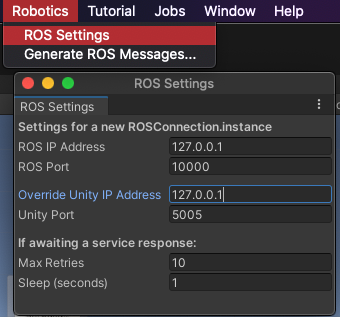
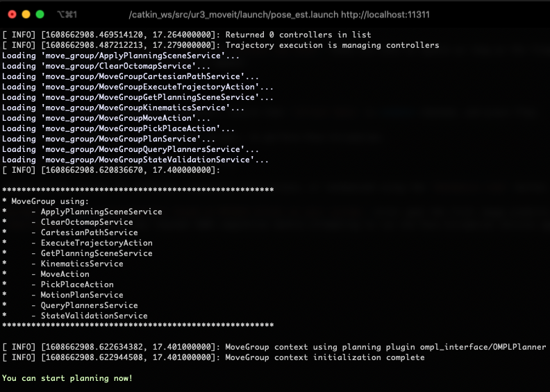

# Pick-and-Place with Pose Estimation: Quick Demo

If you just want to run the completed project, this section can help you get up and running quickly. Here, we provide a pre-trained pose estimation model for you to use, and assume a Docker workflow. By the end of this quick demo, you will be able to perform pick & place in Unity with machine learning-based perception. To learn how to build something like this from scratch, see our [full tutorial](1_set_up_the_scene.md).

**Table of Contents**
- [Prerequisites](#Prerequisites)
- [Add the Pose Estimation Model](#add-the-pose-estimation-model)
- [Set up the ROS side](#set-up-the-ros-side)
- [Set up the Unity side](#set-up-the-unity-side)
- [Putting it together](#putting-it-together)

---

## Prerequisites

You will first need to **clone** this repository. 

>Note For Windows Users:
You need to have a software enabling you to run bash files. One option is to download [GIT](https://git-scm.com/downloads). During installation of GIT, add GIT Bash to windows context menu by selecting its option. After installation right click in your folder select [GIT Bash Here](Images/0_GIT_installed.png).

1. Open a terminal and put yourself where you want to host the repository. 

```bash
git clone https://github.com/Unity-Technologies/Unity-Robotics-Hub.git
```

Three package dependencies for this project, [Universal Robot](https://github.com/ros-industrial/universal_robot) for the UR3 arm configurations, [Robotiq](https://github.com/ros-industrial/robotiq) for the gripper, and [MoveIt Msgs](https://github.com/ros-planning/moveit_msgs) are large repositories. A bash script has been provided to run a sparse clone to only copy the files required for this tutorial, as well as the [ROS TCP Endpoint](https://github.com/Unity-Technologies/ROS-TCP-Endpoint/).

2. Still in the same terminal, run:
```bash
cd Unity-Robotics-Hub/tutorials/pose_estimation
./submodule.sh 
```

3. [Install Unity `2020.2.*`.](install_unity.md)

## <a name='setup'>Setup</a>

1. Open the completed project. In the Unity Hub, click the `Add` button, and select `PoseEstimationDemoProject` from inside the file location where you cloned this repo. 

2. Open the scene. Go to `Assets > Scenes` and double click on `TutorialPoseEstimation`. 

3. The size of the images that will be used for pose estimation depends on a setting in the Game view. Select the `Game` view and select `Free Aspect`. Then select the **+**, with the message `Add new item` on it if you put your mouse over the + sign. For the Width select `650` and for the Height select `400`. A gif below shows you how to do it. 

<p align="center">

</p>

## Add the Pose Estimation Model

In your `pose_estimation` folder, you should have a `ROS` folder. Inside that folder you should have a `src` folder and inside that one 5 folders: `moveit_msgs`, `robotiq`, `ros_tcp_endpoint`, `universal_robot` and `ur3_moveit`. 

1. Download the [pose estimation model](https://github.com/Unity-Technologies/Unity-Robotics-Hub/releases/download/Pose-Estimation/UR3_single_cube_model.tar) we have trained.

2. Go inside the `ROS/SRC/ur3_moveit` folder and create a folder `models`. Copy the `UR3_single_cube_model.tar` file you've just downloaded into this folder.


## Set up the ROS side

>Note: This project has been developed with Python 3 and ROS Noetic.

We have provided a Docker container to get you up and running quickly. 

1. Install the [Docker Engine](https://docs.docker.com/engine/install/) if not already installed. Start the Docker daemon. To check if the Docker daemon is running, when you open you Docker application you should see something similar to the following (green dot on the bottom left corner with the word running at the foot of Docker): 

<p align="center">

</p>

2. In the terminal, ensure the current location is at the root of the `pose_estimation` directory. Build the provided ROS Docker image as follows:

```bash
docker build -t unity-robotics:pose-estimation -f docker/Dockerfile .
```

>Note: The provided Dockerfile uses the [ROS Noetic base Image](https://hub.docker.com/_/ros/). Building the image will install the necessary packages as well as copy the [provided ROS packages and submodules](../ROS/) to the container, predownload and cache the [VGG16 model](https://pytorch.org/docs/stable/torchvision/models.html#torchvision.models.vgg16), and build the catkin workspace.

3. Start the newly built Docker container: 

```docker
docker run -it --rm -p 10000:10000 -p 5005:5005 unity-robotics:pose-estimation /bin/bash
```

When this is complete, it will print: `Successfully tagged unity-robotics:pose-estimation`. This console should open into a bash shell at the ROS workspace root, e.g. `root@8d88ed579657:/catkin_ws#`. 

>Note: If you encounter issues with Docker, check the [Troubleshooting Guide](troubleshooting.md) for potential solutions.

4. Source your ROS workspace: 

```bash
source devel/setup.bash
```

The ROS workspace is now ready to accept commands!


## Set up the Unity side

1. Fill `ROS IP Address` and `Override Unity IP` with the loopback IP address `127.0.0.1`. 

2. Ensure that the ROS Port is set to `10000` and the Unity Port is set to `5005`. You can leave the Show HUD box unchecked. This HUD can be helpful for debugging message and service requests with ROS. You may turn this on if you encounter connection issues.

<p align="center">

</p>

#### Switching to Inference Mode

The completed project is set up for data collection by default, so we must switch it to inference mode.

3. On the `Simulation Scenario` GameObject, uncheck the `Fixed Length Scenario` component to disable it.


## Putting it together

Run the following `roslaunch` command in order to start roscore, set the ROS parameters, start the server endpoint, start the Mover Service and Pose Estimation nodes, and launch MoveIt.

1. In the terminal window of your ROS workspace opened above, run the provided launch file:

```bash
roslaunch ur3_moveit pose_est.launch 
```

This launch file also loads all relevant files and starts ROS nodes required for trajectory planning for the UR3 robot (`gazebo.launch`). The launch files for this project are available in the package's launch directory, i.e. `src/ur3_moveit/launch/`. 

This launch will print various messages to the console, including the set parameters and the nodes launched. The final two messages should confirm `You can start planning now!`.

>Note: The launch file may throw errors regarding `[controller_spawner-5] process has died`. These are safe to ignore as long as the final message is `Ready to plan`. This confirmation may take up to a minute to appear.

<p align="center"></p>

2. Return to Unity, and press Play.

>Note: If you encounter connection errors such as a `SocketException` or don't see a completed TCP handshake between ROS and Unity in the console window, return to the [Set up the Unity side](#set-up-the-unity-side) section above to update the ROS Settings and generate the ROSConnectionPrefab.


Note that the robot arm must be in its default position, i.e. standing upright, to perform Pose Estimation. This is done by simply clicking the `Reset Robot Position` button after each run.

3. Press the `Pose Estimation` button to send the image to ROS. 

This will grab the current camera view, generate a [sensor_msgs/Image](http://docs.ros.org/en/noetic/api/sensor_msgs/html/msg/Image.html) message, and send a new Pose Estimation Service Response to the ROS node running `pose_estimation_service.py`. This will run the trained model and return a Pose Estimation Service Response containing an estimated pose, which is subsequently converted and sent as a new Mover Service Response to the `mover.py` ROS node. Finally, MoveIt calculates and returns a list of trajectories to Unity, and the poses are executed to pick up and place the cube.

The target object and goal object can be moved around during runtime for different trajectory calculations, or the target can be randomized using the `Randomize Cube` button. 

>Note: You may encounter a `UserWarning: CUDA initialization: Found no NVIDIA driver on your system.` error upon the first image prediction attempt. This warning can be safely ignored.

>Note: If you encounter issues with the connection between Unity and ROS, check the [Troubleshooting Guide](troubleshooting.md) for potential solutions.

You should see the following: 
<p align="center">

</p>


If you'd now like to follow the full tutorial to learn how to build the pick-and-place simulation from scratch, proceed to [Part 1](1_set_up_the_scene.md)


