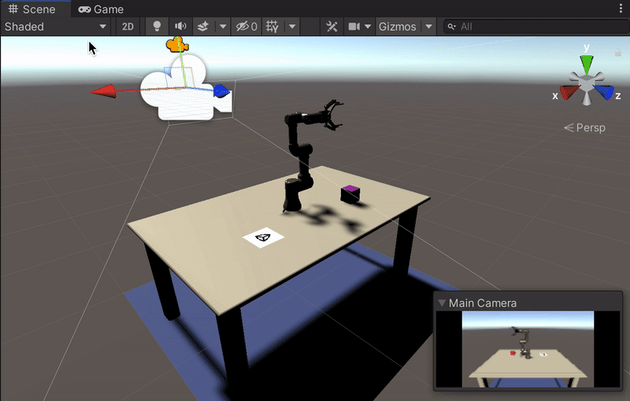

# Data Collection: Quick Demo

## <a name="reqs">Requirements</a>

To follow this tutorial you need to **clone** this repository even if you want to create your Unity project from scratch. In fact, we need the ROS folder of the repository which is dependent of gitsubmodules (hence the command `--recurse-submodules`). 


>Note For Windows Users:
You need to have a software enabling you to run bash files. One option is to download [GIT](https://git-scm.com/downloads). During installation of GIT, add GIT Bash to windows context menu by selecting its option. After installation right click in your folder select GIT Bash Here (see attached pic). 
<p align="center">

</p>


1. Open a terminal and put yourself where you want to host the repository. 
```bash
git clone --recurse-submodules https://github.com/Unity-Technologies/Unity-Robotics-Hub.git
```

2. [Install Unity `2020.2.*`.](install_unity.md)

3. Open the completed project. To do so, open Unity Hub, click the `Add` button, and select `PoseEstimationDemoProject` from the `Unity-Robotics-Hub/tutorials/pose_estimation/` folder. 

## <a name='setup'>Setup</a>

1. Open the scene. Go to `Assets > Scenes` and double click on `TutorialPoseEstimation`. 

2. The size of the images that will be used for pose estimation depends on a setting in the Game view. Select the `Game` view and select `Free Aspect`. Then select the **+**, with the message `Add new item` on it if you put your mouse over the + sign. For the Width select `650` and for the Height select `400`. A gif below shows you how to do it. 

<p align="center">

</p>

## <a name="data-collection">Data Collection</a>
The project is set up for data collection by default, so you can get started without too much work. To see how,
follow the instructions in [Phase 3: Collect the Training and Validation Data](3_data_collection_model_training.md#step-1) of the tutorial. This section will explain how to set the random seed of the environment, choose how many training data examples you'd like to collect, and get it running. 

If you'd like to then move on to training a pose estimation model on the data you've collected, move on to [Phase 3: Train the Deep Learning Model](3_data_collection_model_training.md#step-2). 

Have fun!
