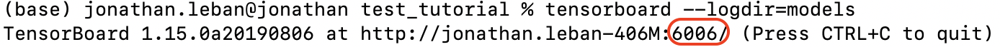

# Visualizing Training Results with Tensorboard
To view the training or evaluation logs you can you use Tensorboard. The logs are saved in the same directory the model is saved. 
You need to run the following command:

* **Action**: 
```bash
tensorboard --logdir=[LOG DIRECTORY]
```

You should see something similar to this: 
<p align="center">

</p>

The result of this command will show you the port on which Tensorboard is now available. In the example above, it can be found at port `6006`.

* **Action**: Open your internet browser and navigate to:
```
localhost:[PORT_NUMBER]
```

Once you navigate to that location in your browser, you should see something like this: 
<p align="center">
    
</p>

These charts show the changing loss during the training process. The training and validation losses are the mean squared errors for position and orientation on the training and validation data sets, respectively. During training, the loss is generally expected to go down, but as you can see here, it can be noisy. If you'd like to learn more about the model, you can explore its code [here](https://github.com/Unity-Technologies/Pose-Estimation-Model).