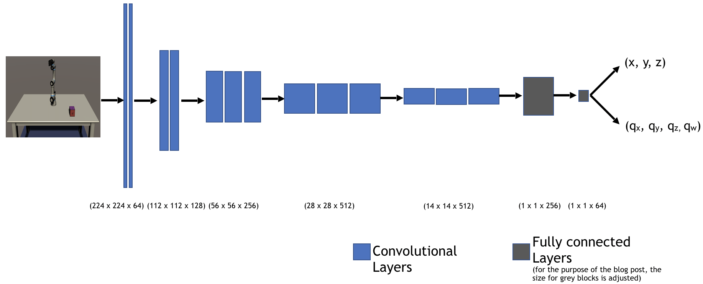

Pose Estimation Model
=====================
This section contains code for training and evaluating a deep neural network to predict the pose of a single object from RGB images. We provide support for running both locally and with Docker.  

This model is a modified implementation of [Domain Randomization for Transferring Deep Neural Networks from Simulation to the Real World](https://arxiv.org/pdf/1703.06907.pdf), by Tobin et. al. It is based on the classic VGG-16 backbone architecture, and initialized with weights pre-trained on the ImageNet dataset. The head of the network is replaced with a 3D position prediction head that outputs (x, y, z), and an orientation predicton head that outputs a quaternion (q<sub>x</sub>, q<sub>y</sub>, q<sub>z</sub>, q<sub>w</sub>). 

<p align='center'>
  
</p>

## Quick Start (Recommended)
We trained this model on sythetic data collected in Unity. To learn how to collect this data and train the model yourself, see our [data collection and training tutorial](../Documentation/quick_demo_train.md).

## Pre-Trained Model
We've provided a pre-trained model, which can be downloaded [here](https://github.com/Unity-Technologies/Unity-Robotics-Hub/releases/download/Pose-Estimation/UR3_single_cube_model.tar).

## Setup
 * [For running on docker](documentation/running_on_docker.md#docker-requirements)
 * [For running in the cloud](documentation/running_on_the_cloud.md)
 * [For running locally with Conda](../Documentation/3_data_collection_model_training.md#option-b-using-conda)

## CLI
This model supports a `train` and an `evaluate` command. Both of these have many arguments, which you can examine in `cli.py`. They will default to the values in `config.yaml` for convenience, but can be overridden via the command line.

The most important `train` arguments to be aware of are:
* `--data_root`: Path to the directory containing your data folders. These directory should include `UR3_single_cube_training` and `UR3_single_cube_validation`, containing the training and validation data, respectively. 
* `--log-dir-system`: Path to directory where you'd like to save Tensorboard log files and model checkpoint files.

The most important `evaluate` arguments to be aware of are:
* `--load-dir-checkpoint`: Path to model to be evaluated. 
* `--data_root`: Path to the directory containing your data folders. These directory should include `UR3_single_cube_training` and `UR3_single_cube_validation`, containing the training and validation data, respectively. 


## Performance

Below is a description of the model's performance on predicting the pose of a cube. For the loss, we used the L2 norm for the position and orientation in each batch.

However, we used different metrics to _evaluate_ the performance of the model. 
* To evaluate translation predictions, we measured the [average L2 norm over the dataset](pose_estimation/evaluation_metrics/translation_average_mean_square_error.py).
* To evaluate the orientation predictions, we used the angle between the orientation of the prediction and the orientation of the target, averaged over the dataset (implementation [here](pose_estimation/evaluation_metrics/orientation_average_quaternion_error.py)).


|                     | Training Error              | Validation Error           |
|:-------------------:|:---------------------------:|:--------------------------:|
|Translation          |  0.012 (12% of cube's size) |  0.01 (10% of cube's size) |
|Orientation (radian) |  0.06                       |  0.05                      |   


## Unit Testing

We use [pytest](https://docs.pytest.org/en/latest/) to run tests located under `tests/`. You can run the tests after following the setup instructions in [Running on Local with Conda](../documentation/3_data_collection_model_training.md#option-b-using-conda) commands.

You can run the entire test suite with:

```bash
python -m pytest
```

or run individual test files with:

```bash
python -m pytest tests/test_average_translation_mean_square_error.py
```

## Resources
* [Documentation](documentation/codebase_structure.md) describing structure of the model code
* [Domain Randomization for Transferring Deep Neural Networks from Simulation to the Real World](https://arxiv.org/pdf/1703.06907.pdf)
* [Pose Estimation Tutorial](../)