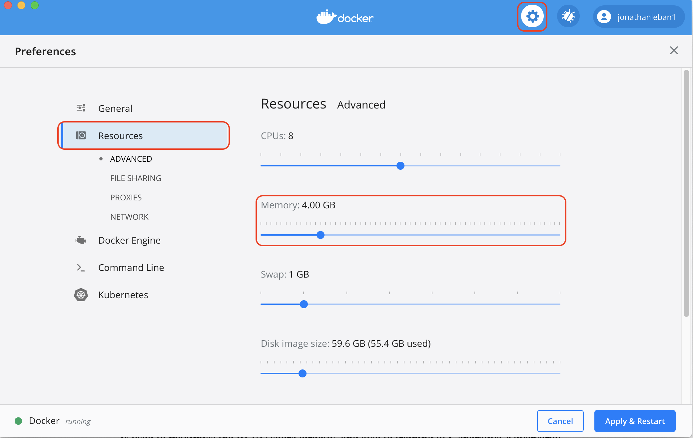
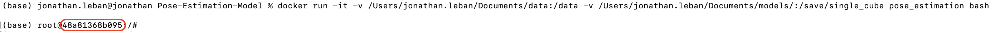

Docker 
======

Another option to run the project is to use a Docker image. This option allows you to avoid downloading the project's libraries to your local computer, while still running the project successfully. With a Docker image, you also have the ability to train or evaluate your model on a cloud platform, such as Google Cloud Platform, AWS, Microsoft Cloud, and many others. 

## Docker Requirements
You will need to have [Docker](https://docs.docker.com/get-docker/) installed on your computer. 

### Docker Creation on Local

* **Action**: In [config.yaml](../config.yaml), under `system`, set the argument `log_dir_system` to: `/save/single_cube`. 
* **Action**: Set the argument `data_root` under `system` to `/data`. 

Before creating the Docker image, you need to be sure your Docker settings are compatible with the project. Open Docker Desktop, click on `Settings` (the gear icon) on the top right, and go to `Resources`. Then change your settings so that it matches the following: 

<p align="center">

</p>

**Note**: You may need to tweak these settings for your exact use case.

The first step is to build the Docker image.

* **Action**: Open a new terminal and navigate to the `Unity-Robotics-Hub/tutorials/pose_estimation/Model` folder. Then run the command to build your docker image, and name it `pose_estimation`:
```bash 
docker build -t pose_estimation .
```

**Note**: If you change any code in the `Model` directory, you will need to rebuild the Docker image. 

* **Action**: Now we need to run the Docker image. One way is to use the bash shell. Still in the same terminal, enter the following:
```bash
docker run -it -v [FULL PATH TO DATA FOLDER]:/data -v [FULL PATH TO MODEL FOLDER]:/save/single_cube pose_estimation bash
```

The `FULL PATH TO DATA FOLDER` is the path to the upper directory of your data. As an example, I have put my `UR3_single_cube_training` and `UR3_single_cube_validation` data folder into a folder called `data` that I have created in my `Documents` folder. Thus my `FULL PATH TO DATA FOLDER` will be `/Users/jonathan.leban/Documents/data`.

The `FULL PATH TO MODEL FOLDER` is the directory in which your models and metrics will be saved. For me, I created a folder called `save` into my Documents. 
The `/save/single_cube` directory is the directory inside the docker container. That is why in the [config.yaml](../config.yaml) file, under the argument `system` the argument `log_dir_system` is set to `/save/single_cube`. 

Thus, the final command for me is: 
```bash
docker run -it -v /Users/jonathan.leban/Documents/data:/data -v Users/jonathan.leban/Documents/save:/save/single_cube pose_estimation bash
```

### CLI 
At the top of the [cli.py](../pose_estimation/cli.py) file, you can see the documentation for all supported commands. 

#### Train
To run the training commmand with default values:

* **Action**: 
```bash 
python -m pose_estimation.cli train
```

You can override many hyperparameters by adding additional arguments to this command. See the documentation at the top of [cli.py](../pose_estimation/cli.py) for a view of all supported arguments.  


#### Evaluate  
To run the evaluate commmand with default values:

```bash
python -m pose_estimation.cli evaluate
```

Again, you can override many hyperparameters by adding additional arguments to this command. See the documentation at the top of [cli.py](../pose_estimation/cli.py) for a view of all supported arguments.  


### Copy metrics and models saved on Docker on your local machine 
Once you have trained or evaluated your model, you may want to copy the results out of the docker container, to your local computer. 

After building and running the docker image your terminal should look something like this:

<p align="center">

</p>

Here you can see on the right of `root@` the id of the docker container you are in. Copy this id. 

As a reminder, we want to extract some files of `save/single_cube/` inside the docker container into your `save` folder you have created on your local computer. 
Open a new terminal and enter the following: 

```bash
docker cp <containerId>:/file/path/within/container /host/path/target
```

As an example, I have put my `save` folder inside my `/Users/jonathan.leban/Documents/`. Thus, to copy my model on my local, I will enter the following: 
```bash
docker cp 48a81368b095:/save/single_cube/UR3_single_cube_model_ep120.tar /Users/jonathan.leban/Documents/save
```

To copy my metrics on my local, I will enter the following: 
```bash
docker cp 48a81368b095:/save/single_cube/events.out.tfevents.1612402202.48a81368b095 /Users/jonathan.leban/Documents/save
```

The metrics folder should have the same format as **events.out.tfevents.<`number`>.<`number`>**

### Troubleshooting 
If when you launch the training you have an issue saying `Killed`, then you need to increase your `Memory` to 8GB in your Docker settings. 
