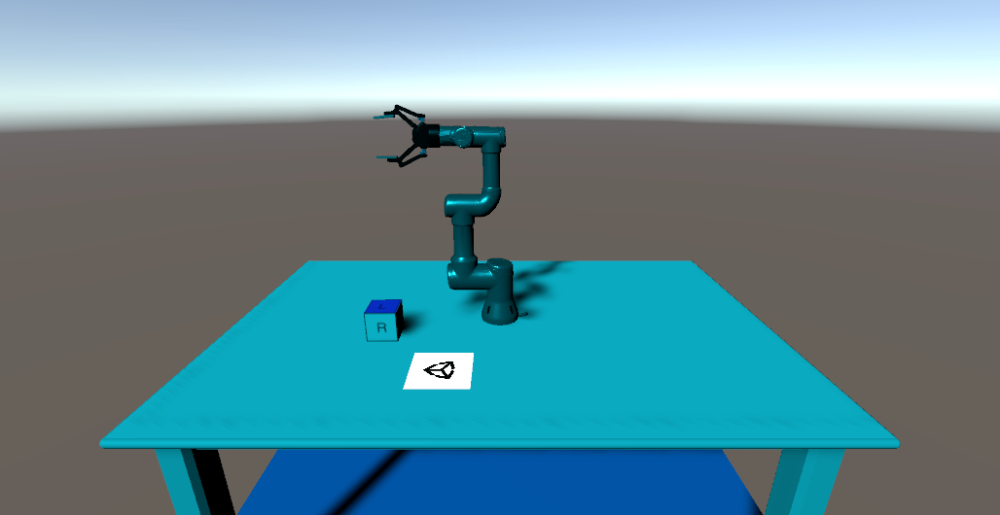

# Pose Estimation Demo 

This tutorial will go through the steps necessary to perform pose estimation with a UR3 robotic arm in Unity. You’ll gain experience integrating ROS with Unity, importing URDF models, collecting labeled training data, and training and deploying a deep learning model. By the end of this tutorial, you will be able to perform pick-and-place with a robot arm in Unity, using computer vision to perceive the object the robot picks up.

**Want to skip the tutorial and run the full demo? Check out our [Quick Demo](Documentation/quick_demo_full.md).**

**Want to skip the tutorial and focus on collecting training data for the deep learning model? Check out our [Quick Data-Collection Demo](Documentation/quick_demo_train.md).**

> Note: This project has been developed with Python 3 and ROS Noetic.

**Table of Contents**
- [Part 1: Create Unity scene with imported URDF](#link-part-1)
- [Part 2: Setting up the scene for data collection](#link-part-2)
- [Part 3: Data Collection and Model Training](#link-part-3)
- [Part 4: Pick-and-Place](#link-part-4)
  
---

### <a name="link-part-1">[Part 1: Create Unity Scene with Imported URDF](Documentation/1_set_up_the_scene.md)</a>

This part includes downloading and installing the Unity Editor, setting up a basic Unity scene, and importing a robot. We will import the [UR3 robot arm](https://www.universal-robots.com/products/ur3-robot) using the [URDF Importer](https://github.com/Unity-Technologies/URDF-Importer) package. 

---

### <a name="link-part-2">[Part 2: Setup the Scene for Data Collection](Documentation/2_set_up_the_data_collection_scene.md)</a> 

This part focuses on setting up the scene for data collection using the Unity Computer Vision [Perception Package](https://github.com/Unity-Technologies/com.unity.perception). You will learn how to use Perception Package [Randomizers](https://github.com/Unity-Technologies/com.unity.perception/blob/master/com.unity.perception/Documentation~/Randomization/Index.md) to randomize aspects of the scene in order to create variety in the training data. 

If you would like to learn more about randomizers, and apply domain randomization to this scene more thoroughly, check out our further exercises for the reader [here](Documentation/5_more_randomizers.md).

---

### <a name="link-part-3">[Part 3: Data Collection and Model Training](Documentation/3_data_collection_model_training.md)</a> 

This part includes running data collection with the Perception Package, and using that data to train a deep learning model. The training step can take some time. If you'd like, you can skip that step by using our pre-trained model.

To measure the success of grasping in simulation using our pre-trained model for pose estimation, we did 100 trials and got the following results:

|                  | Success | Failures | Percent Success |
|:----------------:|:-------:|:--------:|:---------------:|
|Without occlusion |    82   |     5    |      94         |
|With occlusion    |    7    |     6    |      54         |
|All               |    89   |     11   |      89         |

---

### <a name="link-part-4">[Part 4: Pick-and-Place](Documentation/4_pick_and_place.md)</a> 

This part includes the preparation and setup necessary to run a pick-and-place task using MoveIt. Here, the cube pose is predicted by the trained deep learning model. Steps covered include:
* Creating and invoking a motion planning service in ROS
* Sending captured RGB images from our scene to the ROS Pose Estimation node for inference
* Using a Python script to run inference on our trained deep learning model 
* Moving Unity Articulation Bodies based on a calculated trajectory
* Controlling a gripping tool to successfully grasp and drop an object.

---
