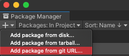

# Installing the Unity Robotics packages

This page provides brief instructions on installing the Unity Robotics packages. Head over to the [Pick-and-Place Tutorial](pick_and_place/README.md) for more detailed instructions and steps for building a sample project.

1. Create or open a Unity project.
    > Note: If you are adding the URDF-Importer, ensure you are using a [2020.2.0](https://unity3d.com/unity/whats-new/2020.2.0)+ version of Unity Editor.

1. Open `Window` -> `Package Manager`.

1. In the Package Manager window, find and click the `+` button in the upper lefthand corner of the window. Select `Add package from git URL...`.

    

1. Enter the git URL for the desired package. Note: you can append a version tag to the end of the git url, like `#v0.4.0` or `#v0.5.0`, to declare a specific package version, or exclude the tag to get the latest from the package's `main` branch.
   1. For the [ROS-TCP-Connector](https://github.com/Unity-Technologies/ROS-TCP-Connector), enter `https://github.com/Unity-Technologies/ROS-TCP-Connector.git?path=/com.unity.robotics.ros-tcp-connector`.
   1. For the [URDF-Importer](https://github.com/Unity-Technologies/URDF-Importer), enter `https://github.com/Unity-Technologies/URDF-Importer.git?path=/com.unity.robotics.urdf-importer`.

1. Click `Add`.

To install from a local clone of the repository, see [installing a local package](https://docs.unity3d.com/Manual/upm-ui-local.html) in the Unity manual.
