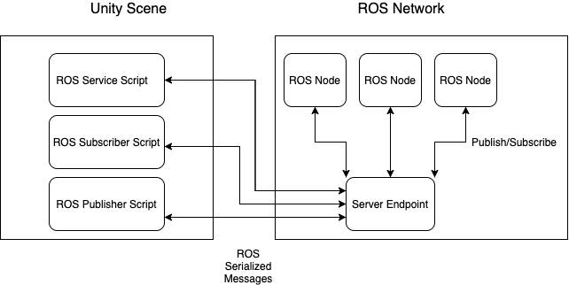

# ROS–Unity Integration

## Editor Version
Most of our projects are developed/tested on Unity Editor version 2020.2.0f9 or later. We expect that anything 2020.2+ should be compatible, and will be actively working to ensure this for future versions. 2020.1.X and below are unlikely to work well, if at all, and we strongly encourage updating to a more recent version to support the bleeding edge updates to Unity's physics and simulation components that we are leveraging.

## ROS–Unity Communication

A TCP endpoint running as a ROS node, which facilitates message passing to and from Unity and ROS.

The messages being passed between Unity and ROS are expected to be serialized as ROS would internally serialize them. To achieve this, the `MessageGeneration` plugin (from the [ROS TCP Connector](https://github.com/Unity-Technologies/ROS-TCP-Connector) repo) can generate C# classes, including serialization and deserialization functions, from ROS `.msg` files.

The `ROSConnection` plugin (also from [ROS TCP Connector](https://github.com/Unity-Technologies/ROS-TCP-Connector)) provides the Unity scripts necessary to publish, subscribe, or call a service.

---

We're currently working on lots of things! As a first step for these tutorials, please take a short moment fill out our [survey](https://unitysoftware.co1.qualtrics.com/jfe/form/SV_0ojVkDVW0nNrHkW) to help us identify what products and packages to build next.

---

## Tutorials
- [ROS–Unity Integration: Initial Setup](setup.md) - ROS–Unity Initial Setup
- [ROS–Unity Integration: Network Description](network.md) - Description of network settings and troubleshooting
- [ROS–Unity Integration: Publisher](publisher.md) - Publish messages from a Unity Scene
- [ROS–Unity Integration: Subscriber](subscriber.md) - Subscribe to receive messages in a Unity Scene
- [ROS–Unity Integration: Unity Service](unity_service.md) - Implement a service inside a Unity Scene
- [ROS–Unity Integration: Service Call](service_call.md) - Call an external service from a Unity Scene

## Example Unity Scripts

Example scripts implemented in tutorials:

- `unity_scripts/RosPublisherExample.cs`
	- Publishes the position of a GameObject every 0.5 seconds.

- `unity_scripts/RosSubscriberExample.cs`
	- Subscribes to a topic that accepts color messages and uses them to change the color of a GameObject in the Unity scene.

- `unity_scripts/RosUnityServiceExample.cs`
	- Runs a service in the Unity scene that takes a GameObject's name and responds with the Pose of that object.

- `unity_scripts/RosServiceExample.cs`
	- Returns a destination position for a GameObject to move towards each time the service is called.

