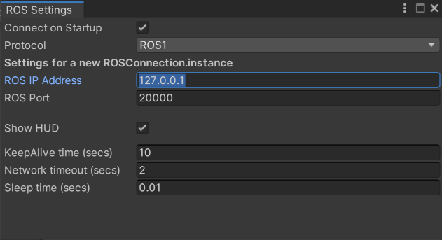
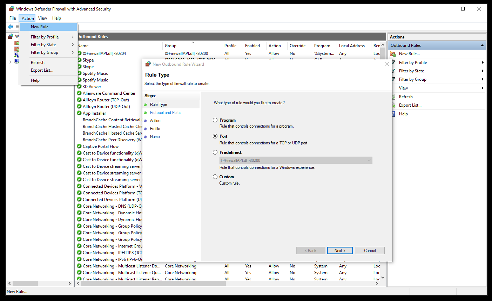
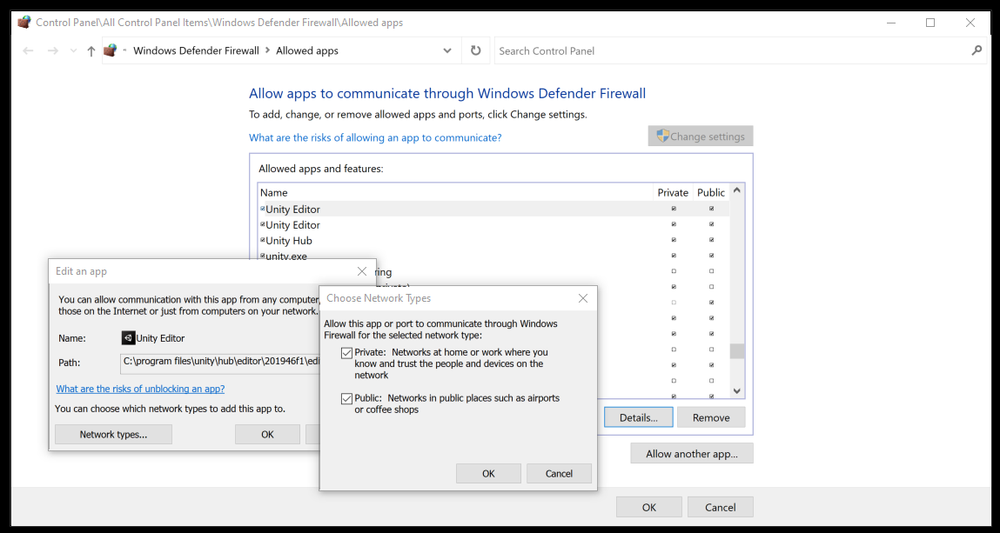

# ROS–Unity Integration Networking

## Table of Contents
- [Definitions](#definitions)
- [Communicaton Minimum Requirements](#communication-minimum-requirements)
	- [If Using Docker](#if-using-docker)
- [Troubleshoooting](#troubleshooting)
	- [Where Does Communication Break Down](#where-does-communication-break-down)
		- [1. Can Unity send messages to ROS?](#1-can-unity-send-messages-to-ros)
		- [2. Can ROS send messages to Unity?](#2-can-ros-send-messages-to-unity)
	- [Open Port on Windows Firewalll](#open-port-on-windows-firewall)

# Definitions

`ROS_IP` : The IP address of the machine, VM, or container running ROS.

> It is possible to set both of these variables on the machines running Unity and ROS. The specifics of where and why each of these settings will be described below.

On the ROS machine, these settings are set as a rosparam and will typically be set in a launch file like [this](ros_packages/unity_robotics_demo/launch/robo_demo.launch) or in a [param file](https://github.com/Unity-Technologies/Unity-Robotics-Hub/blob/main/tutorials/pick_and_place/ROS/src/niryo_moveit/config/params.yaml) loaded by a launch file like [this](https://github.com/Unity-Technologies/Unity-Robotics-Hub/blob/main/tutorials/pick_and_place/ROS/src/niryo_moveit/launch/part_3.launch#L2). The param file can also be loaded manually by running the `rosparam load params.yaml` command.

On the Unity machine, these settings are set from the menu by going to `Robotics` -> `ROS Settings`


# Communication Minimum Requirements

The minimum settings required for Unity to communicate with ROS is to set the `ROS_IP` on the ROS side in a launch file and on the Unity side in `Robotics` -> `ROS Settings`.

## If Using Docker

The container will need to be started with the following arguments to forward the ports used for communication between ROS and Unity.

`-p 10000:10000 -p 5005:5005`


- On the ROS side, set `ROS_IP` to `0.0.0.0`.
  ```bash
  rosparam set ROS_IP 0.0.0.0
  ```

- On the Unity side, set `ROS_IP` to `127.0.0.1`.



# Troubleshooting

## Where Does Communication Break Down

### 1. Can Unity send messages to ROS?

When play is pressed in the Editor, Unity will establish the connection to ROS using the ROS_IP.

If Unity can communicate with ROS, you should see a heads-up display showing the connection in Unity Editor.


The icon in front of ROS IP should be blue indicating the connection between Unity and ROS is successful.


On ROS side, you should see a message printed to the console screen running the `server_endpoint.py` script, something similar to the following:

```Connection from 172.17.0.1```


If the previous message is not shown and either of the following errors are thrown instead:

```
SocketException: A connection attempt failed because the connected party did not respond after a period of time, or established connection failed because connected host has failed to respond.
```

```
SocketException: Connection refused
```

Confirm that:

- `server_endpoint` is running. On ROS side, you can run ```rosrun ros_tcp_endpoint default_server_endpoint.py```
- You can ping ROS machine from Unity machine
	- From a terminal on the Unity machine, run the following command to confirm whether the ROS machine is reachable over the network. ```ping ROS_IP```

If issue still persists:

- If on Windows you may need to [open ports for the firewall](#open-port-on-windows-firewall).

### 2. Can ROS send messages to Unity?

After it is confirmed that Unity can communicate with ROS, publish a message to a ROS topic to which Unity has instantiated a subscriber.

You can confirm the connection status by checking the heads-up display in your Unity Scene after entering the Play mode.

If an error is thrown in the `server_endpoint` console then ROS cannot connect to Unity.

If issue still persists:

- If on Windows you may need to [open ports for the firewall](#open-port-on-windows-firewall).

## Open port on Windows Firewall
- Open port in Windows Firewall by opening `Windows Defender Firewall` then selecting `Action` -> `New Rule...`
	- Port `10000` will need to be added as an outbound rule
	- Port `5005` will need to obe added as an inbound rule



In some instances opening a port did not resolve the communication issues and the Unity Editor had to be allowed through the firewall

- Allow the Editor through the firewall by opening `Windows Defender Firewall` -> `Allowed Apps` and then modifying the settings for the Unity Editor to allow communication on private and public networks.




