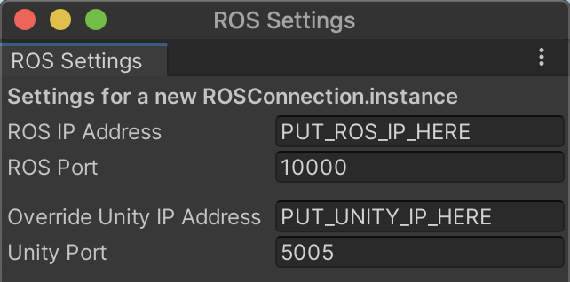
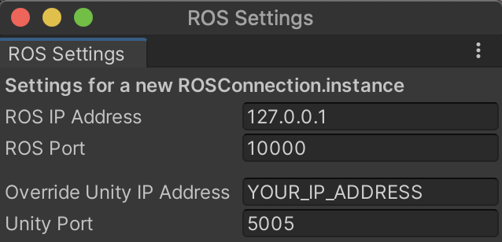

# Troubleshooting ROS-Unity Integration

## Requirements
- ROS-TCP-Endpoint installed in catkin workspace
- ROS package that implements a `server_endpoint` from ROS-TCP-Endpoint
- ROS-TCP-Connector installed in Unity project

The following instructions should be generic enough to apply to any situation but we suggest that users implement the steps from the [ROS Unity Integration](https://github.com/Unity-Technologies/Unity-Robotics-Hub/tree/main/tutorials/ros_unity_integration) tutorial.

## Confirm your IP Addresses

`UNTIY_IP` : The IP address of the machine, VM, or container that is running the Unity Editor.

`ROS_IP` : The IP address of the machine, VM, or container that is running ROS.


### Confirm ROS IP Address on Server
When starting the `server_endpoint` the folllowing should be printed to the console which shows your `ROS_IP` address.

- `Starting server on {ROS_IP}:10000`

> Note: If using a launch file the `--screen` flag will need to be added to print logs to the console.

**Q:** Is the `ROS_IP` value what you expected?

If not and you are using a launch file then update the `ROS_IP` environment variable like,

```
<launch>
    <env name="ROS_IP" value="PUT_ROS_IP_ADDRESS_HERE"/>
    <env name="ROS_HOSTNAME" value="$(env ROS_IP)"/>
    ...
    <param name="ROS_IP" type="str" value="$(env ROS_IP)" />
	...
    <param name="UNITY_IP" type="str" value="PUT_UNITY_IP_HERE" />
</launch>
```

If not and you are using a `params.yaml` file then update the `ROS_IP` variable like,

```
ROS_IP: PUT_ROS_IP_ADDRESS_HERE
```

### Confirm Unity Addresses in Unity

In Unity, go to `Robotics` -> `ROS Settings` and confirm that the IP addresses for ROS and Unity are correct. 



> Note: Setting the `Override Unity IP Address` will force the `server_endpoint` to use the Unity address input here for sending messages to Unity.

--
If the IP addresses are all correct then continue on to the next section.

### If Using Docker

- Set `ROS IP Address` to `127.0.0.1` and set the `Override Unity IP Address` to your local machine's IP address.



**Is there a preference between which of the two following instructions we want to post here or should we include both?**

- Set the `ROS IP` to `0.0.0.0` and the `UNITY IP` to your local machine's IP address.

- Set the `ROS_IP` to `172.17.0.2` and the `UNITY_IP` to "host.docker.internal".

## Where Does Communication Break Down

### 1. Can Unity send messagess to ROS?

When pressing play in the Editor a handshake message is sent from Unity to ROS.

If Unity can communicate with ROS the following message should be printed to the console screen running the `server_endpoint.py` script.

```[UnityTcpSender]: ROS-Unity Handshake received, will connect to UNITY_IP_ADDRESS:5005```

With the corresponding response message printed to the Unity console,

```ROS-Unity server listening on UNITY_IP_ADDRESS:5005```


If the previous message is not shown and either of the following errors are thrown instead:

```
SocketException: A connection attempt failed because the connected party did not respond after a period of time, or established connection failed because connected host has failed to respond.
```

```
SocketException: Connection refused
```

Confirm that:

- `server_endpoint` is running
- Can ping ROS machine from Unity machine

If issue still persists:

- TODO: Linux tips?
- If on Windows follow the two steps [here](#open-port-on-windows-firewall).

### 2. Can ROS send messages to Unity?

After it is confirmed that Unity can communicate with ROS, publish a message to a ROS topic to which Unity has instantiated a subscriber.

If an error is thrown in the `server_endpoint` console then ROS cannot connect to Unity.

TODO: Linux tips?

If on Windows follow the two steps [here](#open-port-on-windows-firewall).

## Open port on Windows Firewall
- Open port in Windows Firewall

> **TODO: Can someone with a Windows machine get a screen capture of this window?**

- In some instances opening a port did not resolve the communication issues and the Unity Editor had to be allowed through the firewall

> **TODO: Can someone with a Windows machine get a screen capture of this from the firewall window?**


