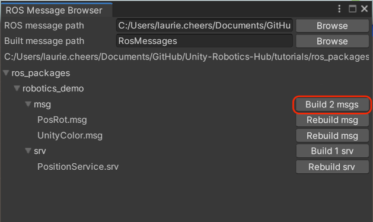

# ROS–Unity Integration: Publisher

Create a simple Unity scene which publishes a GameObject's position and rotation to a [ROS topic](http://wiki.ros.org/ROS/Tutorials/UnderstandingTopics#ROS_Topics).

## Setting Up ROS

- Copy the `tutorials/ros_packages/robotics_demo` folder of this repo into the `src` folder in your Catkin workspace.

- Follow the [ROS–Unity Initial Setup](setup.md) guide.

- Open a new terminal window and run the following commands:
  
   ```bash
    source devel/setup.bash
    rosrun robotics_demo server_endpoint.py
   ```

Once the server_endpoint has started, it will print something similar to `[INFO] [1603488341.950794]: Starting server on 192.168.50.149:10000`.

- Open another new terminal window, navigate to your ROS workspace, and run the following commands:
   ```bash
    source devel/setup.bash
    rostopic echo pos_rot
   ```

## Setting Up Unity Scene
- In the menu bar, find and select `Robotics` -> `Generate ROS Messages...`
- Set the ROS message path to `PATH/TO/Unity-Robotics-Hub/tutorials/ros_packages/robotics_demo`.
    - Expand the robotics_demo subfolder and click "Build 2 msgs" to generate new C# scripts from the ROS .msg files.



   - The generated files will be saved in the default directory `Assets/RosMessages/RoboticsDemo/msg`.
- Create a new directory in `Assets` and name it `Scripts`
- Create a new script in the `Scripts` directory and name it `RosPublisherExample.cs`
- Open `RosPublisherExample.cs` and paste the following code:
    - **Note** Script can be found at `tutorials/ros_unity_integration/unity_scripts`

```csharp
using RosMessageTypes.RoboticsDemo;
using UnityEngine;
using Unity.Robotics.ROSTCPConnector;

/// <summary>
/// 
/// </summary>
public class RosPublisherExample : MonoBehaviour
{
    ROSConnection ros;
    public string topicName = "pos_rot";

    // The game object 
    public GameObject cube;
    // Publish the cube's position and rotation every N seconds
    public float publishMessageFrequency = 0.5f;

    // Used to determine how much time has elapsed since the last message was published
    private float timeElapsed;
    
    void Start()
    {
        // start the ROS connection
        ros = ROSConnection.instance;
    }

    private void Update()
    {
        timeElapsed += Time.deltaTime;

        if (timeElapsed > publishMessageFrequency)
        {
            cube.transform.rotation = Random.rotation;

            PosRot cubePos = new PosRot(
                cube.transform.position.x,
                cube.transform.position.y,
                cube.transform.position.z,
                cube.transform.rotation.x,
                cube.transform.rotation.y,
                cube.transform.rotation.z,
                cube.transform.rotation.w
            );

            // Finally send the message to server_endpoint.py running in ROS
            ros.Send(topicName, cubePos);

            timeElapsed = 0;
        }
    }
}
```

- Add a plane and a cube to the empty Unity scene
- Move the cube a little ways up so it is hovering above the plane
- In the main menu bar, open `Robotics/ROS Settings`.
    - Set the ROS IP address and port to match the ROS IP and port variables defined when you set up ROS.
- Create another empty GameObject, name it `RosPublisher` and attach the `RosPublisherExample` script.
    - Drag the cube GameObject onto the `Cube` parameter.

- Pressing play in the Editor should publish a message to the terminal running the `rostopic echo pos_rot` command every 0.5 seconds


Continue to the [ROS Subscriber](subscriber.md) tutorial.