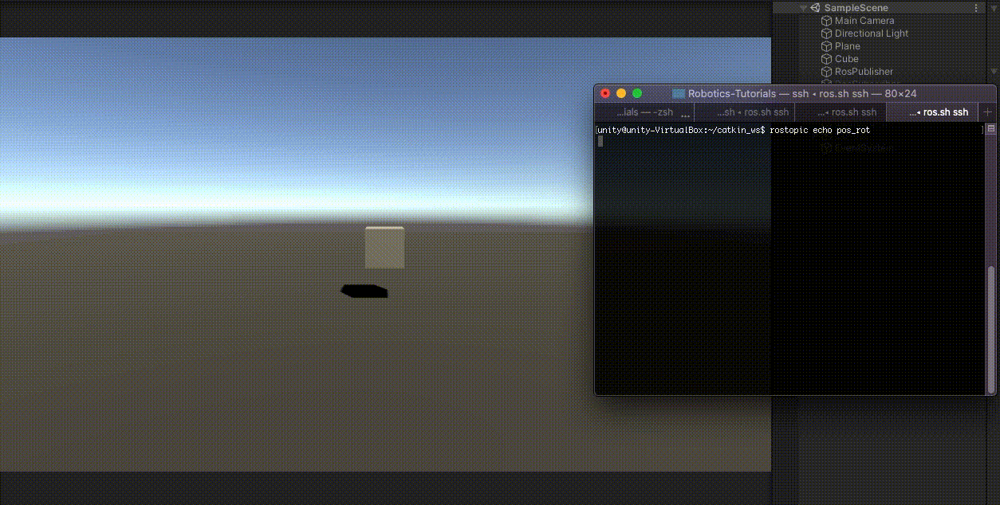

# Unity ROS Integration Publisher

Create a simple Unity scene which publishes a game object's position and rotation to a [ROS topic](http://wiki.ros.org/ROS/Tutorials/UnderstandingTopics#ROS_Topics).

Follow the [Initial ROS Setup](setup.md) guide.

Follow the [ROS Message Generation](https://github.com/Unity-Technologies/Unity-Robotics-Hub/blob/master/tutorials/unity_ros_message_generation/message_generation_tutorial.md) guide.

## Setting Up ROS
- Download and copy the `robotics_demo` directory at `tutorials/ros_packages/` of this repo to your Catkin workspace.
- Run the `catkin_make` command and source the directory
- Run each of the following commands with values that reflect your current environment

```bash
    rosparam set ROS_IP YOUR_ROS_CORE_IP_OR_HOSTNAME
    rosparam set ROS_TCP_PORT 10000
    rosparam set UNITY_IP MACHINCE_RUNNING_UNITY_IP
    rosparam set UNITY_SERVER_PORT 5005
```

- Run each of the following commands in a separate terminal window:
	- `roscore`
	- `rosrun robotics_demo server_endpoint.py`
	- `rostopic echo pos_rot`

## Setting Up Unity Scene
- In the menu bar find and select `RosMessageGeneration` -> `Auto Generate Messages` -> `Single Message ...`
- Set the input file path to `PATH/TO/Unity-Robotics-Hub/tutorials/ros_packages/robotics_demo/msg/PosRot.msg ` and click `GENERATE!`
    - The generated file will be saved in the default directory `Assets/RosMessages/msg`
- Create a new directory in `Assets` and name it `Scripts`
- Create a new script in the `Scripts` directory and name it `RosPublisherExample.cs`
- Open `RosPublisherExample.cs` and paste the following code:
	- **Note** Script can be found at `tutorials/ros_unity_integration/unity_scripts`

```csharp
using RosMessageTypes.RoboticsDemo;
using UnityEngine;
using Random = UnityEngine.Random;

/// <summary>
/// 
/// </summary>
public class RosPublisherExample : MonoBehaviour
{
    // Create a new ROS 
    private TcpConnector tcpCon;

    // Variables required for ROS communication
    public string topicName = "pos_rot";
    public string hostName = "192.168.1.116";
    public int hostPort = 10000;

    // The game object 
    public GameObject cube;
    // Publish the cube's position and rotation every N seconds
    public float publishMessageFrequency = 0.5f;

    // Used to determine how much time has elapsed since the last message was published
    private float timeElapsed;

    void Start()
    {
        // Instantiate the connector with ROS host name and port.
        tcpCon = new TcpConnector(hostName, hostPort);
    }

    private void Update()
    {
        timeElapsed += Time.deltaTime;
        
        if (timeElapsed > 0.5f)
        {
            cube.transform.rotation = Random.rotation;
            
            PosRot cubePos = new PosRot(
                cube.transform.position.x,
                cube.transform.position.y,
                cube.transform.position.z,
                cube.transform.rotation.x,
                cube.transform.rotation.y,
                cube.transform.rotation.z,
                cube.transform.rotation.w
            );

            // Finally send the message to server_endpoint.py running in ROS
            tcpCon.SendMessage(topicName, cubePos);
            
            timeElapsed = 0;
        }

    }
}
```

- Add a plane and a cube to the empty Unity scene
- Move the cube a little ways up so it is hovering above the plane
- Create an empty game object and name it `RosPublisher` and attach the `RosPublisherExample` script
	- Change the host name and port to match the ROS Param variables defined in the previous section
	- Drag the cube game object onto the `Cube` parameter

- Pressing play in the Editor should publish a message to the terminal running the `rostopic echo pos_rot` command every 0.5 seconds



Continue to the [ROS Subscriber](subscriber.md) tutorial.