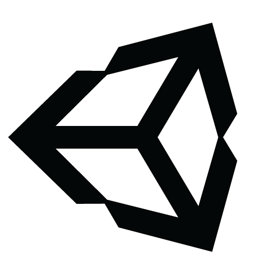
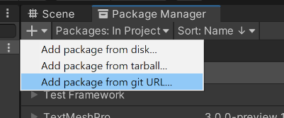
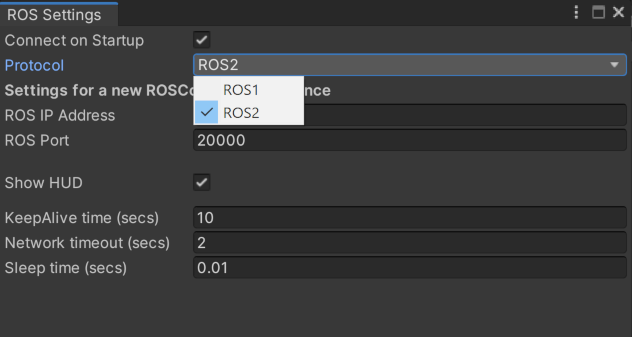
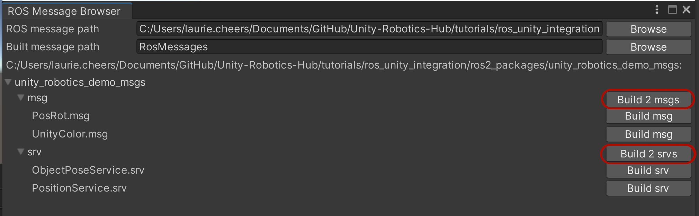

# ROS–Unity Demo Setup

This document is in two parts - [Part 1](#-ros-environment) covers the minimum requirements for a ROS–Unity integration. [Part 2](#install-unity-robotics-demo) sets up the Unity Robotics Demo package, which you will need if you're following the ROS–Unity Integration tutorials.

These instructions cover both ROS1 and ROS2. The symbols  and  indicate instructions for ROS1 and ROS2 users, respectively. If using ROS2, start with [ROS2 Environment](setup.md#-ros2-environment).

##  ROS Environment

Follow these steps to use ROS (melodic or noetic):

1.
   a) If you don't already have a ROS environment set up, we recommend using Docker. Navigate to `tutorials/ros_unity_integration` in your copy of this repo and run the following commands:

   ```bash
   docker build -t melodic -f ros_docker/Dockerfile .
   docker run -it --rm -p 10000:10000 melodic /bin/bash
   ```

   This should build a docker image and start it.

   b) (Alternative) If you're using your own ROS environment, download and copy the [ROS-TCP-Endpoint](https://github.com/Unity-Technologies/ROS-TCP-Endpoint) package into the `src` folder in your Catkin workspace. Then navigate to your Catkin workspace and run `catkin_make`, then `source devel/setup.bash`. Ensure there are no errors.

2. Open a new terminal, navigate to your Catkin workspace, and run:

   ```bash
   source devel/setup.bash
   roslaunch ros_tcp_endpoint endpoint.launch
   ```

   Once the server_endpoint has started, it will print something similar to `[INFO] [1603488341.950794]: Starting server on 192.168.50.149:10000`.

> Note, By default, the server_endpoint will listen on ip 0.0.0.0 (i.e. allowing all incoming addresses) and port 10000, but these settings are configurable. To override them, you can change the command to `roslaunch ros_tcp_endpoint endpoint.launch tcp_ip:=127.0.0.1 tcp_port:=10000` (obviously replacing 127.0.0.1 with your desired IP and 10000 with your desired port number.)

##  ROS2 Environment

Follow these steps if using ROS2:

1.
   a) If you don't already have a ROS2 environment set up, we recommend using Docker. Navigate to `tutorials/ros_unity_integration` in your copy of this repo and run the following commands:

   ```bash
   docker build -t foxy -f ros2_docker/Dockerfile .
   docker run -it --rm -p 10000:10000 foxy /bin/bash
   ```

   This should build a docker image and start it.

   b) Alternatively, if you're not going to use the Docker image, download the [ROS2 branch of the ROS-TCP-Endpoint](https://github.com/Unity-Technologies/ROS-TCP-Endpoint/tree/main-ros2) repository and copy it into the `src` folder in your Colcon workspace. Then navigate to your Colcon workspace and run the following commands:

    ```bash
	source install/setup.bash
    colcon build
	source install/setup.bash
	```

	Note: yes, you need to run the source command twice. The first sets up the environment for the build to use, the second time adds the newly built packages to the environent.

2. In your Colcon workspace, run the following command, replacing `<your IP address>` with your ROS machine's IP or hostname.

	```bash
	ros2 run ros_tcp_endpoint default_server_endpoint --ros-args -p ROS_IP:=<your IP address>
    ```

   - If you're running ROS in a Docker container, 0.0.0.0 is a valid incoming address, so you can write `ros2 run ros_tcp_endpoint default_server_endpoint --ros-args -p ROS_IP:=0.0.0.0`
   - On Linux you can find out your IP address with the command `hostname -I`
   - On MacOS you can find out your IP address with `ipconfig getifaddr en0`

   Once the server_endpoint has started, it will print something similar to `[INFO] [1603488341.950794]: Starting server on 192.168.50.149:10000`.

3. (Alternative) If you need the server to listen on a port that's different from the default 10000, here's the command line to also set the ROS_TCP_PORT parameter:

	```bash
	ros2 run ros_tcp_endpoint default_server_endpoint --ros-args -p ROS_IP:=127.0.0.1 -p ROS_TCP_PORT:=10000
	```

##  Unity Setup
1. Launch Unity and create a new project. The Robotics package works best with a version of Unity no older than 2020.
2. Open Package Manager and click the + button at the top left corner. Select "add package from git URL" and enter "https://github.com/Unity-Technologies/ROS-TCP-Connector.git?path=/com.unity.robotics.ros-tcp-connector" to install the [ROS-TCP-Connector](https://github.com/Unity-Technologies/ROS-TCP-Connector) package.

  

  

3. If you're not using a Docker container, open `Robotics/ROS Settings` from the Unity menu bar, and set the `ROS IP Address` variable to the IP you set earlier. (If you're using Docker, leave it as the default 127.0.0.1.)

	

4.  Also in the ROS Settings window, ROS2 users should switch the protocol to ROS2 now.
	

## Install Unity Robotics Demo

The instructions so far have set up the ROS-TCP-Connector package for general use. If you are specifically following one of the [ROS–Unity Integration tutorials](README.md), you'll need to do the following additional steps:

1. Copy the `unity_robotics_demo` and `unity_robotics_demo_msgs` packages into the `src` folder in your Catkin workspace. (Skip this step if you're using one of the Dockerfiles from this repo: they have the demo packages pre-installed.)

    -  If using ROS1, copy them from from `tutorials/ros_unity_integration/ros_packages` in this repo.

    -  If using ROS2, copy them from `tutorials/ros_unity_integration/ros2_packages` in this repo.

1. Build the new packages.

	-  In ROS1: Run `catkin_make`, and then `source devel/setup.bash` (again) so that ROS can find the newly built messages.

    -  In ROS2: run `colcon build`, then `source install/setup.bash` (again) so that ROS can find the newly built messages.

2. In the Unity menu bar, go to `Robotics` -> `Generate ROS Messages...`. In the Message Browser window, click the Browse button at the top right to set the ROS message path to `tutorials/ros_unity_integration/ros_packages/unity_robotics_demo_msgs` in this repo.

   (Note: The version in the ros2_packages folder is equivalent; ROS2 users can feel free to use it, or not.)

3. In the message browser, expand the unity_robotics_demo_msgs subfolder and click "Build 2 msgs" and "Build 2 srvs" to generate C# scripts from the ROS .msg and .srv files.

  

  The generated files will be saved in the default directories `Assets/RosMessages/UnityRoboticsDemo/msg` and `Assets/RosMessages/UnityRoboticsDemo/srv`. Note, there is no difference between the message scripts generated in ROS1 and ROS2 mode. You don't need to regenerate messages when you switch between them.
