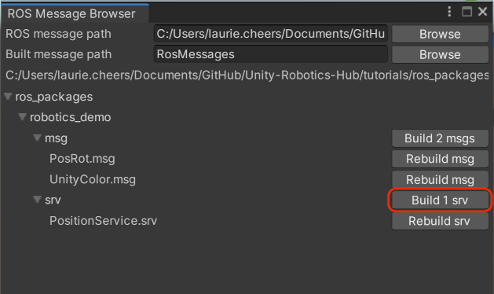

# ROS–Unity Integration: UnityService

Create a simple Unity scene which create a [Service](http://wiki.ros.org/Services) in Unity that takes a request with a GameObject's name and responds with the GameObject's pose (position and orientation) in the ROS coordinate system.

## Setting Up ROS

(Skip to [Setting Up the Unity Scene](unity_service.md#setting-up-the-unity-scene) if you already did the [ROS–Unity Integration Publisher](publisher.md) or [Subscriber](subscriber.md) tutorials.)

- Copy the `tutorials/ros_packages/robotics_demo` folder of this repo into the `src` folder in your Catkin workspace.

- Follow the [ROS–Unity Initial Setup](setup.md) guide.

- Open a new terminal window, navigate to your ROS workspace, and run the following commands:
  
   ```bash
    source devel/setup.bash
    rosrun robotics_demo server_endpoint.py
   ```

Once the server_endpoint has started, it will print something similar to `[INFO] [1603488341.950794]: Starting server on 192.168.50.149:10000`.

## Setting Up the Unity Scene
- Generate the C# code for `ObjectPoseService`'s messages by going to `Robotics` -> `Generate ROS Messages...`
 - Set the input file path to `PATH/TO/Unity-Robotics-Hub/tutorials/ros_packages/robotics_demo`, expand the robotics_demo folder and click `Build 2 srvs` (Note that you may skip this step if you have already done it in the previous tutorial).

 

 - The generated files will be saved in the default directory `Assets/RosMessages/RoboticsDemo/srv`.
 
- Create a new C# script and name it `RosUnityServiceExample.cs`
- Paste the following code into `RosUnityServiceExample.cs`
    - **Note:** This script can be found at `tutorials/ros_unity_integration/unity_scripts`.

```csharp
using RosMessageTypes.RoboticsDemo;
using UnityEngine;
using Unity.Robotics.ROSTCPConnector;
using Unity.Robotics.ROSTCPConnector.ROSGeometry;

/// <summary>
/// Example demonstration of implementing a UnityService that receives a Request message from another ROS node and sends a Response back
/// </summary>
public class RosUnityServiceExample : MonoBehaviour
{
    [SerializeField]
    string m_ServiceName = "obj_pose_srv";

    void Start()
    {
        // register the service with ROS
        ROSConnection.instance.ImplementService<MObjectPoseServiceRequest>(m_ServiceName, GetObjectPose);
    }

    /// <summary>
    ///  Callback to respond to the request
    /// </summary>
    /// <param name="request">service request containing the object name</param>
    /// <returns>service response containing the object pose (or 0 if object not found)</returns>
    private MObjectPoseServiceResponse GetObjectPose(MObjectPoseServiceRequest request)
    {
        // process the service request
        Debug.Log("Received request for object: " + request.object_name);

        // prepare a response
        MObjectPoseServiceResponse objectPoseResponse = new MObjectPoseServiceResponse();
        // Find a game object with the requested name
        GameObject gameObject = GameObject.Find(request.object_name);
        if (gameObject) 
        {
            // Fill-in the response with the object pose converted from Unity coordinate to ROS coordinate system
            objectPoseResponse.object_pose.position = gameObject.transform.position.To<FLU>();
            objectPoseResponse.object_pose.orientation = gameObject.transform.rotation.To<FLU>();
        }
       
        return objectPoseResponse;
    }
}
```

- From the main menu bar, open `Robotics/ROS Settings`, and change the `ROS IP Address` variable to the ROS IP.
- Create an empty GameObject and name it `UnityService`.
- Attach the `RosUnityServiceExample` script to the `UnityService` GameObject. 
- Pressing play in the Editor should start running as a ROS node, waiting to accept ObjectPose requests. Once a connection to ROS has been established, a message will be printed on the ROS terminal similar to `Connection from 172.17.0.1`.


## Start the Client
- On your ROS system, open a new terminal window, navigate to your ROS workspace, and run the following commands:

   ```bash
    source devel/setup.bash
    rosrun robotics_demo object_pose_client.py Cube
   ```
- This wil print an output similar to the following with the current pose information of the game object (note that the coordinates are converted to the ROS coordinate system in our Unity Service):

   ```bash
   Requesting pose for Cube
   Pose for Cube: 
   position: 
     x: 0.0
     y: -1.0
     z: 0.20000000298023224
   orientation: 
     x: 0.0
     y: -0.0
     z: 0.0
     w: -1.0
   ```
You may replace `Cube` with the name of any other GameObject currently present in the Unity hierarchy.

- Alternatively you may also call the ROS service using `rosservice call`:

   ```bash
   rosservice call /obj_pose_srv Cube
   ```
   ```bash
   object_pose: 
    position: 
      x: 0.0
      y: -1.0
      z: 0.20000000298023224
    orientation: 
      x: 0.0
      y: -0.0
      z: 0.0
      w: -1.0
   ```