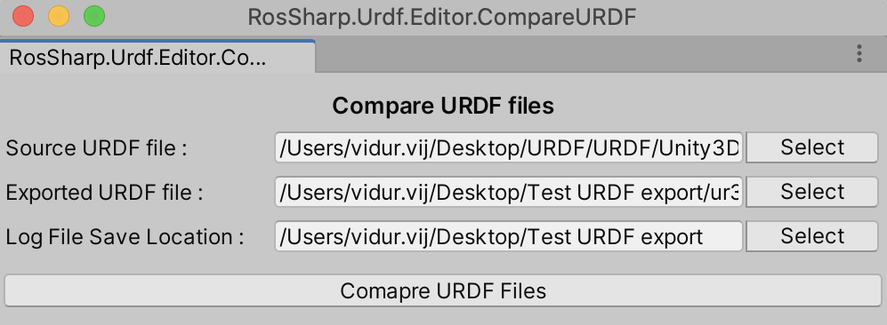
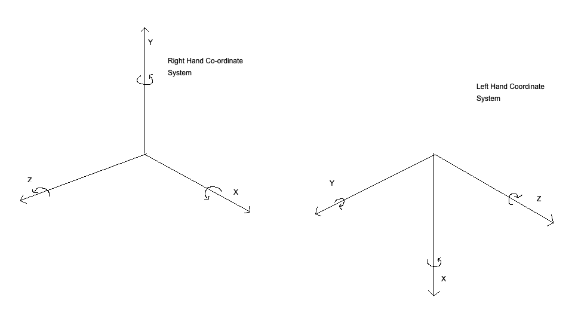
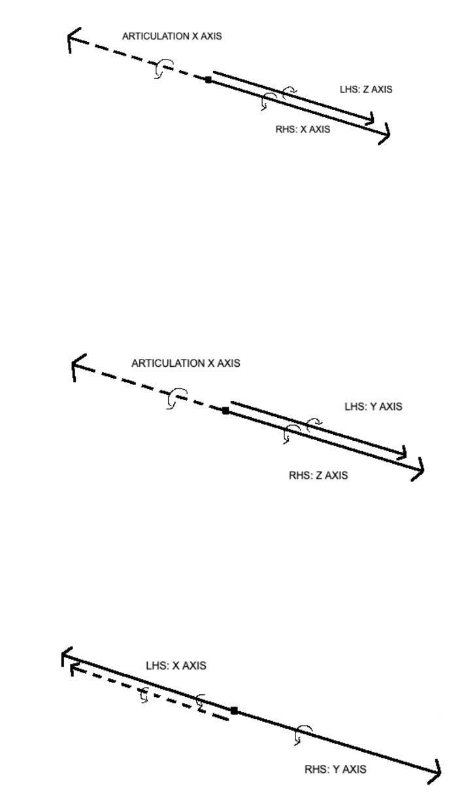
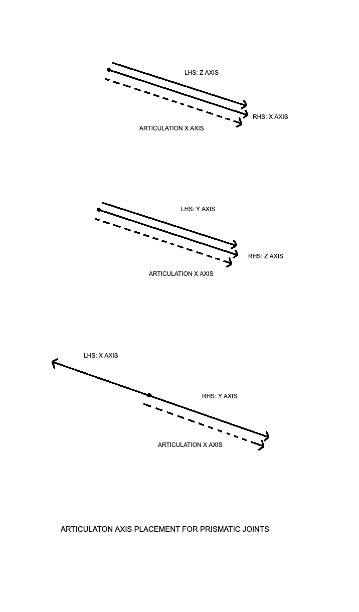
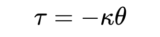
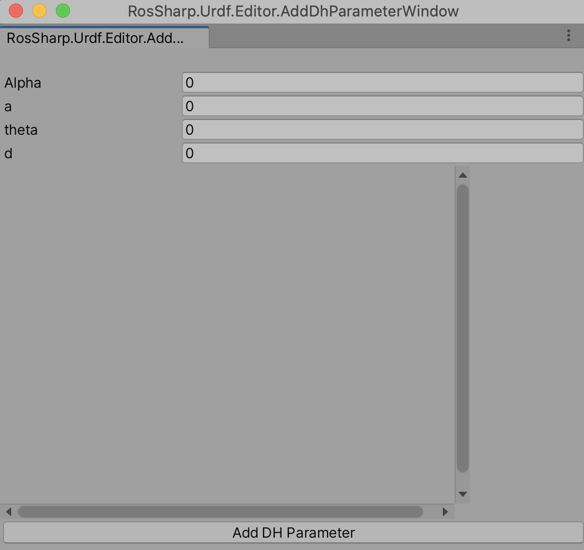
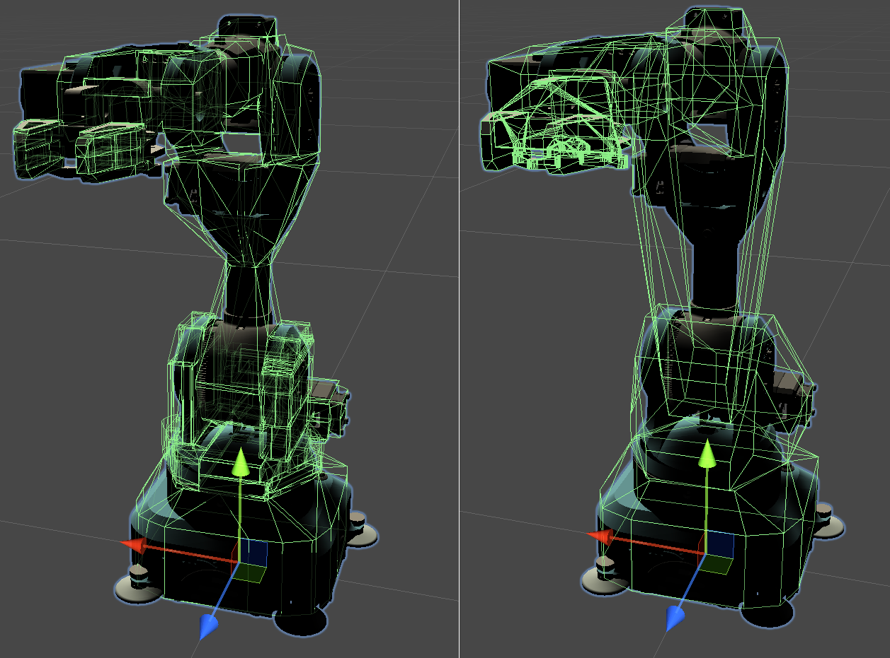
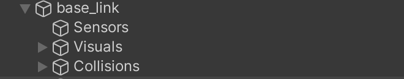
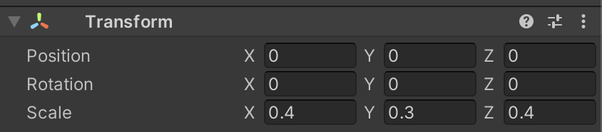

# URDF Tutorials Appendix
- [File Hierarchy](#File-Hierarchy)
- [GameObject Hierarchy](#GameObject-Hierarchy)
- [URDF Comparator](#URDF-Comparator)
- [Articulation Body axis definition](#Articulation-Body-axis-definition)
- [Guide to write your own controller](#Guide-to-write-your-own-controller)
- [Using FK Robot Script](#Using-FK-Robot-Script)
- [Convex Mesh Collider](#Convex-Mesh-Collider)
- [Supported Tags in URDF](#Supported-Tags-in-URDF)
- [Disable Collision Support](#Disable-Collision-Support)
- [Sizing of Primitives](#Sizing-of-Primitives)


## File Hierarchy
URDF files and associated meshes should be placed in a single folder within the Assets directory of Unity. We suggest creating a new folder with the robot's name and place the URDF file in its root with all associated mesh files in sub folders. Be sure to update the file locations as described by the URDF file.

## GameObject Hierarchy

The robot imported in Unity follows a Parent -  Child hierarchy.
- Robot GameObject
  - UrdfRobot Script: UrdfRobot.cs script contains functions to change the behaviors of the imported robot. The script is used to control a robot's behavior, compare against a URDF file, and export the robot as a URDF file.
  - Controller Script: Enables keyboard control of the robot. It can be modified to create custom controllers as described [here](##Guide-to-write-your-own-controller).
    - Link GameObject
        - Articulation Body: This component exposes the Physx 4.0 functionality in UnityEditor which enables robotic simulation. The API details can be found [here](https://docs.unity3d.com/2020.1/Documentation/ScriptReference/ArticulationBody.html).
        - UrdfJoint Script -  This script encapsulates details of the jointType and contains APIs to get information about the joints. It also contains helper functions for export of URDF file.
        - UrdfInertial Script: This script contains inertial data for the original configuration of joints and links. It also has helper function to export robot to a URDF file.
        - JointControl: This script is an auxiliary script to the Controller script and helps pass control information to the Articulation Body.
            - Visuals GameObject: This gameObject and its children store visual information for the robot. Like its position, orientation, visual primitives, meshes, materials etc.
            - Collisions GameObject: This gameObject and its children store collision information for the robot. Like its position, orientation, visual primitives, meshes, materials etc.

## URDF Comparator


URDF comparator is a testing tool to compare two URDF files. This tool can be used to check wether the URDF file has been exported correctly. To use the URDF comparator:
- Click `Compare URDF Files` on the UrdfRobot script in the Inspector Window.
- A menu will open containing three text fields.
    - `Source URDF file`: Contains the path of the first URDF file to be compared
    - `Exported URDF file`: Contains the path of the second URDF file to be compared
    - `Log File Save Location`: Contains the save location of the lof file
- Click on button `Select` to open the File Explorer menu and select the location of the two URDF files.
- After the exported file location is selected, its location is automatically selected as location of `Log File Save Location`. You can choose your own save location by pressing the `Select` next to the text field.
- To compare the two URDF files press `Compare URDF Files` to generate the [log file](#URDF_Comparator).

## URDF_Comparator
The URDF comparator generates a log file which details the results of the comparison. Log file contains two types of log blocks. One type of block details joint:
```
********LINK*****

 Name:
 Equal:   True
 Name: Source:    base_link Exported:    base_link
 Inertial Checks
  Mass:
  Equal:  True
   Origin Checks
   Origin Nullity Check:   True
   XYZ position
   Equal:  True
    Value: (0.0, 0.0, 0.0)
    RPY position:
    Equal:  True
    Value: (0.0, 0.0, 0.0)
 Visual Checks
 Number of Visual Components Equal:  True
 -Visual Component:   1
   Visual Component Name :   True
  Origin Checks
  Origin Nullity Check:   True
  Geometry Checks
   Geometry:
   Type: Mesh
   Name Equal:   True
   Name: Source: package://example_mesh.dae Exported: package://meshes/base.dae
   Scales Equal : (1,1,1)
  Material Checks
  Material Nullity Check:   True
   Name Equal:  True
   Name: Source:    LightGrey
   Exported:    LightGrey
   Colors Equal:   True
   RGB :0.700 0.700 0.700
   Texture nullity equality:  True
 Collisions Checks
Number of Collision Components
 Equal:  True
Source Count: 0001
Exported Count: 0001
 -Collision Component:   1
  Collision Name
  Equal:   True
  Name: Source:
  Exported:
  Origin Checks
  Origin Nullity Check:   True
  Geometry:
  Type: Mesh
  Name Equal:   True
  Name: Source: package://example_mesh.stl Exported: package://meshes/base.stl
  Scales Equal : (1,1,1)
Number of Connected Joints:
Components Equal:  True
Count: Source: 0002
 Exported: 0002
```
and joint block as :
```
********Joint*****

Name:
Equal:  True
Name: Source: shoulder_pan_joint
Exported: shoulder_pan_joint
Name:
Equal:  True
Type: Source:     revolute
Type: Exported:     revolute
  Origin Checks
  Origin Nullity Check:   True
  XYZ position
  Equal:  True
   Value: (0.0, 0.0, 0.2)
  RPY:
   Equal Check:   True
   Value:Zero Vector
Parent:
Equal:  True
Parent: Source:    base_link
Parent: Exported:    base_link
  Axis Checks
  Axis
  Equal:   True
  XYZ : (0.000,0.000,1.000)
  Dynamics Checks
  Dynamics Equal:   True
  Lower Limit:
  Equal:   True
  Lower Limit Value: -3.14159265359
  Upper Limit:
  Equal:   True
  Upper Limit Value: 3.14159265359
  Effort Equal:   True Effort: 330.000
  Velocity Equal:   True Velocity: 2.160
Child Name:
Equal:   True
Child Name: Source: shoulder_link
Child Name: Exported: shoulder_link

```
Log file contains comparison for every attribute contained in the source URDF file to the corresponding attribute in exported URDF file. Each attribute follows the format :
```
<Attribute_Name>
Equal : <True/False>
<Attribute_Name>: Source: <Attribute_Value>
<Attribute_Name>: Exported: <Attribute_Value>
```
Some attributes generates a nullity check which checks for presence of attributes in both URDF files.

## Articulation Body axis definition


The most commonly used Coordinate system is the right hand coordinate system which is shown in the figure above. It follows the convention that if your right-hand thumb represents the X direction, then the index finger and the middle finger stretched out uncrossed at right angles would represent the Y and Z direction respectively. Positive direction of rotation is represented by the curl of the fingers with the thumb stretched out.

Unity uses a left- hand coordinate system which defines the direction of the axis and positive direction of rotation in the same way as above but using the left hand. URDF Importer converts the position and orientation of the links and joints from LHS to RHS using the functions present in  Unity3D/Assets/RosSharp/Scripts/Extensions/TransformExtensinons.cs.




The exception to this is the axis of movement for Articulation Bodies. In local co-ordinates, x-axis is the chosen as default axis in which a joint will move. Articulation Bodies' anchor can be transformed which allows it to be rotated and transformed with respect to the world co-ordinate system. This enables the joint to be moved around different orientations. The importer changes the orientation of the [anchor](https://docs.unity3d.com/2020.1/Documentation/ScriptReference/ArticulationBody-anchorRotation.html) to allow the [joint position](https://docs.unity3d.com/2020.1/Documentation/ScriptReference/ArticulationBody-jointPosition.html) in reduced co-ordinates to be represent the value in right hand co-ordinate system.

Note: When the mesh is imported in Unity, the x axis is negated to convert the mesh from LHS co-ordinate system to RHS co-ordinate system. One can correct this by applying a rotation of 180° on y axis or pressing the button `Default Space` on the urdfRobot interface.

## Guide to write your own controller

Articulation Body allows the joints to be controlled by three methods:

1. Position Control
2. Torque Control
3. Velocity Control

All types of control are governed by the Spring-Damper equation :

```
F = stiffness * (currentPosition - target) - damping * (currentVelocity - targetVelocity)
```

#### Example Code

Code for positional control can be divided into two scripts. One script would be attached to the root GameObject which represents the robot. This script would determine the correct position of the joint, directed by a control policy implemented by the user. The other end of the script is attached to the GameObject with ArticulationBody component which receives the target position and assigns that
value to the articulation body.

**Note: This architecture can be changed according to the user's design.**

##### Controller Script

In this example the control policy is to reach the target position as determined by arrow keys. This is implemented in the Controller script. The controller uses two sets of inputs.It registers the `left` and `right` keystrokes to first select the articulation body to be moved. Source code can be found [here](https://github.com/Unity-Technologies/URDF-Importer/blob/main/Runtime/Controller/Controller.cs).

```C#
void Update()
{
    bool SelectionInput1 = Input.GetKeyDown("right");
    bool SelectionInput2 = Input.GetKeyDown("left");

    UpdateDirection(selectedIndex);

    if (SelectionInput2)
    {
        if (selectedIndex == 1)
        {
            selectedIndex = articulationChain.Length - 1;
        }
        else
        {
            selectedIndex = selectedIndex - 1;
        }
        Highlight(selectedIndex);
    }
    else if (SelectionInput1)
    {
        if (selectedIndex == articulationChain.Length - 1)
        {
            selectedIndex = 1;
        }
        else
        {
            selectedIndex = selectedIndex + 1;
        }
        Highlight(selectedIndex);
    }

    UpdateDirection(selectedIndex);
}
```
The up and down arrow keys are used to update the direction in which the joint is to be moved. This is updated in the JointControl script that is attached to each GameObject with the articulation body and has been described in the next section
```C#
private void UpdateDirection(int jointIndex)
{
    float moveDirection = Input.GetAxis("Vertical");
    JointControl current = articulationChain[jointIndex].GetComponent<JointControl>();
    if (previousIndex != jointIndex)
    {
        JointControl previous = articulationChain[previousIndex].GetComponent<JointControl>();
        previous.direction = RotationDirection.None;
        previousIndex = jointIndex;
    }
    if (current.controltype != control)
        UpdateControlType(current);
    if (moveDirection > 0)
    {
        current.direction = RotationDirection.Positive;
    }
    else if (moveDirection < 0)
    {
        current.direction = RotationDirection.Negative;
    }
    else
    {
        current.direction = RotationDirection.None;
    }
}

```

##### Joint Control Script

The joint control script determines the direction in which the joint needs to moved and sends the command using Articulation Body API. In all three control systems, you can directly control the primary value of the control, i.e position, velocity and torque respectively in the aforementioned control system or you can set the control of these values depending upon a time derivative of these values, i.e, speed, acceleration and power. In the latter case we multiply the time derivate constants with the *delta* time between frames. The source code can be found [here](https://github.com/Unity-Technologies/URDF-Importer/blob/main/Runtime/Controller/JointControl.cs).

```C#
    void FixedUpdate(){

        speed = controller.speed;
        torque = controller.torque;
        acceleration = controller.acceleration;


        if(joint.jointType != ArticulationJointType.FixedJoint)
        {
            if (controltype == RosSharp.Control.ControlType.PositionControl)
            {
                ArticulationDrive currentDrive = joint.xDrive;
                float newTargetDelta = (int)direction * Time.fixedDeltaTime * speed;
                if (newTargetDelta + currentDrive.target <= currentDrive.upperLimit && newTargetDelta + currentDrive.target >= currentDrive.lowerLimit){
                    currentDrive.target += newTargetDelta;
                }
                joint.xDrive = currentDrive;
            }
        }
    }
}

```

### Position Control

Position Control can be imagined as adding a spring to a joint with linear spring in case of prismatic joint and a torsional spring in case of revolute joint. The joint follows Hooke's law:



When we set the the [target](https://docs.unity3d.com/2020.1/Documentation/ScriptReference/ArticulationDrive-target.html) position of the Articulation Drive, we assign an equilibrium point for the spring. The difference between the current position and the target position generates a corrective force in the joint(spring) to move the joint to the target position.

Damping should be set to zero for pure positional control but can be set to a non-zero value to avoid rapid increase in joint speed. Make sure it is not set too high as it can counter the force generated by the spring.

Note: Best practices for velocity and torque control will be published in the future.

## Using FK Robot Script

FK Robot script calculates the position of the end effector based on the joint position of the Articulation Body and the DH parameters input by the user for the robot. It is automatically attached to the Robot GameObject when the controller is added to the Robot. It displays the transformation matrix for the end effector and the current joint position of the robot.

To insert DH parameters in the script :

- Click the `Add DH Parameters` button in the inspector window. Following window will appear.



- Fill the DH parameters for the robot starting from first joint and click `Add DH parameter`.
- The added DH parameter will appear on the text box below.

## Convex Mesh Collider

Collider components in Unity define the shape of a body for detecting collisions. There are three types of [colliders](https://docs.unity3d.com/Manual/CollidersOverview.html) supported in Unity.
- Primitive Colliders: These represent basic shapes like Box, Circle and sphere.
- Compound Colliders: These colliders are formed by union of various Primitive Colliders
- Mesh Colliders: This uses a mesh similar in shape to visual mesh to create more accurate collision meshes.

The drawback for using [MeshColliders](https://docs.unity3d.com/Manual/class-MeshCollider.html) is that it cannot collide with other MeshColliders. We need to use a convex hull of the collision mesh to enable collision with other MeshColliders. In Unity these collision meshes are limited to 255 triangles. This can lead to poor performance in simulation as the volume of these collision meshes tend be greater than the visual meshes resulting in erratic behavior in Articulation Body.

To address this predicament we have integrated another algorithm to create Convex Hulls from a mesh. This is called Volumetric Hierarchical Approximate Convex Decomposition or VHACD whose details can be found [here](https://www.microsoft.com/en-us/research/uploads/prod/2019/09/a226-thul.pdf) and the source code for the algorithm can be found [here](https://github.com/kmammou/v-hacd). The difference in algorithms can be found below.



## Supported Tags in URDF

- Link
    - Name
    - Inertial
        - origin
            - xyz
            - rpy
        - mass
        - inertia
    - visual
        - name
        - origin
            - xyz
            - rpy
        - geometry
            - box
            - cylinder
            - sphere
            - mesh
        - material
            - color
            - texture
    - collision
        - name
        - origin
            - xyz
            - rpy
        - geometry
- joint
    - name
    - type
    - origin
        - xyz
        - rpy
    - parent
        - link
    - child
        - link
    - axis
        - xyz
    - dynamics
        - damping
        - friction
    - limit
        - lower
        - upper


## Disable Collision Support
URDF defines the robot visually using Visual Meshes, and its collision using Collision Meshes. Collision meshes define the physical volume of the links, and are used to calculate the inertia of the links and also to detect collisions between different physical objects. In Unity, [RigidBodies](https://docs.unity3d.com/ScriptReference/Rigidbody.html) cannot have concave collision meshes, so when importing a concave collision mesh, all concave regions are closed over to produce a convex outline. As a result, the convex shapes might intersect with each other, creating a hindrance in robot movement. To remedy this, we support a ```disable collision``` tag in URDF. To add an exception for collision detection in Unity:

1. Identify the links between which you want to ignore the collisions.
2. Add a tag in the URDF file with the format
```XML
 <disable_collision link1= <name_of_link_1> link2=<name_of_link_2>>
  </disable_collision>
```
An example of the tag can be seen [here](https://github.com/Unity-Technologies/Unity-Robotics-Hub/blob/main/tutorials/pick_and_place/PickAndPlaceProject/Assets/URDF/niryo_one/niryo_one.urdf#L223).

The disable collision tag flags the links that need to be ignored to the URDF parser. Values of link1 and link2 attributes are the names of the two links between which the collision needs to be ignored. Make sure the names of the links match the names defined in the URDF file.

Note: You can also manually ignore collisions in Unity using [APIs](https://docs.unity3d.com/ScriptReference/Physics.IgnoreCollision.html).

## Sizing of Primitives

```xml
<collision>
    <geometry>
        <cylinder size=".4 .3 .4" />
    </geometry>
</collision>
```

The URDF Importer will set the size of the primitive using the "scale" parameter of the GameObject that contains the UrdfCollsion script.

|   |  |
|:---:|:---:|

The reason we set the size via the "scale" of the parent GameObject as opposed to the "size" of the primitive collider is to have consistency across different mesh types; the size API is only available for primitive mesh colliders and not for complex collider meshes and visual meshes, whose size must be changed using their parent GameObject's "scale" parameter. The "scale" parameter of the gameObject is also used to set the values of primitive "size" in the URDF when performing a URDF export.


