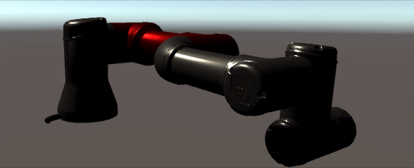
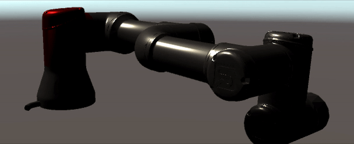

# Importing a UR3 Robot using URDF importer

## Requirements
-  Unity Version 2020.2+
-  UR3 URDF file 
-  [URDF importer unity package](TODO!!!insert Link here)

## Setting up the URDF importer in Unity Editor 
- Create a new Unity project.
- Copy the associated URDF file and meshes into the Assets folder. The files should follow [this](urdf_appendix.md#File-Hierarchy) hierarchy 
- From the menu click `Assets` -> `Import Package` -> `Import Robot from URDF` or in the Unity file explorer, open the folder containing URDF file and select the option `Import Robot from URDF`.
- Select the co-ordinate system in which the meshes were designed. Default mesh orientation is Y-up which is supported by Unity but some packages often use Z-up and X-up configuration. For more [information](https://docs.unity3d.com/Manual/HOWTO-FixZAxisIsUp.html). 
- Click `Import`
   
## Using the Controller
- The Robot is loaded in Unity without any constraints or controller.
- A controller is  pre-built in Unity URDF importer to help showcase the movement of UR3 in Unity.
- To add the controller to UR3 robot click `Enable` button on the Inspector window in front of the `Controller Script`. This will add Controller Script, FKrobot and Joint Control at runtime. These scripts help 
- Set the Stiffness and Damping to 100,000 and 10,000 respectively
- In the GameObject tree expand `ur3` -> `world` -> `base_link`
- Turn the toggle for 'Immovable' for the base_link
- Press the play button to start the scene
- The robot is controlled by using the arrow keys.

- Use the left and right arrow keys to select the articulation body you want to move.
- Use the up and down keys to move the articulation body clockwise and counterclockwise.

A guide to making your controller can be found [here](urdf_appendix.md##Guide-to-write-your-own-controller)

## Forward Kinematics script
Forward Kinematics scripts gives you the ability to see the current position of the end effector based on forward kinematics of the robot. You can [use](urdf_appendix.md##Using-FK-Robot-Script) it to compare the end effector position of the robot of the articulation body to make sure the importer is working correctly.
